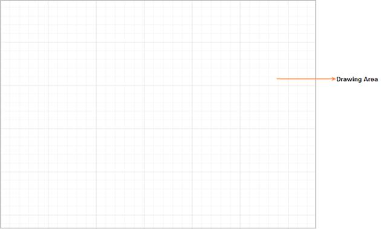

# Model

The Diagram model represents data for rendering the Diagram and manipulating the Diagram elements.

The following code illustrates how to create a Diagram with some model properties.



<%--Creates Diagram--%>

<asp:ScriptManager ID="ScriptManager1" runat="server"></asp:ScriptManager>

<ej:Diagram ID="Diagram1" runat="server" Height="600px" Width="100%">        

</ej:Diagram>





    public partial class Diagram : System.Web.UI.Page

    {

        protected void Page_Load(object sender, EventArgs e)

        {

            if (!IsPostBack)

            {

                // Sets diagram model properties

                Diagram1.Model.Width = "100%";

                Diagram1.Model.Height = "100%";

                Diagram1.Model.PageSettings.PageWidth = 2000;

                Diagram1.Model.PageSettings.PageHeight = 2000;

            }

        }

    }



 

