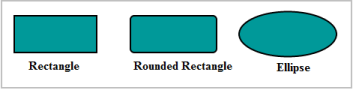
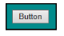
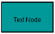
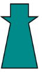
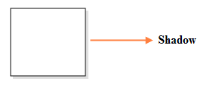
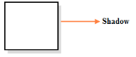
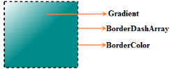
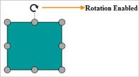
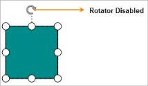

# Node

Nodes are graphical object that represent visual data to be placed on the page.

  

_Node_

## Create Node

Node is created and added to the Diagram model by using diagram model’s Nodes property. The node’s name must be unique. The following code illustrates how to create a node and add it to the Diagram.



//Creates a node with default shape (Rectangle)

Node node = new Node();

node.Name = "Rect1";

node.OffsetX = 400;

node.OffsetY = 60;

node.Width = 100;

node.Height = 100;

node.FillColor = "darkCyan";

node.BorderWidth = 2;

model.Nodes.Add(node);



  

_Node_

List of preloaded nodes from symbol palette are added to the Diagram by clicking the palette nodes or by dragging a node and dropping on the Diagram. The method to add node/connector to palette and drag and drop on Diagram is explained in palette section

## Node Shapes

The Diagram has a collection of predefined shapes. The shape to be drawn can be set by using specific properties. The most commonly used shapes are:

* Rectangle (A type of basic shape)
* Ellipse (A type of basic shape)
* Html
* Text
* Native
* Path (A type of basic shape)
* Polygon (A type of basic shape)

### Rectangle

You can create a rectangle with the help of BasicShape and by setting node’s shape as BasicShapes.Rectangle. The following code illustrates how a rectangle node is created.



BasicShape node = new BasicShape();

//Creates a node with rectangle shape

node.Shape = BasicShapes.Rectangle;

//Creates a node with rounded rectangle shape

node.Shape = BasicShapes.Rectangle;

node.Shape.CornerRadius = 5; 

//Creates a node with ellipse shape

node.Shape = BasicShapes.Ellipse; 



  

_Built-in Shapes_

### Html

Html elements are embedded in the Diagram through CustomNodenode. The following code illustrates how a Html node is created.



<!--dependency scripts-->





//CustomNode derived from HTMLNode class

CustomNode node = new CustomNode ();

node.Shape.TemplateId = "htmlTemplate";

node.Value="button";



 

_Html Shape_

### Text Node

You can add Text to the Diagram by using Textshapenode. The text shape has Textblock that contains text, font style and align properties .The following code illustrates how to create a Text node.



//Creates a node with text content

TextNode node = new TextNode();

TextBlock block = new TextBlock();

block.TextAlign = TextAlign.Center;

block.Text = "TextNode";

node.TextBlock = block;



  

_Text Shape_

### Path

You can create complex shapes by using Pathshapenode. It is achieved by assigning path string to shape’s PathData. The following code illustrates how a Pathnode is created.



BasicShape node = new BasicShape();

//Creates a node with path shape

node.Shape = BasicShapes.Path;

node.PathData = "M 67.2947 100 L 67.2947 0.00102291 L 59.138 0.00102291 M 100 50 L 66.8899 50 M 33.1101 50 L 0 50 M 33.1101 0 L 67.5585 50.0015 L 33.1101 99.9995 Z";



  

_Path Shape_

### Polygon

You can create Polygon by setting BasicShape node’s type as BasicShapes.Polygon and assigning the desired points to the node’s Point property.

The following code illustrates how to create a Polygonnode. 



BasicShape node = new BasicShape();

//Creates a node with polygon shape

node.Shape = BasicShapes.Polygon;

Collection points = new Collection();

points.Add(new DiagramPoint(0,20));

points.Add(new DiagramPoint(25,30));

points.Add(new DiagramPoint(0, 100));

points.Add(new DiagramPoint(100, 100));

points.Add(new DiagramPoint(75,30));

points.Add(new DiagramPoint(100, 20));

points.Add(new DiagramPoint(75, 20));

points.Add(new DiagramPoint(75, 0));

points.Add(new DiagramPoint(25, 0));

points.Add(new DiagramPoint(25, 20));

points.Add(new DiagramPoint(0, 20));

node.Points = points; 



 

_Polygon Shape_

### Native 

Diagram supports adding SVG content as shape content. It is achieved by creating node by using CustomNode and assigning the template ID to the TemplateId property. The TemplateId property receives id svg template. The following code illustrates how a Native node is created.



//dependency scripts

 





//CustomNode is derived from NativeNode class

CustomNode node = new CustomNode ();

node.Shape = new Shape(Shapes.Native);

node.Shape.TemplateId = "svgTemplate";

node.Text="Mail";



 

_Native Shape_

N> Shapes of type Node or HTML cannot be exported to an image format, like JPEG, PNG and BMP. It is by design that while exporting, Diagram is drawn in a canvas. Further, this canvas is exported into image formats. Currently, drawing in a canvas from all possible HTML and SVG elements is not feasible. So, this limitation. Note that fill color is applied to the Native Node only when its inline style or fill for an SVG child element is not specified. In the following example, the node’s fill color is overridden by the specified color for the group.



<svg>
<g id=”task”>
<g fill="#fff">
</g>
</g>
</svg>



### Image

You can add Image as a node to the Diagram by creating node by using ImageNode and setting the image URL to Source property of shape. The following code illustrates how an Image node is created.



// create a node with image

ImageNode node = new ImageNode();

node.Source = "sample/Syncfusion.PNG";



  

_Image Shape_

## Shadow

Dropshadoweffect for a node can be enabled or disabled by using the NodeConstraints.Shadow. The following image represents the drop shadow effect for a Node.

 

_Shadow_



Node node = new Node ();

//Enables Shadow for the node.

node.Constraints = NodeConstraints.Default | NodeConstraints.Shadow;

//Disables shadow for the node.

node.Constraints = node.Constraints &~ NodeConstraints.Shadow;



Customizing Shadow

Position and opacity of the shadow can be customized by using opacity, angle, and distance of the shadow. The following code example illustrates how to customize the shadow.



Node node = new Node ();

//Shadow Customization.

node.Shadow.Opacity = 0.8F;

node.Shadow.Distance = 9;

node.Shadow.Angle = 50;



 

_Shadow Customization_

## Appearance

You can customize the appearance of the shapes by using node customization properties.

<table>
<tr>
<th>
Properties</th><th>
Data Type</th><th>
Description</th></tr>
<tr>
<td>
Visible</td><td>
Boolean</td><td>
Gets or sets the visibility of the node</td></tr>
<tr>
<td>
BorderColor</td><td>
String</td><td>
Gets or sets the border color of the node</td></tr>
<tr>
<td>
FillColor</td><td>
String</td><td>
Gets or sets the fill color of the node</td></tr>
<tr>
<td>
Opacity</td><td>
Int</td><td>
Gets or sets the opacity of the node</td></tr>
<tr>
<td>
Gradient</td><td>
Object</td><td>
Gets or sets the gradient fill of the node</td></tr>
<tr>
<td>
BorderDashArray</td><td>
String</td><td>
Gets or sets the pattern of dashes and gaps used to stroke node border.</td></tr>
<tr>
<td>
BorderWidth</td><td>
Int</td><td>
Gets or sets the width of node border.</td></tr>
</table>



//Sets various appearance properties to node 

Node node = new Node();

node.BorderWidth = 2;

node.BorderColor = "black";

node.Visible = true;

node.Opacity = 1;

node.BorderDashArray="5 5";

LinearGradient gradient = new LinearGradient();

gradient.X1 = 0;

gradient.X2 = 50;

gradient.Y1 = 0;

gradient.Y2 = 50;

Stop stop = new Stop();

stop.Color = "white";

stop.Offset = 0;

gradient.Stops.Add(stop);

stop = new Stop();

stop.Color = "darkCyan";

stop.Offset = 100;

gradient.Stops.Add(stop);

gradient.Stops.Add(stop);

node.LinearGradient = gradient;



 

_Customized Node_

## Constraints

NodeConstraints

You can enable or disable certain behaviors of Nodes by using Node’s constraints property.

<table>
<tr>
<th>
Constraints</th><th>
Description</th></tr>
<tr>
<td>
Select</td><td>
Enables or disables selection.</td></tr>
<tr>
<td>
Delete</td><td>
Enables or disables deletion.</td></tr>
<tr>
<td>
Resize</td><td>
Enables or disables resizing.</td></tr>
<tr>
<td>
Drag</td><td>
Enables or disables dragging.</td></tr>
<tr>
<td>
Rotate</td><td>
Enables or disables rotation.</td></tr>
<tr>
<td>
Connect</td><td>
Enables or disables connection.</td></tr>
<tr>
<td>
ResizeNorthEast</td><td>
Enables or disables resizing nodes in the north east direction.</td></tr>
<tr>
<td>
ResizeEast</td><td>
Enables or disables resizing nodes in the east.</td></tr>
<tr>
<td>
ResizeSouthEast</td><td>
Enables or disables resizing nodes in the south east.</td></tr>
<tr>
<td>
ResizeSouth </td><td>
Enables or disables resizing nodes in the south.</td></tr>
<tr>
<td>
ResizeSouthWest</td><td>
Enables or disables resizing nodes in the south west.</td></tr>
<tr>
<td>
ResizeWest</td><td>
Enables or disables resizing nodes in the west.</td></tr>
<tr>
<td>
ResizeNorthWest</td><td>
Enables or disables resizing nodes in the north west direction.</td></tr>
<tr>
<td>
ResizeNorth </td><td>
Enables or disables resizing nodes in the north.</td></tr>
<tr>
<td>
Shadow</td><td>
Enables or disables Shadow.</td></tr>
<tr>
<td>
DragLabel</td><td>
Enables or disables label dragging.</td></tr>
<tr>
<td>
AllowPan</td><td>
Enables or disables panning while dragging nodes.</td></tr>
<tr>
<td>
AspectRatio</td><td>
Enables or disables proportional  resizing of nodes.</td></tr>
<tr>
<td>
Default</td><td>
Enables all the constraints.</td></tr>
<tr>
<td>
None</td><td>
Disables all the constraints.</td></tr>
</table>
The Default value for the node constraints property is NodeConstraints.Default.

The following code illustrates how to enable rotate, select constraints, and disable other constraints.



//Applies selection and rotation constraints only.

node.Constraints = NodeConstraints.Select| NodeConstraints.Rotate;



  

_Rotator Constraints–Enabled_

The following code illustrates how to disable rotate constraints. Disabling rotate constraint does not allow you to rotate the node.



//Disables rotate constraint.

node.Constraints = node.Constraints &~ NodeConstraints.Rotate;



  

_Rotate Constraints-disabled_

N> Node’s constraints property is manipulated by using bitwise operations. For more information about bitwise operations, see_ Bitwise Operations.

