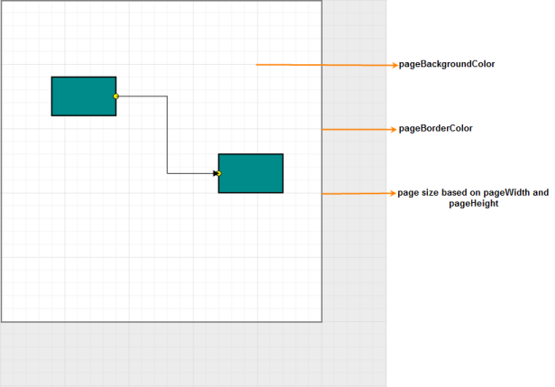
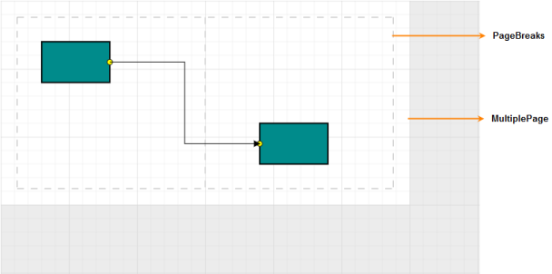
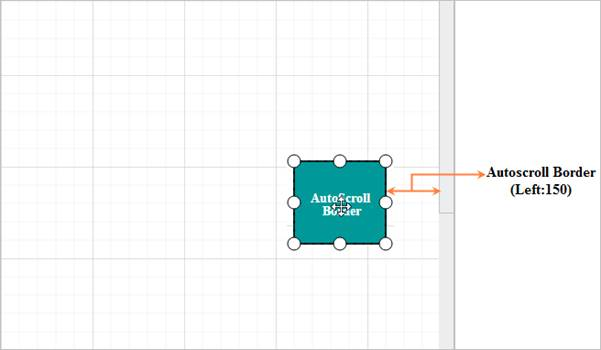

# Page Settings

Page settings enable you to customize the width and height of the Diagram page. The properties of PageSetting are listed as follows.

Page settings

<table>
<tr>
<th>Properties</th><th>
Data Type</th><th>
Description</th></tr>
<tr>
<td>
PageWidth</td><td>
Int</td><td>
Gets or sets the width of the page</td></tr>
<tr>
<td>
PageHeight</td><td>
Int</td><td>
Gets or sets the height of the page</td></tr>
<tr>
<td>
MultiplePage</td><td>
Boolean</td><td>
Gets or sets whether  multiple page option is enabled or not</td></tr>
<tr>
<td>
PageBorderWidth</td><td>
Int</td><td>
Gets or sets the border width of the page</td></tr>
<tr>
<td>
PageBackgroundColor</td><td>
String</td><td>
Gets or sets the background color of the page</td></tr>
<tr>
<td>
PageBorderColor</td><td>
String</td><td>
Gets or sets the border color of the page</td></tr>
<tr>
<td>
PageMargin</td><td>
Int</td><td>
Gets or sets the  margin of the page</td></tr>
<tr>
<td>
ShowPageBreak</td><td>
Boolean</td><td>
Gets or sets whether  page break option is enabled or not</td></tr>
<tr>
<td>
PageOrientation</td><td>
PageOrientation</td><td>
Gets or sets the orientation of the page</td></tr>
</table>

The following code illustrates how to customize Page Settings



//Sets page setting properties

Diagram1.PageSettings.PageHeight = 300;

Diagram1.PageSettings.PageWidth = 450;

Diagram1.PageSettings.PageBorderWidth = 4;

Diagram1.PageSettings.PageBackgroundColor = "lightBlue";

Diagram1.PageSettings.PageBorderColor = "black";

Diagram1.PageSettings.PageMargin = 35;

Diagram1.PageSettings.ShowPageBreaks = true;

Diagram1.PageSettings.MultiplePage = true;

Diagram1.PageSettings.PageOrientation = PageOrientation.Portrait;



  

Page Appearance-PageSettings based
{:.caption} 

## MultiplePage and PageBreaks

When MultiplePage is enabled, size of the page dynamically increases or decreases in multiples of page width and height and completely fits the Diagram within the page boundaries. PageBreaks is used as a visual guide to see how pages are split into multiple pages.

 

Multiple Page and Page Breaks
{:.caption} 

## AutoScroll

Autoscroll feature automatically scrolls the Diagram whenever the node or connector is beyond the boundary of the diagram, so that, it is always visible during dragging, resizing, and multiple selection operations.

Autoscroll is automatically triggered when any one of the following is dragged towards the edge of the Diagram.

* Node dragging
* Node’s control points: resizer, rotator
* Connector’s control points: end point, segment
* Rubber band selection
* Dropping item from palette

Properties table

<table>
<tr>
<th>Properties</th><th>
Data Type</th><th>
Description</th></tr>
<tr>
<td>
ScrollLimit</td><td>
String</td><td>
Gets or sets the scroll limit of the page</td></tr>
<tr>
<td>
ScrollableArea</td><td>
Object</td><td>
Gets or sets the scrollable region of the page</td></tr>
<tr>
<td>
AutoScrollBorder</td><td>
Object</td><td>
Gets or sets the auto scroll starting point </td></tr>
</table>

### Autoscroll border

The Autoscroll border is used to specify the distance from where the autoscroll is to be enabled when moving the node or connector. The default value is set to 15 for all the sides (left, right, top, and bottom).

The following code example illustrates how to set Autoscroll border.



// Specifies Autoscroll border

DiagramContent.PageSettings.AutoScrollBorder.Left = 150;

DiagramContent.PageSettings.AutoScrollBorder.Right = 15;

DiagramContent.PageSettings.AutoScrollBorder.Top = 15;

DiagramContent.PageSettings.AutoScrollBorder.Bottom = 15;



### Scroll limit

The scroll limit allows you to scroll the diagram page along X and Y axes based on the options specified. 

* By default, the value is set to infinity to scroll in all directions without any restriction. 
* When scroll limit is set as diagram, you are restricted to scroll the page beyond the diagram content. 
* By specifying the value as limited, you can set the limit of the scrollable area through scrollable area property. 

N> Refer to the scrollable area for more details.

The following code example illustrates how to specify scroll limit. 



//Scrolllimit for Diagram by default

<PageSettings ScrollLimit="Inifinity" />



### Scrollable Area

You can restrict scrolling beyond a particular rectangular area and the rectangular area is specified by using ScrollableArea property. This is applicable only when the scroll limit for the Diagram is specified as limited. 

The following code example illustrates how to customize scrollable area of diagram.



  //Scrolllimit for Diagram as limited

DiagramContent.PageSettings.ScrollLimit=  

  ScrollLimit.Limited;

  //Sets limit of the scrollable area

  DiagramContent.PageSettings.ScrollableArea.X = 0;

  DiagramContent.PageSettings.ScrollableArea.Y = 0;

  DiagramContent.PageSettings.ScrollableArea.Width = 5000;

  DiagramContent.PageSettings.ScrollableArea.Height = 5000;



  

AutoScroll Border
{:.caption} 

