# Predefined Shapes

## In-built Shapes

Diagram has several in-built shapes .The in-built shapes are categorized as follows.

1. Basic Shapes
2. Flow Shapes
3. BPMN shapes

### Basic Shape

The Basic shapes are common shapes used to represent geometrical information visually.

The following code example illustrates how to create a basic shape.



//Creates a basic shape

  BasicShape node = new BasicShape();

  node.Shape = BasicShapes.Plus;



The list of basic shapes are as follows.

  

### Flow Shape

The flow shapes are used to represent the process flow. It is used for analysing, designing, managing or for documentation process. 

The following code example illustrates how to create a flow shape. 



//Creates a flow shape

FlowShape node = new FlowShape();

node.Shape = FlowShapes.Document;



The list of flow shapes are as follows.

 

### BPMN Shape

BPMN shapes are used to represent internal business procedure in graphical notation and enables you to communicate the procedures in a standard manner.

The BPMN shapesare categorized as follows.

1. Event
2. Gateway
3. Activity
4. Message
5. DataSource
6. DataObject

The shapes are listed as follows.

 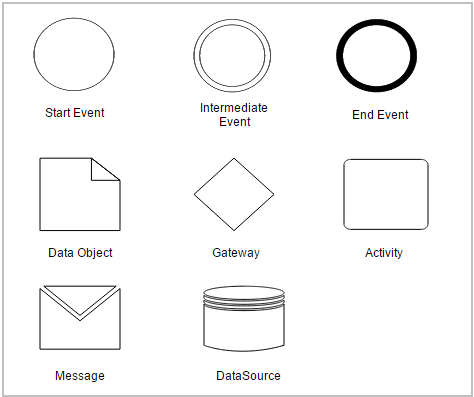 

The BPMN shapes and its types are explained as follows.

#### Event 

An event is represented with a circle and it denote something that happens. Icons within the circle denote the type of event. For example, an envelope representing a message, or a clock representing time. 

The following code example illustrates how to create an event in BPMN shape.



//Creates an event shape in BPMN 

 BPMNNode node = new BPMNNode();

 node.Shapes = BPMNShapes.Event;

 node.Event = BPMNEvents.Start;

 node.Trigger = BPMNTriggers.None;



_Events_ 

<table>
<tr>
<td>
{{ '**Events**' | markdownify }}</td><td>
{{ '**Type**' | markdownify }}</td><td>
{{ '**Trigger Result**' | markdownify }}</td></tr>
<tr>
<td rowspan = "2">
Start Event</td><td>
Interrupting </td><td rowspan = "5">
NoneMessageTimerEscalationLinkErrorCompensationSignalMultipleParallel</td></tr>
<tr>
<td>
Non-Interrupting</td></tr>
<tr>
<td rowspan = "2">
Intermediate Event</td><td>
Interrupting </td></tr>
<tr>
<td>
Non-Interrupting</td></tr>
<tr>
<td>
End Event</td><td>
             -----</td></tr>
</table>

_Representation of different BPMN events_ 

<table>
<tr>
<td>
{{ '**Events**' | markdownify }}</td><td>
{{ '**Image**' | markdownify }}</td></tr>
<tr>
<td>
Start Interrupting</td><td>
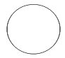

</td></tr>
<tr>
<td>
Start Non-Interrupting</td><td>

</td></tr>
<tr>
<td>
Intermediate Interrupting</td><td>
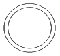

</td></tr>
<tr>
<td>
Intermediate Non-Interrupting</td><td>
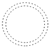

</td></tr>
<tr>
<td>
End</td><td>
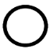

</td></tr>
</table>

_Representation of event trigger states_

<table>
<tr>
<td>
{{ '**Trigger Result**' | markdownify }}</td><td>
{{ '**Image**' | markdownify }}</td></tr>
<tr>
<td>
 Message</td><td>

</td></tr>
<tr>
<td>
Timer</td><td>
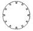

</td></tr>
<tr>
<td>
Escalation</td><td>

</td></tr>
<tr>
<td>
Link </td><td>

</td></tr>
<tr>
<td>
Error</td><td>

</td></tr>
<tr>
<td>
Compensation</td><td>

</td></tr>
<tr>
<td>
Signal</td><td>

</td></tr>
<tr>
<td>
Multiple</td><td>
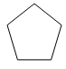

</td></tr>
<tr>
<td>
Parallel</td><td>
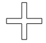

</td></tr>
</table>

#### Gateway

Gateway is used to control the flow of a process. It is represented as a diamond shape.

There are several types in Gateway. They are listed as follows.

1. None
2. Exclusive
3. Parallel
4. Inclusive
5. Complex
6. Event Based

The following code example illustrates how to create a gateway in BPMN shape.



//Creates a gateway shape in BPMN 

BPMNNode node = new BPMNNode();

node.Shapes = BPMNShapes.Gateway;



_Types of Gateway_

<table>
<tr>
<td>
{{ '**Gateway Types**' | markdownify }}</td><td>
{{ '**Image**' | markdownify }}</td></tr>
<tr>
<td>
Exclusive Gateway</td><td>

</td></tr>
<tr>
<td>
Parallel Gateway</td><td>
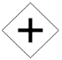

</td></tr>
<tr>
<td>
Inclusive Gateway</td><td>

</td></tr>
<tr>
<td>
Complex Gateway</td><td>

</td></tr>
<tr>
<td>
Event Based</td><td>

</td></tr>
</table>

#### Activity

The activity is the task performed in a process. It is represented by rounded rectangle.

There are two types in activities .They are listed as follows.

1. Task - Occurs within a process and it is not broken down to finer level of detail.
2. Subprocess - Occurs within a process broken down to finer level of detail.

_Activity Type_

<table>
<tr>
<td>
{{ '**Activity**' | markdownify }}</td><td>
{{ '**Loop**' | markdownify }}</td><td>
{{ '**Tasks**' | markdownify }}</td><td>
{{ '**Compensation**' | markdownify }}</td><td>
{{ '**Call**' | markdownify }}</td><td>
{{ '**Ad-Hoc**' | markdownify }}</td><td>
{{ '**Boundary**' | markdownify }}</td></tr>
<tr>
<td>
Task</td><td>
</td><td>
</td><td>
* </td><td>
 </td><td>
</td><td>
</td></tr>
<tr>
<td>
SubProcess</td><td>
</td><td>
</td><td>
</td><td>
</td><td>
</td><td>
</td></tr>
</table>

The following code example illustrates how to create activity in BPMN shape.



//Creates an activity shape in BPMN

 BPMNNode node = new BPMNNode();

 node.Shapes = BPMNShapes.Activity;

 node.Activity = BPMNActivity.Task;



The different activities in the BPMN shape are listed as follows.

1. Loop

The task that is internally looped.

 

2. Tasks

The task for sending, receiving, user based task, etc…

 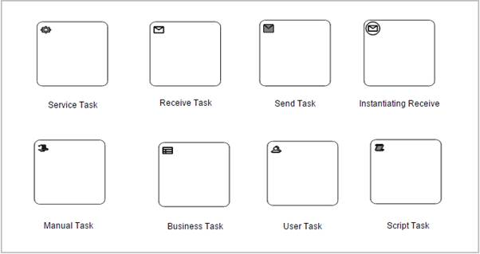 

3. Compensation

Compensation is triggered when operation partially fails.

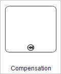 

4. Call

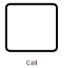 

5. Ad-Hoc

 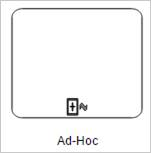 

6. Boundary

Boundary represents the type of task that is processed.

  

#### Data

Data object is used to represent the data produced by activities in process.

DataSource is used to read and write data.

##### DataObject & Datasource

The following code example illustrates how to create connecting objects in BPMN shape.



//Creates a DataObject shape in BPMN

BPMNNode node = new BPMNNode();

node.Shapes = BPMNShapes.DataObject;

//Creates a DataSource shape in BPMN

BPMNNode node = new BPMNNode();

node.Shapes = BPMNShapes.DataSource;



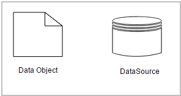 

