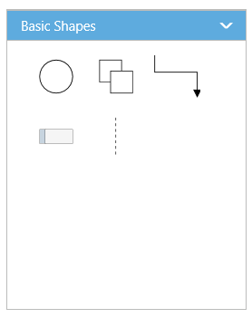
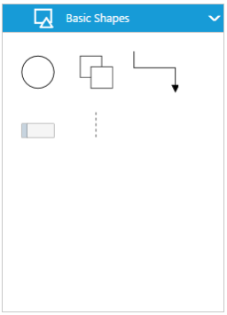
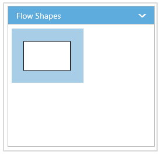
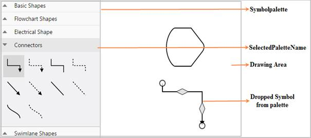
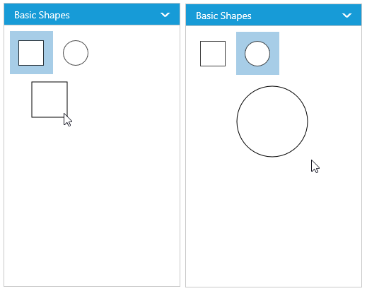
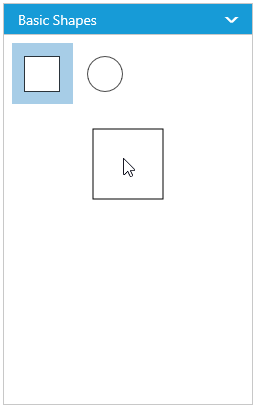
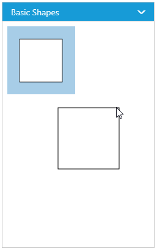

# Symbol Palette

The **SymbolPalette** displays a collection of palettes. The Palette shows a set of nodes and connectors. It allows you to drag and drop the nodes and connectors into the Diagram.

## Create symbol palette

The `DiagramId` property of symbolpalette should be set with the corresponding Diagram ID to drag and drop the nodes and connectors into the Diagram. The following code illustrates how to create symbolpalette.  



    <!--Initializes the Diagram control-->
    <ej:Diagram ID="DiagramContent" runat="server" Height="700px" Width="100%"> 
    </ej:Diagram>
    <!-- Initializes the SymbolPalette control -->
    <ej:SymbolPalette ClientIDMode="Static" DiagramId="DiagramContent" ID="symbolpalette" runat="server"> 
    </ej:SymbolPalette>


 

## Add palettes to SymbolPalette

A palette allows to display a group of related symbols and it textually annotates the group with its header.
To initialize a palette, define a JSON object with the property `Name` that is displayed as the header text of palette. The `Expanded` property of palette allows to expand/collapse its palette items.
The following code example illustrates how to define a palette and how its added to symbol palette.



    <%--define a palette with its name and expands its children.--%>
    <ej:DiagramPalette Name="Basic Shapes" Expanded="true"></ej:DiagramPalette>



You can add any number of palettes to the `Palettes` collection of the symbol palette. The following example illustrates how to define symbol palette with a palette object that is defined in the previous step.



    <ej:SymbolPalette ClientIDMode="Static" ID="symbolpalette" runat="server">
    <Palettes>
        <%--define a palette with its name and expands its children.--%>
        <ej:DiagramPalette Name="Basic Shapes" Expanded="true"></ej:DiagramPalette>
    </Palettes>
    </ej:SymbolPalette
    


The following image shows the symbol palette with multiple palette Items.

### Customize the Palette Header

Palettes can be annotated with its header texts and you can change the height of palette header by using `HeaderHeight` property of symbol palette.

Also, you can embed any HTML element into a palette header by defining the ScriptTemplate id to palette's templateId property. Following code example illustrates how to customize palette headers.

 



    <!--dependency scripts-->
        											



 

    <ej:SymbolPalette ClientIDMode="Static" ID="symbolpalette" runat="server">
        <Palettes>
            <%--define a palette with its name and expands its children.--%>
            <ej:DiagramPalette TemplateId="svgTemplate" Name="Basic Shapes" HeaderHeight ="30" Expanded="true"></ej:DiagramPalette>
        </Palettes>
    </ej:SymbolPalette>



The following image shows the customized palette header

## Add symbols to palette

The symbol need to be defined and added to the `Items` collection of the palette. You can create a symbol as a node, group, connector, lane, or phase except swimlane.  
 
The following code example illustrates how to define a palette with symbols that are defined in the previous section. 



    <ej:SymbolPalette ClientIDMode="Static" ID="symbolpalette" runat="server">
    <Palettes>
        <%--define a palette with its name and expands its children.--%>
        <ej:DiagramPalette Name="Basic Shapes" Expanded="true">
            <Items>
                <%--define a node with its size, position and shape.--%>
                <ej:BasicShape Width="40" Height="40" OffsetX="20" Name="Ellipse"
                    OffsetY="20" Shape="Ellipse" BorderWidth="1">
                </ej:BasicShape>
            </Items>
        </ej:DiagramPalette>
    </Palettes>
    </ej:SymbolPalette>



### Customize the size of symbols

You can customize the size of the individual symbol. The `PaletteItem` property of node enables you to define the size of the symbols. The following code example illustrates how to change the size of a symbol.



    <ej:SymbolPalette ClientIDMode="Static" ID="symbolpalette" paletteItemWidth="50" PaletteItemHeight="50" runat="server">
        <Palettes>
            <%--define a palette with its name and expands its children.--%>
            <ej:DiagramPalette Name="Basic Shapes" Expanded="true">
                <Items>
                    <%--define a node with its size, position and shape.--%>
                    <ej:BasicShape Width="40" Height="80" Name="Rectangle">
                        <%--Specifies the size of palette Item--%>
                        <paletteitem width="50" height="50">
                            <Margin Left="20" Top="20" Right="20" Bottom="20">
                            </Margin>
                        </paletteitem>
                    </ej:BasicShape>
                </Items>
            </ej:DiagramPalette>
        </Palettes>
    </ej:SymbolPalette>



Symbol size will be set based on the following precedence.

**Precedence**

| Palette Item | Rendering Size |  
|---|---|---|
| Width | PaletteItem.Width > model.PaletteItemWidth > Node.Width |  
| Height | PaletteItem.height > model.PaletteItem.Height > Node.Height | 

* Symbol size will be rendered in the palette based on Node.PaletteItem's `Width` and `Height` property. 
* If PaletteItem's Width and Height property is not specified, symbol size will be rendered in the palette based on model's `PaletteItemWidth` and `PaletteItemHeight` property. 
* If you don't specify above two, then symbol size will be rendered in the palette based on node's `Width` and `Height` property. 
 

### Stretch the symbols into the palette

The `EnableScale` property of the paletteItem enables you to customize the size of the symbol regardless of the precedence. The following code example illustrates how to customize the symbol size.



    <ej:SymbolPalette ID="symbolpalette" Width="100%" Height="100%" runat="server">
        <Palettes>
            <%--define a palette with its name and expands its children.--%>
            <ej:DiagramPalette Name="Basic Shapes" Expanded="true">
                <Items>
                    <ej:BasicShape Width="40" Height="80" Name="Rectangle">
                        <%--Enables to fit the content into the specified palette item size--%>
                        <paletteitem enablescale="true">
        </paletteitem>
                        <%--When it is set as false, the element is rendered with actual node size--%>
                    </ej:BasicShape>
                </Items>
            </ej:DiagramPalette>
        </Palettes>
    </ej:SymbolPalette>



## Symbol Previews

Image, simple snippet to customize the preview size

You can customize the preview size of the individual palette items. The `PaletteItem` property of node enables you to define the preview size of the symbol items. The following code example illustrates how to change the preview size of a palette item.



    <ej:SymbolPalette ID="symbolpalette" Width="100%" Height="100%" runat="server">
        <Palettes>
            <%--define a palette with its name and expands its children.--%>
            <ej:DiagramPalette Name="Basic Shapes" Expanded="true">
                <Items>
                    <ej:BasicShape Width="50" Height="50" Name="Rectangle">
                        <%--Enables to fit the content into the specified palette item size--%>
                        <paletteitem enablescale="true" previewwidth="50" previewheight="50">
        </paletteitem>
                        <%--When it is set as false, the element is rendered with actual node size--%>
                    </ej:BasicShape>
                    <ej:BasicShape Width="50" Height="50" Name="Ellipse" Shape="Ellipse">
                    </ej:BasicShape>
                </Items>
            </ej:DiagramPalette>
        </Palettes>
    </ej:SymbolPalette>



You can also customize the preview size of the all palette items. The `PreviewWidth` and `PreviewHeight` property of SymbolPalette enables you to define the preview size to all the symbol palette items. The following code example illustrates how to change the preview size of a symbol palette items.



    <ej:SymbolPalette ID="symbolpalette" Width="100%" Height="100%" previewwidth="50" previewheight="50" runat="server">
        <Palettes>
            <%--define a palette with its name and expands its children.--%>
            <ej:DiagramPalette Name="Basic Shapes" Expanded="true">
                <Items>
                    <ej:BasicShape Width="50" Height="50" Name="Rectangle">
                        <%--Enables to fit the content into the specified palette item size--%>
                        <paletteitem enablescale="true" previewwidth="50" previewheight="50">
        </paletteitem>
                        <%--When it is set as false, the element is rendered with actual node size--%>
                    </ej:BasicShape>
                    <ej:BasicShape Width="50" Height="50" Name="Ellipse" Shape="Ellipse">
                    </ej:BasicShape>
                </Items>
            </ej:DiagramPalette>
        </Palettes>
    </ej:SymbolPalette>



Symbol palette allows to sets the offset of the dragging helper relative to the mouse cursor.



    <ej:SymbolPalette ID="symbolpalette" Width="100%" Height="100%" previewwidth="50" previewheight="50" runat="server">
        <%--define a offset of the drag helper--%>
        <PreviewOffset X="50" Y="50" />
        <Palettes> 
            <ej:DiagramPalette Name="Basic Shapes" Expanded="true">
                <Items>
                    <ej:BasicShape Width="50" Height="50" Name="Rectangle"> 
                    </ej:BasicShape> 
                </Items>
            </ej:DiagramPalette>
        </Palettes>
    </ej:SymbolPalette>



Symbol preview size will be set based on the following precedence.

**Precedence**

| Palette Item |   Preview Size |
|---|---|---|
| Width |  PaletteItem.PreviewWidth > Model.PreviewWidth > Node.Width |
| Height | PaletteItem.PreviewHeight > Model.PreviewHeight > Node.Height |

* Symbol preview size will be set based on node.paletteItem's `PreviewWidth` and `PreviewHeight` property. 
* If paletteItem's width and height property is not specified, symbol size will be set based on model's `PreviewWidth` and `PreviewHeight` property. 
* If you don't specify above two, then symbol size will be rendered in the palette based on node's `Width` and `Height` property. 

## Show/hide the symbol Text 

You can show/hide the symbol text by using the `ShowPaletteItemText` property of symbol palette.



    <%--Specifies whether palette item text should be visible or not and height of the symbol palette header.--%>
    
    <ej:SymbolPalette ID="symbolPalette" Width="100%" Height="100%"
        ShowPaletteItemText="true" HeaderHeight="30"> 
    </ej:SymbolPalette>


To explore the properties of symbol palette, refer to [Symbol Palette Properties](https://help.syncfusion.com/cr/aspnet/Syncfusion.JavaScript.DataVisualization.Models.SymbolPaletteProperties.html "Symbol Palette Properties").
