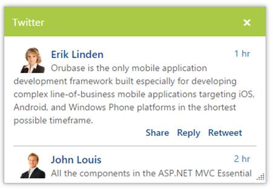

# AJAX Content

The Dialog provides AJAX content support where you can add the HTML content to the Dialog content. 

## Configure AJAX Content

The following steps explains how to implement AJAX content in the Dialog control. 

In the ASPX page, add the Dialog control and set the ContentUrl from the file reference and set ContentType as ajax.



    <ej:Dialog ID="ajaxdialog" runat="server" ContentUrl="Content/twitter.html" ContentType="ajax" Title="Twitter">        

    </ej:Dialog>



Content in the twitter.html.



<!DOCTYPE html>

<html xmlns="http://www.w3.org/1999/xhtml">

<head>

    <title></title>

    

</head>

<body>

    

        

            

                

                
1 hr

                <b class="headername">Erik Linden</b> 

                Orubase is the only mobile application development framework built especially for developing complex line-of-business mobile applications targeting iOS, Android, and Windows Phone platforms in the shortest possible timeframe. 

                

                    
Retweet

                    
Reply

                    
Share

                

            

            

                

                
2 hr

                <b class="headername">John Louis</b> 

                All the components in the ASP.NET MVC Essential Studio have been built from the ground up with performance in mind and are extremely lightweight.

                 

                     
Retweet

                     
Reply

                     
Share

                 

            

        

    

</body>

</html>



The output of Dialog with AJAX content.

 

