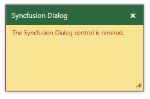

# Appearance and Styling 

## Theme

The Dialog control’s style and appearance can be controlled based on CSS classes. In order to apply the styles to the Dialog control, refer to the files, ej.widgets.core.min.css and ej.theme.min.css. When the file ej.widgets.all.min.css is referred, it is not necessary to include the files ej.widgets.core.min.css and ej.theme.min.css in your project, as ej.widgets.all.min.css is the combination of these two files. 

By default, there are 13 themes available for the Dialog control,

* default-theme
* bootstrap
* flat-azure-dark
* fat-lime
* flat-lime-dark
* flat-saffron
* flat-saffron-dark
* gradient-azure
* gradient-azure-dark
* gradient-lime
* gradient-lime-dark
* gradient-saffron
* gradient-saffron-dark

## CSS Class

The CSS properties can be customized by using CSS Class in the Dialog control. The following steps explain the implementation of CSS Class option in the Dialog control.

In the ASPX page, add the Dialog control and assign the CssClass property from the custom class.



    <ej:Dialog ID="dialog" runat="server" Width="300" Height="200" Title="Syncfusion Dialog" CssClass="customCss">

        <DialogContent>

            

                The Syncfusion Dialog control is rendered.

            

        </DialogContent>

    </ej:Dialog> 



Customize the CSS class by setting CSS properties. 



           .customCss {            

            border-color: #661e19 !important;

        }

        /*Customizes the dialog header*/

        .customCss .e-header {

            background-color: #2c683b;

        }	

        /*Customizes the dialog content*/

        .customCss .e-dialog, .customCss .e-dialog-scroller {

          color: #b21010;

          background-color: #f6e492;        

         }



The output of Dialog control after customizing the CssClass.

 

