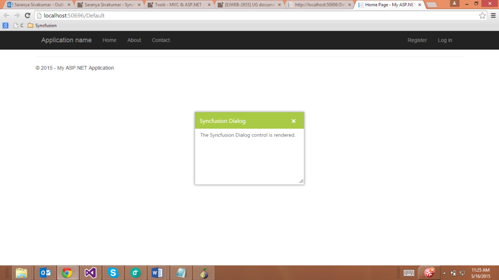
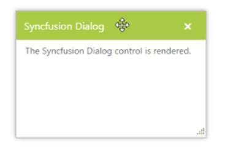
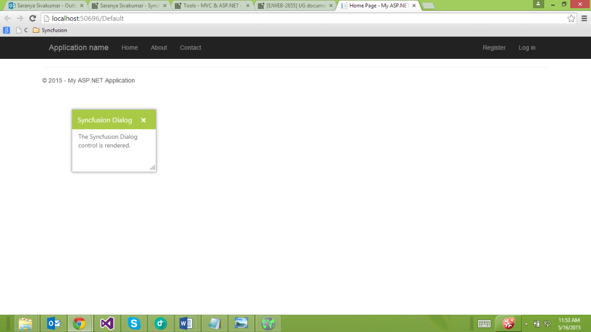
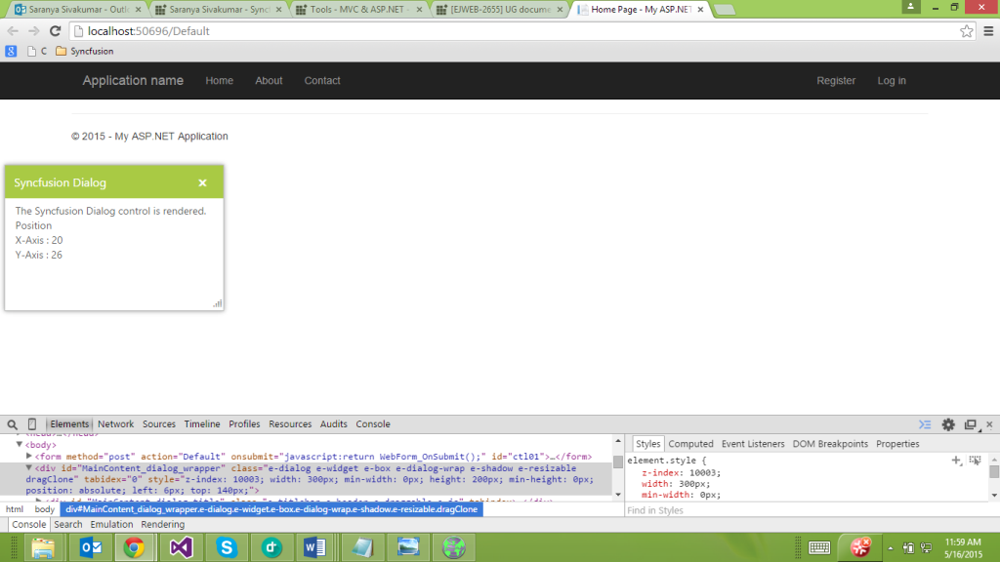
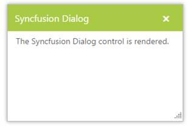

# Behavior Settings 

## Resize Support

The Dialog control can be resized by using this feature. You can resize the Dialog by dragging the bottom right corner area. EnableResize accepts Boolean value. 

### Enable Resize Option

The following steps explain the implementation of resize option in the Dialog control. 

In the ASPX page, add the Dialog control and set the EnableResize as true. 



<ej:Dialog ID="dialog" runat="server" Width="300" Height="200" EnableResize="true" Title="Syncfusion Dialog">

    <DialogContent>       

        

            The Syncfusion Dialog control is rendered.

        

    </DialogContent>

</ej:Dialog>



The output of the Dialog control when EnableResize is true.                                  

 

## Drag Support

The Dialog control supports the drag function. You can click the Dialog header and drag the control anywhere in the web page.

### Allow Drag Option

The following steps explain the implementation of drag option in the Dialog control. 

In the ASPX page, add the Dialog control and set the AllowDraggable to true. 



<ej:Dialog ID="dialog" runat="server" Width="300" Height="200" AllowDraggable="true" Title="Syncfusion Dialog">

    <DialogContent>       

        

            The Syncfusion Dialog control is rendered.

        

    </DialogContent>

</ej:Dialog>



The output of Dialog control when AllowDraggable is true.                                         

 

## Close Icon ToolTip Support

You can change the close icon ToolTip in the Dialog control by using the CloseIconTooltip property. The default value for CloseIconTooltip is close.

### Define Close Icon ToolTip

The following steps explain how to implement close icon ToolTip option in the Dialog control. 

In the ASPX page, add the Dialog control and set the CloseIconTooltip value as close.



<ej:Dialog ID="dialog" runat="server" Width="300" Height="200" CloseIconTooltip="close" Title="Syncfusion Dialog">

    <DialogContent>       

        

            The Syncfusion Dialog control is rendered.

        

    </DialogContent>

</ej:Dialog>



The output of Dialog control when CloseIconTooltip is close.

 

## Persistence Support

The Dialog control supports state maintenance where you can maintain the state of the Dialog control in the web page. The default value for EnablePersistence is false.

## Enable Persistence Option

The following steps explain the implementation of persistence support in the Dialog control. 

In the ASPX page, add the Dialog control and set the EnablePersistence as true.



<ej:Dialog ID="dialog" runat="server" Width="300" Height="200" EnablePersistence="true" Title="Syncfusion Dialog">

    <DialogContent>       

        

            The Syncfusion Dialog control is rendered.

        

    </DialogContent>

</ej:Dialog>



You can resize and reload the web page. The state is maintained in the Dialog control. The following is the output when EnablePersistence is true. 

 

## Enabled or Disabled

The Dialog control supports enabled and disabled options that allow you to enable or disable the Dialog control in the web page.

### Enable Dialog Control

The following steps explain how to implement the enable option in the Dialog control. 

In the ASPX page, add the Dialog control and set Enabled to true.



<ej:Dialog ID="dialog" runat="server" Width="300" Height="200" Enabled="true" Title="Syncfusion Dialog">

    <DialogContent>       

        

            The Syncfusion Dialog control is rendered.

        

    </DialogContent>

</ej:Dialog>



The output of the Dialog control when Enabled is true.          

 

### Disable Dialog Control

The following steps explain the implementation of disable option in the Dialog control. 

In the ASPX page, add the Dialog control and set Enabled to false.



<ej:Dialog ID="dialog" runat="server" Width="300" Height="200" Enabled="false" Title="Syncfusion Dialog">

    <DialogContent>       

        

            The Syncfusion Dialog control is rendered.

        

    </DialogContent>

</ej:Dialog>



The following is the output when Enabled is set to false.            

 

## Dialog Position

The Dialog provides the option to place the control based on its X axis and Y axis positions in the web page. The following steps explain how to position the Dialog.

In the ASPX page, add the Dialog control and set Position values.



    <ej:Dialog ID="dialog" runat="server" Width="300" Height="200" Title="Syncfusion Dialog">

<Position XValue="20" YValue="26" />

        <DialogContent>

            

                The Syncfusion Dialog control is rendered. 

                Position

               

                X-Axis : 20

               

                Y-Axis : 26

            

        </DialogContent>

    </ej:Dialog>



The output of the Dialog control after setting X axis and Y axis values.

 

## Header Option

You can show or hide the Dialog header by setting the ShowHeader property. The following steps explains how to set the header option.

### Show Header

In the ASPX page, add the Dialog control and set the ShowHeader to true.



    <ej:Dialog ID="dialog" runat="server" Width="300" Height="200" ShowHeader="true" Title="Syncfusion Dialog">

        <DialogContent>

            

                The Syncfusion Dialog control is rendered.               

            

        </DialogContent>

    </ej:Dialog>



The following screenshot displays the Dialog control when ShowHeader is true.

 

### Hide Header

In the ASPX page, add the Dialog control and set the ShowHeader to false.



    <ej:Dialog ID="dialog" runat="server" Width="300" Height="200" ShowHeader="false" Title="Syncfusion Dialog">

        <DialogContent>

            

                The Syncfusion Dialog control is rendered.               

            

        </DialogContent>

    </ej:Dialog>



The following screenshot displays the Dialog control when ShowHeader is set to false.

 

## Show at Initial

The Dialog control contains an option to be visible or hidden at initialization. The default value for ShowOnInit is true. Setting it to false hides the dialog control at initialization.

In the ASPX page, add the Dialog control and set the ShowOnInit to true.



    <ej:Dialog ID="dialog" runat="server" Width="300" Height="200" ShowOnInit="true" Title="Syncfusion Dialog">

        <DialogContent>

            

                The Syncfusion Dialog control is rendered.               

            

        </DialogContent>

    </ej:Dialog>



The output when ShowOnInit is set to true.

 

## Rounded Corner Support

The Dialog supports rounded corners. The default value for ShowRoundedCorner is false. 

In the ASPX page, add the Dialog control and set the ShowRoundedCorner to true.



    <ej:Dialog ID="dialog" runat="server" Width="300" Height="200" ShowRoundedCorner="true" Title="Syncfusion Dialog">

        <DialogContent>

            

                The Syncfusion Dialog control is rendered.               

            

        </DialogContent>

    </ej:Dialog>



The output of Dialog control when ShowRoundedCorner is true.

 

