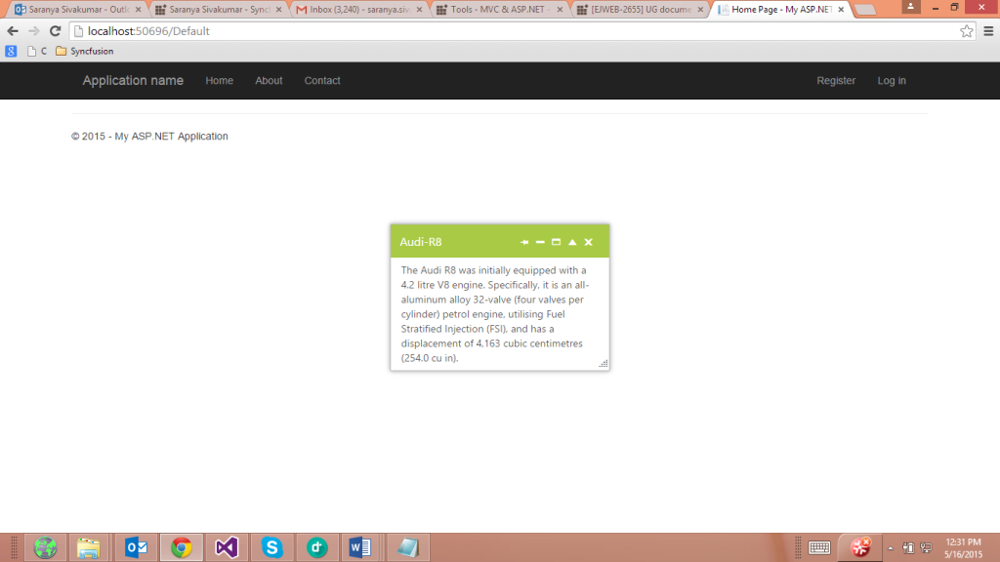

# Custom Action Support

The Dialog provides custom action buttons such as close, collapsible, maximize, minimize, and pin. You can set the action buttons as per your requirement in the Dialog.

## Configure Custom Action

The following steps show how to implement custom action. 

In the ASPX page, add the Dialog control and assign the ActionButtons value.



    <ej:Dialog ID="customaction" runat="server" Width="300" Title="Audi-R8" ActionButtons="close,collapsible,maximize,minimize,pin">

        <DialogContent>

            

                The Audi R8 was initially equipped with a 4.2 litre V8 engine. Specifically, it is an all-aluminum alloy 32-valve (four valves per cylinder) petrol engine, utilising Fuel Stratified Injection (FSI), and has a displacement of 4,163 cubic centimetres (254.0 cu in).

            

        </DialogContent>

    </ej:Dialog> 



The following is the output of ActionButtons in Dialog control.

