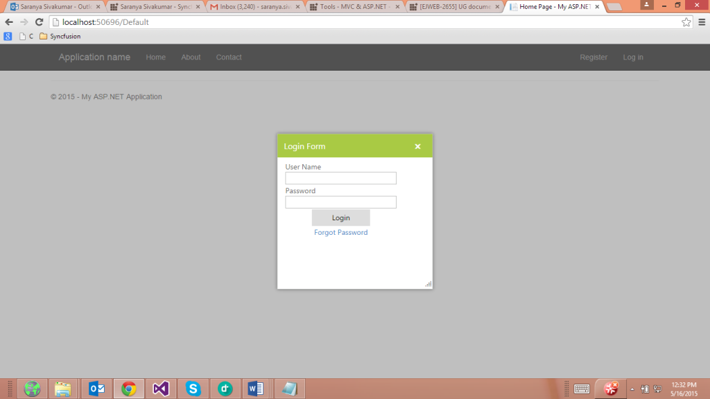

# Model Dialog Support

The Model Dialog is like an alert window that disables the main window and allows exploration of its content to interact with others. 

## Configure Modal Dialog

The following steps explain how to implement Model Dialog. 

In the ASPX page, add the Dialog control and set the EnableModel to true.



    <ej:Dialog ID="loginform" runat="server" Width="300" Height="300" Title="Login Form" EnableModal="true">

        <DialogContent>

            

                <table>

                    <tr>

                        <td>User Name

                  <input type="text" id="txtName" class="ejinputtext" style="width: 100%" />

                        </td>

                    </tr>

                    <tr>

                        <td>Password

                  <input type="text" id="Text1" class="ejinputtext" style="width: 100%" />

                        </td>

                    </tr>

                    <tr>

                        <td align="center">

                            <input type="button" id="downloadBtn" value="Login" class="e-btn" style="width: 100px; height: 30px" />

                        </td>

                    </tr>

                    <tr>

                        <td align="center">

                            <a href="#">Forgot Password</a>

                        </td>

                    </tr>

                </table>

            

        </DialogContent>

    </ej:Dialog>



The following screenshot displays Model Dialog control.                                     

 

