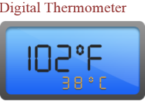
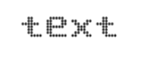
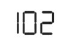
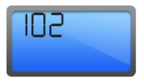
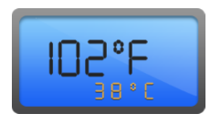

# Getting Started

* The ASP.NET Digital Gauge provides support to display the Digital gauge within your web page and allows you to customize it. This section encompasses the details on how to configure Digital Gauge. Here you will learn how to provide data for a Digital Gauge and display the data in the required way. 
* In addition, you will learn how to customize the default Digital gauge appearance to your requirements. As a result, you will get a Digital Gauge that shows like a Digital thermometer. 
* You can use this Digital Gauge in advertisement, decorative purpose, displaying share details in share market, game score boards, token systems, etc.

 

Digital Thermometer
{:.caption} 

## Creating a Digital Gauge

ASP.NET Digital Gauge widget basically renders flexible API’s. You can easily create the Digital Gauge widget by using simple code example as follows.

1. First create a ASP.NET Project and add necessary Dll’s and Scripts with the help of the given ASP.NET-Getting Started Documentation.
2. Configure web.config files for assemblies

   * The following assemblies references are added properly in web.config file.  

   ~~~ html	
	
		<compilation debug="true" targetFramework="4.5">
		
			<assemblies>
			
				<add assembly="Syncfusion.EJ.Web, Version=12.2450.0.36, Culture=neutral, PublicKeyToken=3d67ed1f87d44c89"/>
				
				<add assembly="Syncfusion.EJ, Version=12.2450.0.36, Culture=neutral, PublicKeyToken=3d67ed1f87d44c89"/>
				
			</assemblies>
			
		</compilation>	
		
		<httpRuntime targetFramework="4.5" />
		
		<pages> 
		
			<controls>
			
				<add namespace="Syncfusion.JavaScript.Web" assembly="Syncfusion.EJ.Web, Version=12.2450.0.36, Culture=neutral, PublicKeyToken=3d67ed1f87d44c89" tagPrefix="ej"/>
				
				<add namespace="Syncfusion.JavaScript.Web" assembly="Syncfusion.EJ, Version=12.2450.0.36, Culture=neutral, PublicKeyToken=3d67ed1f87d44c89" tagPrefix="ej"/>
				
				<add  namespace="Syncfusion.JavaScript.DataVisualization.Models" assembly="Syncfusion.EJ" tagPrefix="ej"/>
				
			</controls>
			
		</pages>	
		
   ~~~

3. Adding Script Reference,
    
By default, Syncfusion JavaScript source files has been included into the EJ.Web assembly as an embedded source. So we no need to refer jQuery and Syncfusion scripts externally. For debugging purpose want to refer script files externally, set false to **LoadEJResourcesFromAssembly** in Web.config file as shows in the below image and refer jQuery and Syncfusion script files.



    <!--  jquery script  -->
    

    <!-- Essential JS UI widget -->
    



N> If you are using the Essential Studio below 13.4.0.53 version, then you need to refer **jQuery.globalize.js** script file along with the above references to render the digital gauge control.

4. Add the mentioned code to the corresponding view page to render Digital Gauge .
   


<ej:DigitalGauge runat="server" ID="digital"></ej:DigitalGauge>



Run the above code example and you will get a default Digital Gauge as follows.

Digital gauge
{:.caption} 

## Set Height and Width values

Basic attributes of each canvas elements are height and width. You can set the height and width of the gauge. 

### Code:



<ej:DigitalGauge runat="server" ID="digital" Height="145" Width="260"></ej:DigitalGauge>



Run the above code example and you will see a default gauge with the specified height and width values.

 
 
Digital gauge with height and width
{:.caption} 

## Set Items Property

Items have different properties to customize the Digital Gauge.

### Adding Segment and Character Properties

* In the welcome board, the text color is attentive in nature. You are required to give some segment properties such as segment spacing, segment width, segment color, segment length and segment opacity.
* Character type is used to define the Digital representation of the character. The five types of character representation available are,
  
  1. EightCrossEightDotMatrix
  2. SevenSegment
  3. FourteenSegment
  4. SixteenSegment 
  5. EightCrossEightSquareMatrix.

#### Code:



<ej:DigitalGauge runat="server" ID="digital" Height="145" Width="260">

<Items>

<ej:DigitalGaugeItems Value="102">

<SegmentSettings Length="20" Width="2"/>

<CharacterSettings Spacing="12" Type="SevenSegment" />

</ej:DigitalGaugeItems>

</Items>

</ej:DigitalGauge>



Execute this code to render a gauge as follows.

Digital gauge segment properties
{:.caption} 

### Adding Background Image

* Add a div element to set the background for the Digital gauge.
* Add a style tag in the View page to display the background image for the Digital gauge. 
* Add the required properties such as position, margin, display, etc, to enhance the look of the background image.

I> The background image path is given in background-image URL.

#### Code:



<ej:DigitalGauge runat="server" ID="digital" Height="145" Width="260">

<Items>

<ej:DigitalGaugeItems Value="102">

<SegmentSettings Length="20" Width="2"/>

<CharacterSettings Spacing="12" Type="SevenSegment" />

</ej:DigitalGaugeItems>

</Items>

</ej:DigitalGauge>



Execute this code to render a gauge as follows.

Digital gauge Background image
{:.caption} 

### Adding Location

Position property is used to positioning the digital letters inside the canvas element.

#### Code:



<ej:DigitalGauge runat="server" ID="digital" Height="145" Width="260">

<Items>

<ej:DigitalGaugeItems Value="102">

<SegmentSettings Length="20" Width="2"/>

<CharacterSettings Spacing="12" Type="SevenSegment" />

<Position X="15" Y="40"/>

</ej:DigitalGaugeItems>

</Items>

</ej:DigitalGauge>



Execute this code to render a Gauge as follows.

Digital gauge with segment location
{:.caption} 

### Adding the Items collection 

Similarly adding the further item collection will display the temperature value as in the Digital thermometer value.

#### Code:



<ej:DigitalGauge runat="server" ID="digital" Height="145" Width="260">

<Items>

<ej:DigitalGaugeItems Value="102">

<SegmentSettings Length="20" Width="2"/>

<CharacterSettings Spacing="12" Type="SevenSegment" />

<Position X="15" Y="40"/>

</ej:DigitalGaugeItems>

<ej:DigitalGaugeItems Value="0">

<SegmentSettings Length="5" Width="2"/>

<CharacterSettings Spacing="12" Type="SevenSegment" />

<Position X="85" Y="28"/>

</ej:DigitalGaugeItems>

<ej:DigitalGaugeItems Value="F">

<SegmentSettings Length="20" Width="2"/>

<CharacterSettings Spacing="12" Type="SevenSegment" />

<Position X="170" Y="40"/>

</ej:DigitalGaugeItems>

<ej:DigitalGaugeItems Value="38">

<SegmentSettings Length="9" Width="1" Color="#f5b43f"/>

<CharacterSettings Spacing="12" Type="SevenSegment" />

<Position X="70" Y="90"/>

</ej:DigitalGaugeItems>

<ej:DigitalGaugeItems Value="0">

<SegmentSettings Length="3" Width="1" Color="#f5b43f"/>

<CharacterSettings Spacing="12" Type="SevenSegment" />

<Position X="90" Y="80"/>

</ej:DigitalGaugeItems>

<ej:DigitalGaugeItems Value="c">

<SegmentSettings Length="9" Width="1" Color="#f5b43f"/>

<CharacterSettings Spacing="12" Type="SevenSegment" />

<Position X="120" Y="90"/>

</ej:DigitalGaugeItems>

</Items>

</ej:DigitalGauge>



Execute this code to render a Digital thermometer as follows.

Digital gauge with item collection
{:.caption} 

