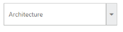
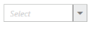
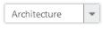

# Adjusting Dropdown size

## Width

DropDownList widget provides support to customize the dimensions of the DropDown textbox. By using the Width property, you can set the width of the DropDown textbox. Its data type is string.

## Height

DropDownList widget provides support to customize the dimensions of the DropDown textbox. By using the Height property, you can set the height of the DropDown textbox. Its data type is string.

## Defining the DropDown size properties

The following step explains the configuration of Height and Width properties in the DropDownList.

In an ASPX page, add an element to configure the DropDownList.



    <ej:DropDownList ID="dropdownlist" TargetID="list" Width="250px" Height="50px" runat="server">

    </ej:DropDownList>

    

        <ul>

            <li>Art</li>

            <li>Architecture</li>

            <li>Biography</li>

            <li>Comics</li>

            <li>Sports</li>

            <li>Science</li>

        </ul>

    



Output of the above step.

## Water Mark 

DropDownList widget provides the support to water mark of the DropDown textbox. The WaterMarkText defines the text displayed on a page load. Its data type is string.

### Defining the Water Mark property

The following step explains the configuration of WaterMarkText properties in the DropDownList. 

In an ASPX page, add an element to configure the DropDownList.



    <ej:DropDownList ID="dropdownlist" Width="200px" TargetID="list" WatermarkText="Select" runat="server">

    </ej:DropDownList>

    

        <ul>

            <li>Art</li>

            <li>Architecture</li>

            <li>Biography</li>

            <li>Comics</li>

            <li>Sports</li>

            <li>Science</li>

        </ul>

    



Output of the above step.

  

## Enabling Rounded corner

DropDownList widget provides support to change the appearance of DropDown textbox. By using the ShowRoundedCorner, you can create a rounded corner on the DropDown textbox. Its data type is Boolean.

The following step explains the configuration of Rounded corner of the DropDownList

In an ASPX page, add an element to configure the DropDownList.



    <ej:DropDownList ID="dropdownlist" Width="200px" TargetID="list" ShowRoundedCorner="true" runat="server">

    </ej:DropDownList>

    

        <ul>

            <li>Art</li>

            <li>Architecture</li>

            <li>Biography</li>

            <li>Comics</li>

            <li>Sports</li>

            <li>Science</li>

        </ul>

    



Output of the above step.

