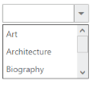
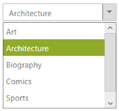
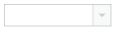
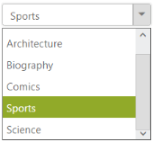
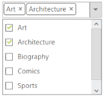
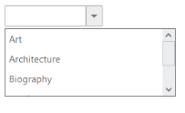

# Behaviour Settings

The following are some miscellaneous properties that help you to change the behaviour of the DropDownList control. 

## Target ID

You can append a list with DropDown textbox by using the TargetID property. You need to define a <ul>, < li> tags that you want to show on DropDownList and then set the id of parent <ul> tag to the TargetID property. Its data type is string. 

The following step explains the configuration of the TargetID property in the DropDownList. 

In an ASPX page, add an element to configure the DropDownList.



    <ej:DropDownList ID="dropdownlist" Width="200px" TargetID="list" runat="server">

    </ej:DropDownList>

    

        <ul>

            <li>Art</li>

            <li>Architecture</li>

            <li>Biography</li>

            <li>Comics</li>

            <li>Sports</li>

            <li>Science</li>

        </ul>

    



## Number of items in the list

DropDown widget provides you support to customize the items visible on popup visible. The ItemsCount property defines the number of items displayed on the DropDownList. Its data type is number.

The following step explains the configuration of the ItemsCount property in the DropDownList.

In an ASPX page, add an element to configure the DropDownList.



    <ej:DropDownList ID="dropdownlist" TargetID="list" Width="200px" ItemsCount="3" runat="server">

    </ej:DropDownList>

    

        <ul>

            <li>Art</li>

            <li>Architecture</li>

            <li>Biography</li>

            <li>Comics</li>

            <li>Sports</li>

            <li>Science</li>

        </ul>

    



Output of the above step.

## Select the value by index 

DropDown widget provides you support to select an item by mentioning the index of the item. The SelectedItemIndex property helps you to select the particular item from the list. Its date type is number. 

The following step explains the configuration of the SelectedItemIndex property in the DropDownList.

In an ASPX page, add an element to configure the DropDownList.



  
      

     <ej:DropDownList ID="dropdownlist" TargetID="list" Width="200px" SelectedItemIndex="1" runat="server"></ej:DropDownList              

   

            <ul>

                <li>Art</li>

                <li>Architecture</li>

                <li>Biography</li>

                <li>Comics</li>

                <li>Sports</li>

                <li>Science</li>

            </ul>

        
    



Output of the above step.

 

## Show Popup on load

You can display the popup panel when page loads itself by using the ShowPopupOnLoad property. Its data type is Boolean. 

The following step explains the configuration of the ShowPopupOnLoad property in the DropDownList.

In an ASPX page, add an element to configure the DropDownList widget.



    <ej:DropDownList ID="dropdownlist" TargetID="list" Width="200px" ShowPopupOnLoad="true" runat="server">

    </ej:DropDownList>

    

        <ul>

            <li>Art</li>

            <li>Architecture</li>

            <li>Biography</li>

            <li>Comics</li>

            <li>Sports</li>

            <li>Science</li>

        </ul>

    



## Multiple selection through index 

You can select the list of items from the DropDownList by using the selectedItems property. Its data type is array. To achieve this, set true to Checkbox property in the DropDownList. 

The following step explains the configuration of the SelectedItems property in the DropDownList.

In an ASPX page, add an element to configure the DropDownList.



    <ej:DropDownList ID="dropdownlist" TargetID="list" Width="200px" ShowCheckbox="true" runat="server">

    </ej:DropDownList>

    

        <ul>

            <li>Art</li>

            <li>Architecture</li>

            <li>Biography</li>

            <li>Comics</li>

            <li>Sports</li>

            <li>Science</li>

        </ul>

    





protected void Page_Load(object sender, EventArgs e)

        {

            List<int> list = new List<int>();

            list.Add(0);

            list.Add(1);

            dropdownlist.SelectedItems = list; 

          }



Output of the above step.

## Read-only

This feature supports to make the DropDown as readable. You can make the DropDown as editable or non-editable by setting Boolean type value to the ReadOnly property.

The following step explains the configuration of the ReadOnly property in the DropDownList. 

In an ASPX page, add an element to configure the DropDownList.



    <ej:DropDownList ID="dropdownlist" TargetID="list" Width="200px" ReadOnly="true"

        runat="server">

    </ej:DropDownList>

    

        <ul>

            <li>Art</li>

            <li>Architecture</li>

            <li>Biography</li>

            <li>Comics</li>

            <li>Sports</li>

            <li>Science</li>

        </ul>

    



## Enable or Disable the Dropdown Widget

This feature enables you to set the enable or disable options for DropDown by setting Boolean type value to Enabled property. 

The following step explains the configuration of the Enabled property in the DropDownList.

In an ASPX page, add an element to configure the DropDownList.



    <ej:DropDownList ID="dropdownlist" TargetID="list" Enabled="false" Width="200px"

        runat="server">

    </ej:DropDownList>

    

        <ul>

            <li>Art</li>

            <li>Architecture</li>

            <li>Biography</li>

            <li>Comics</li>

            <li>Sports</li>

            <li>Science</li>

        </ul>

    



Output of the above step. 

## Persistence support 

This feature enables you to save current model value to browser cookies for state maintainence. When you refresh the DropDownList control page, it retains the model value applied from browser cookies. The date type of the EnablePersistence is Boolean type. 

The following step explains the configuration of the EnablePersistence property in the DropDownList.

In an ASPX page, add an element to configure the DropDownList.



    <ej:DropDownList ID="dropdownlist" TargetID="list" EnablePersistence="true" Width="200px"

        runat="server">

    </ej:DropDownList>

    

        <ul>

            <li>Art</li>

            <li>Architecture</li>

            <li>Biography</li>

            <li>Comics</li>

            <li>Sports</li>

            <li>Science</li>

        </ul>

    



## Search Options 

### Incremental Search 

This feature provides support to DropDownList with a search option that enables the search options by quick typing in the textbox when popup is displayed. In case, when the matched options are not available in the list, it automatically selects the last one in the list.  The data type of the EnbleIncrementalSearch is Boolean type.

### Case-Sensitive Search 

This feature provides support to search option with case sensitive. To achieve this, you need to enable the incremental search on DropDown and the data type of the CaseSensitiveSearch is Boolean type. 

### Define the Incremental Search with Case-Sensitive 

The following step explains the configuration of search options in the DropDownList.

In an ASPX page, add an element to configure the DropDownList.



    <ej:DropDownList ID="dropdownlist" TargetID="list" Width="200px" EnableIncrementalSearch="true" CaseSensitiveSearch="false" ShowRoundedCorner="true" runat="server">

    </ej:DropDownList>

    

        <ul>

            <li>Art</li>

            <li>Architecture</li>

            <li>Biography</li>

            <li>Comics</li>

            <li>Sports</li>

            <li>Science</li>

        </ul>

    



Output of the above step.

## Checkbox Support

### Show Checkbox 

You can enable the checkbox in the DropDownList with this property. The data type of the ShowCheckbox value is Boolean type. It maintains multiple selections and gets the checked items on its DropDown client-side events.  

### Check All 

You can check all the check boxes in the list by using this property. The data type of CheckAll needs to be in Boolean type. To achieve this, you need to set the ShowCheckbox property to true

### Uncheck All

You can uncheck all the check boxes in the list by using this property. The data type of UncheckAll is Boolean type. To achieve this, set the ShowCheckbox property to true.

### Defining the Checkbox support

The following step explains the configuration of checkbox options in the DropDownList.

In an ASPX page, add an element to configure the DropDownList.



    <ej:DropDownList ID="dropdownlist" TargetID="list" Width="200px" ShowCheckbox="true" CheckAll="true" runat="server">

    </ej:DropDownList>

    

        <ul>

            <li>Art</li>

            <li>Architecture</li>

            <li>Biography</li>

            <li>Comics</li>

            <li>Sports</li>

            <li>Science</li>

        </ul>

    



Output of the above step.

 

## MultiSelection modes

DropDownList widget allows you to select multiple values from the suggestion list using AllowMultiSelection property. You can select multiple values by setting allowMultiSelection value to true.

### Configuring MultiSelection Mode

The following steps explain the configuration of the AllowMultiSelection for a DropDownList textbox.

In an ASPX page, add an element to configure the DropDownList.



    <ej:DropDownList ID="dropdownlist" TargetID="list" AllowMultiSelection="true" Width="200px" ShowCheckbox="true" runat="server">

    </ej:DropDownList>

    

        <ul>

            <li>Art</li>

            <li>Architecture</li>

            <li>Biography</li>

            <li>Comics</li>

            <li>Sports</li>

            <li>Science</li>

        </ul>

    



Output for DropDown control that provides multiple selection is as follows.

## Appearance and Styling

### Popup Customization  

Popup Height

DropDownList widget provides support to customize the dimensions of the DropDown popup. By using the PopupHeight property, you can set the height of the popup list. Its data type is string. 

Popup Width

DropDownList widget provides support to customize the dimensions of the DropDown popup. By using the PopupWidth property, you can set the width of the popup list. Its data type is string. 

Defining the popup customizing properties

The following step explains the configuration of the PopupHeight and PopupWidth properties in the DropDownList

In an ASPX page, add an element to configure the DropDownList widget.



    <ej:DropDownList ID="dropdownlist" TargetID="list" PopupHeight="100px" PopupWidth="250px" runat="server">

    </ej:DropDownList>

    

        <ul>

            <li>Art</li>

            <li>Architecture</li>

            <li>Biography</li>

            <li>Comics</li>

            <li>Sports</li>

        </ul>

    



Output of the above step.

 

