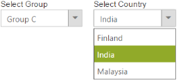
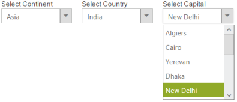

# Cascading Support 

By using the cascade option, you can create behaviour of cascade between DropDown list controls. For this, you need to create database with a single field as common between two DropDown data fields and then mention that column id in field. With this, you need to set second DropDown id in the CascadeTo property in a first one. 

> _Note: In case the second DropDown is disabled, until the first one is selected, you need to set enable property to false in a second DropDown that enables automatically once the value is selected in a first one._ 

The following step explains the behaviour of cascade DropDown. 

In an ASPX page, add an element to configure the DropDownList.



    Select Group

    <ej:DropDownList ID="groupsList" runat="server" DataValueField="parentId" CascadeTo="MainContent_countryList">

    </ej:DropDownList>

    Select Country

    <ej:DropDownList ID="countryList" runat="server">

    </ej:DropDownList>





protected void Page_Load(object sender, EventArgs e)

    {

        List<GroupsList> groups = new List<GroupsList>();

        groups.Add(new GroupsList("a", "Group A"));

        groups.Add(new GroupsList("b", "Group B"));

        groups.Add(new GroupsList("c", "Group C"));

        groups.Add(new GroupsList("d", "Group D"));

        groups.Add(new GroupsList("e", "Group E"));

        this.groupsList.DataSource = groups;

        List<CountryList> countries = new List<CountryList>();

        countries.Add(new CountryList(11, "a", "Algeria", "flag-dz"));

        countries.Add(new CountryList(12, "a", "Armenia", "flag-am"));

        countries.Add(new CountryList(13, "a", "Bangladesh", "flag-bd"));

        countries.Add(new CountryList(14, "a", "Cuba", "flag-cu"));

        countries.Add(new CountryList(15, "b", "Denmark", "flag-dk"));

        countries.Add(new CountryList(16, "b", "Egypt", "flag-eg"));

        countries.Add(new CountryList(17, "c", "Finland", "flag-fi"));

        countries.Add(new CountryList(18, "c", "India", "flag-in"));

        countries.Add(new CountryList(19, "c", "Malaysia", "flag-my"));

        countries.Add(new CountryList(20, "d", "New Zealand", "flag-nz"));

        countries.Add(new CountryList(21, "d", "Norway", "flag-no"));

        countries.Add(new CountryList(22, "d", "Poland", "flag-pl"));

        countries.Add(new CountryList(23, "e", "Romania", "flag-ro"));

        countries.Add(new CountryList(24, "e", "Singapore", "flag-sg"));

        countries.Add(new CountryList(25, "e", "Thailand", "flag-th"));

        countries.Add(new CountryList(26, "e", "Ukraine", "flag-ua"));

        this.countryList.DataSource = countries;

    }

    [Serializable]

    class CountryList

    {

        public int value;

        public string parentId;

        public string text;

        public string sprite;

        public CountryList(int cvalue, string cid, string ctext, string sprt)

        {

            this.value = cvalue;

            this.parentId = cid;

            this.text = ctext;

            this.sprite = sprt;

        }

    }

    [Serializable]

    class GroupsList

    {

        public string parentId;

        public string text;

        public GroupsList(string gID, string gtext)

        {

            this.parentId = gID;

            this.text = gtext;

        }

    }



Output of the above step.

{:.image }

## Multiple Cascading support

By using multi cascade option, you can create a behavior of cascade between the DropDownList controls. To achieve this, map the common field from table to “Fields” property of all the DropDownLists. Also, specify the ID of the cascading DropDownList in “CascadeTo” property of the parent DropDownList. 

> _Note: In case, when you want to show the cascading DropDowns in disabled state initially, then set the value of enable property as false in each cascading DropDowns. It is then enabled automatically once a value is selected in parent (first) DropDown list._

The following step explains the behavior of multiple cascade DropDown.

In an ASPX page, add an element to configure the DropDownList.



<asp:Content ID="Content1" runat="server" ContentPlaceHolderID="MainContent">

    

        Select Continent

        <ej:DropDownList ID="groupsList" runat="server" DataValueField="parentId">

        </ej:DropDownList>

    

    

        Select Country

        <ej:DropDownList ID="countryList" runat="server">

        </ej:DropDownList>

    

    

        Select Capital

        <ej:DropDownList ID="capitalList" runat="server">

        </ej:DropDownList>

    

</asp:Content>





protected void Page_Load(object sender, EventArgs e)

    {

        List<string> cascade = new List<string> { "countryList", "capitalList" };

        List<GroupsList> groups = new List<GroupsList>();

        groups.Add(new GroupsList("a", "Africa"));

        groups.Add(new GroupsList("b", "Asia"));

        groups.Add(new GroupsList("c", "Europe"));

        groups.Add(new GroupsList("d", "North America"));

        groups.Add(new GroupsList("e", "South America"));

        groups.Add(new GroupsList("f", "Oceania"));

        groups.Add(new GroupsList("g", "Antarctica"));

        this.groupsList.DataSource = groups;

        this.groupsList.CascadeTo = "MainContent_countryList,MainContent_capitalist";

        List<CountryList> countries = new List<CountryList>();

        countries.Add(new CountryList(11, "a", "Algeria"));

        countries.Add(new CountryList(12, "a", "Egypt"));

        countries.Add(new CountryList(13, "b", "Armenia"));

        countries.Add(new CountryList(14, "b", "Bangladesh"));

        countries.Add(new CountryList(15, "b", "India"));

        countries.Add(new CountryList(16, "c", "Denmark"));

        countries.Add(new CountryList(17, "c", "Finland"));

        countries.Add(new CountryList(18, "d", "Cuba"));

        countries.Add(new CountryList(19, "d", "USA"));

        countries.Add(new CountryList(20, "e", "Brazil"));

        countries.Add(new CountryList(21, "e", "Peru"));

        countries.Add(new CountryList(22, "f", "Australia"));

        countries.Add(new CountryList(23, "f", "New Zealand"));

        countries.Add(new CountryList(24, "g", "French Southern"));

        countries.Add(new CountryList(25, "g", "South Georgia"));

        this.countryList.DataSource = countries;

        List<CountryList> capital = new List<CountryList>();

        capital.Add(new CountryList(111, "a", "Algiers"));

        capital.Add(new CountryList(112, "a", "Cairo"));

        capital.Add(new CountryList(113, "b", "Yerevan"));

        capital.Add(new CountryList(114, "b", "Dhaka"));

        capital.Add(new CountryList(115, "b", "New Delhi"));

        capital.Add(new CountryList(116, "c", "Copenhagen"));

        capital.Add(new CountryList(117, "c", "Helsinki"));

        capital.Add(new CountryList(118, "d", "Havana"));

        capital.Add(new CountryList(119, "d", "Washington, D.C."));

        capital.Add(new CountryList(120, "e", "Brasília"));

        capital.Add(new CountryList(121, "e", "Lima"));

        capital.Add(new CountryList(122, "f", "Canberra"));

        capital.Add(new CountryList(123, "f", "Wellington"));

        capital.Add(new CountryList(124, "g", "Alfred Faure"));

        capital.Add(new CountryList(125, "g", "King Edward Point"));

        this.capitalList.DataSource = capital;

    }

    class CountryList

    {

        public int value;

        public string parentId;

        public string text;

        public CountryList(int cvalue, string cid, string ctext)

        {

            this.value = cvalue;

            this.parentId = cid;

            this.text = ctext;

        }

    }

    [Serializable]

    class GroupsList

    {

        public string parentId;

        public string text;

        public GroupsList(string gID, string gtext)

        {

            this.parentId = gID;

            this.text = gtext;

        }

    }



The following screenshot displays the output of the above code example.

{:.image }

