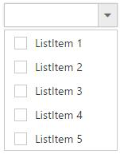
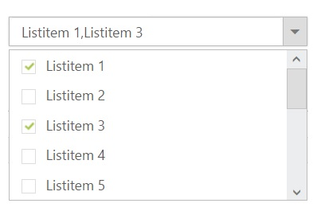
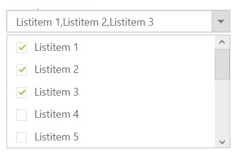
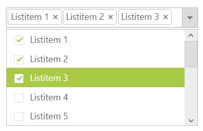

# Checkbox

DropDownList displays checkboxes to the left of each item when you set <b>ShowCheckbox</b> property to true. It allows you to select more than one item at a time from DropDownList. Popup list stays open until the user finishes selection. When you click on an item’s text or checkbox then the checkbox checked status get change.


    
    <ej:DropDownList ID="DropDownList1" runat="server" ShowCheckbox="true">
        <Items>
            <ej:DropDownListItem Text="ListItem 1" Value="item1"></ej:DropDownListItem>
            <ej:DropDownListItem Text="ListItem 2" Value="item2"></ej:DropDownListItem>
            <ej:DropDownListItem Text="ListItem 3" Value="item3"></ej:DropDownListItem>
            <ej:DropDownListItem Text="ListItem 4" Value="item4"></ej:DropDownListItem>
            <ej:DropDownListItem Text="ListItem 5" Value="item5"></ej:DropDownListItem>
        </Items>
    </ej:DropDownList>



N> if you want to showcase the DropDownList with default checked items on data binding, specify Selected field with Boolean values.



	
       
       <ej:DropDownList ID="DropDownList1" runat="server" ShowCheckbox="true" DataTextField="Text" DataValueField="Value" DataSelectedField="Selected"></ej:DropDownList>
	
    
    
    
        protected void Page_Load(object sender, EventArgs e)
        {
            List<Data> DropDownData = new List<Data>();
            DropDownData.Add(new Data { Value = "item1", Text = "ListItem 1", Selected = true });
            DropDownData.Add(new Data { Value = "item2", Text = "ListItem 2", Selected = false });
            DropDownData.Add(new Data { Value = "item3", Text = "ListItem 3", Selected = true });
            DropDownData.Add(new Data { Value = "item4", Text = "ListItem 4", Selected = false });
            DropDownData.Add(new Data { Value = "item5", Text = "ListItem 5", Selected = false });
            DropDownList1.DataSource = DropDownData;
        }
        public class Data
        {
            public string Value { get; set; }
            public string Text { get; set; }
            public bool Selected { get; set; }
        }
    
    


## Selection Modes

The MultiSelectMode property enables you to make multiple selections in the following two ways:

* Delimiter 
* Visual Mode

I> “MultiSelectMode” property accepts **Syncfusion.JavaScript.MultiSelectModeTypes** enum value.

### Delimiter

Each checked item’s text is appended to the textbox with delimiter “,” by default. This is enabled by assigning **Syncfusion.JavaScript.MultiSelectModeTypes.Delimiter** (enum) value to MultiSelectMode property. You can customize the delimiter option by using DelimiterChar property.


    
    <ej:DropDownList ID="DropDownList1" runat="server" MultiSelectMode="Delimiter" DelimiterChar="-">
        <Items>
            <ej:DropDownListItem Text="ListItem 1" Value="item1"></ej:DropDownListItem>
            <ej:DropDownListItem Text="ListItem 2" Value="item2"></ej:DropDownListItem>
            <ej:DropDownListItem Text="ListItem 3" Value="item3"></ej:DropDownListItem>
            <ej:DropDownListItem Text="ListItem 4" Value="item4"></ej:DropDownListItem>
            <ej:DropDownListItem Text="ListItem 5" Value="item5"></ej:DropDownListItem>
        </Items>
    </ej:DropDownList>
    

    

### Visual Mode

When you enable this option in DropDownList control, each checked item’s text is appended to the text box in a box model layout. This is enabled by assigning **Syncfusion.JavaScript.MultiSelectModeTypes.VisualMode** (enum) value to MultiSelectMode property.


    
    <ej:DropDownList ID="DropDownList1" runat="server" MultiSelectMode="VisualMode">
        <Items>
            <ej:DropDownListItem Text="ListItem 1" Value="item1"></ej:DropDownListItem>
            <ej:DropDownListItem Text="ListItem 2" Value="item2"></ej:DropDownListItem>
            <ej:DropDownListItem Text="ListItem 3" Value="item3"></ej:DropDownListItem>
            <ej:DropDownListItem Text="ListItem 4" Value="item4"></ej:DropDownListItem>
            <ej:DropDownListItem Text="ListItem 5" Value="item5"></ej:DropDownListItem>
        </Items>
    </ej:DropDownList>
    


