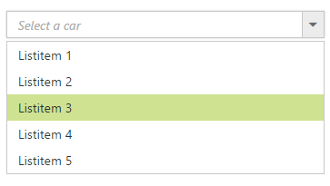
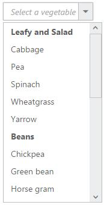
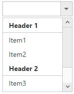
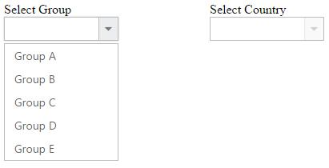
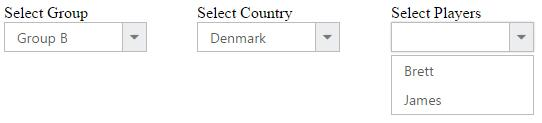

# Functionalities

## Selection

By default only one item can be selected from the popup list. For multiple selection, you have to enable [checkboxes](Checkbox). The selected item consist of active class (“e-active”) to differentiate it from other items.

The following API’s, select the items in the DropDownList via text or value or indices.

<table>
    <tr>
        <th>
            Properties
             
        </th>
        <th>
            Description
             
        </th>
    </tr>
    <tr>
        <td>
            {{'[value](http://help.syncfusion.com/js/api/ejdropdownlist#members:value)'| markdownify }} 
             
        </td>
        <td>
            To select an item initially, you can pass the item’s value via value property.
             
            Multiple items can select via Value property, the given values should be separated by delimiter character.
        </td>
    </tr>
    <tr>
        <td>
            {{'[text](http://help.syncfusion.com/js/api/ejdropdownlist#members:text)'| markdownify }} 
             
        </td>
        <td>
            To select an item initially, you can pass the item’s text via text property.
             
            Multiple items can select via Text property, the given values should be separated by delimiter character.
        </td>
    </tr>
    <tr>
        <td>
            {{'[selectedIndex](http://help.syncfusion.com/js/api/ejdropdownlist#members:selectedindex)'| markdownify }} 
             
        </td>
        <td>
            Select a single item by passing an index value to the selectedIndex property.
             
        </td>
    </tr>
    <tr>
        <td>
             {{'[selectedIndices](http://help.syncfusion.com/js/api/ejdropdownlist#members:selectedindices)'| markdownify }}
             
        </td>
        <td>
            Select more than one items by passing index values to the selectedIndices property when multi selection enabled. 
             
        </td>
    </tr>
</table>

N> Index starts from 0 here.
N> To use “selectedIndices” property, you should enable wither ShowCheckbox or MultiSelectMode property.

The following methods, select the items in the DropDownList.

<table>
    <tr>
        <th>
            Methods
             
        </th>
        <th>
            Description
             
        </th>
    </tr>
    <tr>
        <td>
            {{'[selectItemByIndices](http://help.syncfusion.com/js/api/ejdropdownlist#methods:selectitembyindices)'| markdownify }}
             
        </td>
        <td>
            This method is used to select the list of items in the DropDownList through the Index of the items.
        </td>
    </tr>
    <tr>
        <td>
            {{'[selectItemByText](http://help.syncfusion.com/js/api/ejdropdownlist#methods:selectItemByText)'| markdownify }}
             
        </td>
        <td>
            This method is used to select an item in the DropDownList by using the given text value.
        </td>
    </tr>
    <tr>
        <td>
            {{'[selectItemByValue](http://help.syncfusion.com/js/api/ejdropdownlist#methods:selectitembyvalue)'| markdownify }}
             
        </td>
        <td>
            This method is used to select an item in the DropDownList by using the given value.
             
        </td>
    </tr>
</table>

The following methods, used to retrieve the items from the DropDownList.

<table>
    <tr>
        <th>
            Methods
             
        </th>
        <th>
            Description
             
        </th>
    </tr>
    <tr>
        <td>
            {{'[getListData](http://help.syncfusion.com/js/api/ejdropdownlist#methods:getlistdata)'| markdownify }}
             
        </td>
        <td>
            This method is used to retrieve the items that are bound with the DropDownList.
        </td>
    </tr>
    <tr>
        <td>
            {{'[getSelectedItem](http://help.syncfusion.com/js/api/ejdropdownlist#methods:getselecteditem)'| markdownify }}
             
        </td>
        <td>
            This method is used to get the selected items in the DropDownList.
        </td>
    </tr>
    <tr>
        <td>
            {{'[getSelectedValue](http://help.syncfusion.com/js/api/ejdropdownlist#methods:getSelectedValue)'| markdownify }}
             
        </td>
        <td>
            This method is used to retrieve the items value that are selected in the DropDownList.
             
        </td>
    </tr>
</table>

I> When multiSelectMode is enabled in a DropDownList and selected items having same text but its value is different means, the items can be selected. Please refer the online link

### Using value or text

To select an item initially you can pass the item’s value via Value or SelectItemByValue property. To achieve this DropDownList control must be initiated with the associate value. 



	
    
        <ej:DropDownList ID="DropDownList1" runat="server" DataTextField="Text" DataValueField="Value" Value="item1"></ej:DropDownList>
		
	
    
    
    
        protected void Page_Load(object sender, EventArgs e)
        {
            List<Data> DropdownData = new List<Data>();
            DropdownData.Add(new Data { Value = "item1", Text = "ListItem 1" });
            DropdownData.Add(new Data { Value = "item2", Text = "ListItem 2" });
            DropdownData.Add(new Data { Value = "item3", Text = "ListItem 3" });
            DropdownData.Add(new Data { Value = "item4", Text = "ListItem 4" });
            DropdownData.Add(new Data { Value = "item5", Text = "ListItem 5" });
            DropDownList1.DataSource = DropdownData;

        }
        public class Data
        {
            public string Value { get; set; }
            public string Text { get; set; }
        }
        
    
    


N> To retrieve the selected item’s value you can use Value property in code behind.


	
    
        
       <ej:DropDownList ID="DropDownList1" runat="server" DataTextField="Text" DataValueField="Value" Value="item1"></ej:DropDownList>
       <ej:Button ID="Button1" OnClick="Button1_Click" Text="Get Value" runat="server"></ej:Button>
        

	
    
    
         protected void Page_Load(object sender, EventArgs e)
        {
            List<Data> DropdownData = new List<Data>();
            DropdownData.Add(new Data { Value = "item1", Text = "ListItem 1" });
            DropdownData.Add(new Data { Value = "item2", Text = "ListItem 2" });
            DropdownData.Add(new Data { Value = "item3", Text = "ListItem 3" });
            DropdownData.Add(new Data { Value = "item4", Text = "ListItem 4" });
            DropdownData.Add(new Data { Value = "item5", Text = "ListItem 5" });
            DropDownList1.DataSource = DropdownData;

        }
        public class Data
        {
            public string Value { get; set; }
            public string Text { get; set; }
        }
        protected void Button1_Click(object Sender, Syncfusion.JavaScript.Web.ButtonEventArgs e)
        {
            var value = DropDownList1.Value;
        }
    



### Using indices

You can select a single or more than one item by passing index values to the properties SelectedIndex or SelectedIndices respectively. Index starts from 0 here.



	
    
       <ej:DropDownList ID="DropDownList1" runat="server" DataTextField="Text" DataValueField="Value" SelectedIndex="2"></ej:DropDownList>
		
	
    
    
         protected void Page_Load(object sender, EventArgs e)
        {
            List<Data> DropdownData = new List<Data>();
            DropdownData.Add(new Data { Value = "item1", Text = "ListItem 1" });
            DropdownData.Add(new Data { Value = "item2", Text = "ListItem 2" });
            DropdownData.Add(new Data { Value = "item3", Text = "ListItem 3" });
            DropdownData.Add(new Data { Value = "item4", Text = "ListItem 4" });
            DropdownData.Add(new Data { Value = "item5", Text = "ListItem 5" });
            DropDownList1.DataSource = DropdownData;

        }
        public class Data
        {
            public string Value { get; set; }
            public string Text { get; set; }
        }
    
    


I> To use "SelectedIndices" property, you should enable either ShowCheckbox or MultiSelectMode property First.



	
         <ej:DropDownList ID="DropDownList1" runat="server" DataTextField="Text" DataValueField="Value" ShowCheckbox="true"></ej:DropDownList>
		
	
    
    
    
        protected void Page_Load(object sender, EventArgs e)
        {
            List<Data> DropdownData = new List<Data>();
            DropdownData.Add(new Data { Value = "item1", Text = "ListItem 1" });
            DropdownData.Add(new Data { Value = "item2", Text = "ListItem 2" });
            DropdownData.Add(new Data { Value = "item3", Text = "ListItem 3" });
            DropdownData.Add(new Data { Value = "item4", Text = "ListItem 4" });
            DropdownData.Add(new Data { Value = "item5", Text = "ListItem 5" });
            DropDownList1.DataSource = DropdownData;
            DropDownList1.SelectedIndices = new List<int> { 1, 2 };

        }
        public class Data
        {
            public string Value { get; set; }
            public string Text { get; set; }
        }
        
    
    


### Unselect items

Similarly, you can unselect a single or multiple items by using [unselectItemByValue](http://help.syncfusion.com/js/api/ejdropdownlist#methods:unselectitembyvalue) or [unselectItemByIndices](http://help.syncfusion.com/js/api/ejdropdownlist#methods:unselectitembyindices) or [unselectItemByText](http://help.syncfusion.com/js/api/ejdropdownlist#methods:unselectitembytext) methods. This will remove the selection state of the corresponding data item from the popup list and textbox. 



	
    
        <ej:DropDownList ID="DropDownList1" runat="server" DataTextField="Text" DataValueField="Value" ShowCheckbox="true" SelectedIndex="2"></ej:DropDownList>
        <ej:Button ID="Button1" ClientSideOnClick="unselect" runat="server" Text="unSelect"></ej:Button>
        
        
    
    
    
    
        protected void Page_Load(object sender, EventArgs e)
        {
            List<Data> DropdownData = new List<Data>();
            DropdownData.Add(new Data { Value = "item1", Text = "ListItem 1" });
            DropdownData.Add(new Data { Value = "item2", Text = "ListItem 2" });
            DropdownData.Add(new Data { Value = "item3", Text = "ListItem 3" });
            DropdownData.Add(new Data { Value = "item4", Text = "ListItem 4" });
            DropdownData.Add(new Data { Value = "item5", Text = "ListItem 5" });
            DropDownList1.DataSource = DropdownData;

        }
        public class Data
        {
            public string Value { get; set; }
            public string Text { get; set; }
        }
        
    
    


## Grouping

The DropDownList items can be categorized by using a specific field in the popup list. This is enabled by using Category field on data source binding. By default grouping is disabled in DropDownList.
The below given example explains the behavior of grouping with List data binding.



	
    
        <ej:DropDownList ID="DropDownList1" runat="server" DataTextField="Name" DataValueField="Name" DataGroupByField="Category" ></ej:DropDownList>
        
	
    
    
    
        protected void Page_Load(object sender, EventArgs e)
        {
            List<VegetableList> Vegetables = new List<VegetableList>();
            Vegetables.Add(new VegetableList { Name = "Cabbage", Category = "Leafy and Salad" });
            Vegetables.Add(new VegetableList { Name = "Pea", Category = "Leafy and Salad" });
            Vegetables.Add(new VegetableList { Name = "Spinach", Category = "Leafy and Salad" });
            Vegetables.Add(new VegetableList { Name = "Wheat grass", Category = "Leafy and Salad" });
            Vegetables.Add(new VegetableList { Name = "Yarrow", Category = "Leafy and Salad" });
            Vegetables.Add(new VegetableList { Name = "Chickpea", Category = "Beans" });
            Vegetables.Add(new VegetableList { Name = "Green bean", Category = "Beans" });
            Vegetables.Add(new VegetableList { Name = "Horse gram", Category = "Beans" });
            Vegetables.Add(new VegetableList { Name = "Peanut", Category = "Beans" });
            Vegetables.Add(new VegetableList { Name = "Pigeon pea", Category = "Beans" });
            Vegetables.Add(new VegetableList { Name = "Garlic", Category = "Bulb and Stem" });
            Vegetables.Add(new VegetableList { Name = "Garlic Chives", Category = "Bulb and Stem" });
            Vegetables.Add(new VegetableList { Name = "Lotus root", Category = "Bulb and Stem" });
            Vegetables.Add(new VegetableList { Name = "Nopal", Category = "Bulb and Stem" });
            Vegetables.Add(new VegetableList { Name = "Onion", Category = "Bulb and Stem" });
            Vegetables.Add(new VegetableList { Name = "Shallot", Category = "Bulb and Stem" });
            Vegetables.Add(new VegetableList { Name = "Beetroot", Category = "Root and Tuberous" });
            Vegetables.Add(new VegetableList { Name = "Carrot", Category = "Root and Tuberous" });
            Vegetables.Add(new VegetableList { Name = "Ginger", Category = "Root and Tuberous" });
            Vegetables.Add(new VegetableList { Name = "Potato", Category = "Root and Tuberous" });
            Vegetables.Add(new VegetableList { Name = "Radish", Category = "Root and Tuberous" });
            Vegetables.Add(new VegetableList { Name = "Turmeric", Category = "Root and Tuberous" });
            DropDownList1.DataSource = Vegetables;
            
        }
        public class VegetableList
        {
            public string Name { get; set; }
            public string Category { get; set; }
        }
        
    
    


N> Grouping has restrictions in the following scenarios,  
1.  It is not supported on using HTML "select" element with predefined set of options 
2.  When using UL-LI elements you need to use “e-category” class in LI element to specify it as the grouping header. The following code will explain this behavior, 
3.  The sorting behavior varies when grouping is enabled in the DropDownList, based on browser as we have used browser based stable sorting method when there is multiple level of sorting.  
4.  To overcome this behavior on sorting order with browser, we suggest you to set ej.support.stableSort as false from the script when the page is loaded or in document ready function.
   
   
    
   



    <ej:DropDownList ID="DropDownList1" runat="server" TargetID="#groupinglist"></ej:DropDownList>

     

            <ul>
                Header 1
                <li>Item 1</li>
                <li>Item 2</li>
                Header 2
                <li>Item 3</li>
                <li>Item 4</li>
                <li>Item 5</li>
            </ul>
        

        


I> Virtual scrolling is not supported with Grouping.

## Sorting

Sorting is enabled in order to display the items alphabetically in either ascending or descending order. By default the items is displayed in the initialized order, use EnableSorting property to automatically sort strings based on text field value. You can assign either SortOrder.Ascending or SortOrder.Descending enum values to the SortOrder property to sort out the list items. By default ascending order is followed when SortOrder property is not specified. 



	
    
        <ej:DropDownList ID="DropDownList1" runat="server" DataValueField="Value" DataTextField="Text" SortOrder="Descending" EnableSorting="true"></ej:DropDownList>
		
	
    
    
       
        protected void Page_Load(object sender, EventArgs e)
        {
            List<Data> DropDownData = new List<Data>();
            DropDownData.Add(new Data { Value = "item1", Text = "List Item 1" });
            DropDownData.Add(new Data { Value = "item5", Text = "List Item 5" });
            DropDownData.Add(new Data { Value = "item4", Text = "List Item 4" });
            DropDownData.Add(new Data { Value = "item2", Text = "List Item 2" });
            DropDownData.Add(new Data { Value = "item3", Text = "List Item 3" });
            DropDownList1.DataSource = DropDownData;
            
        }
        public class Data
        {
            public string Value { get; set; }
            public string Text { get; set; }
        }
    
    
    


I> Virtual scrolling is not supported with Sorting.

## Cascading

This works for series of DropDownList in which items are filtered based on the previous DropDownList‘s selection. Cascading is performed based on the value field and this field should be bounded with a foreign key. To perform cascading, specify the child DropDownList’s id in CascadeTo property and use delimiter (“,”) to specify more than one child DropDownList.

Configuring the data items for cascading to the series of DropDownList is demonstrated below



	
        
        

           

               Select Group
                <ej:DropDownList ID="groupsList" runat="server" DataTextField="text" DataValueField="parentId" CascadeTo="LayoutSection_ControlsSection_countryList" ClientSideOnChange="onChange"></ej:DropDownList>
           

           

               Select Country
               <ej:DropDownList ID="countryList" runat="server" Enabled="false"></ej:DropDownList>
           

       

       
	
    
    

        function onChange() {
            var country = $('#<%=countryList.ClientID%>').data("ejDropDownList");
            country.element.val("");
        }

    

    
        List<GroupsList> groups = new List<GroupsList>();
            groups.Add(new GroupsList("a", "Group A"));
            groups.Add(new GroupsList("b", "Group B"));
            groups.Add(new GroupsList("c", "Group C"));
            groups.Add(new GroupsList("d", "Group D"));
            groups.Add(new GroupsList("e", "Group E"));           
            this.groupsList.DataSource = groups;

            List<CountryList> countries = new List<CountryList>();            
            countries.Add(new CountryList(11, "a", "Algeria", "flag-dz"));
            countries.Add(new CountryList(12, "a", "Armenia", "flag-am"));
            countries.Add(new CountryList(13, "a", "Bangladesh", "flag-bd"));
            countries.Add(new CountryList(14, "a", "Cuba", "flag-cu"));
            countries.Add(new CountryList(15, "b", "Denmark", "flag-dk"));
            countries.Add(new CountryList(16, "b", "Egypt", "flag-eg"));
            countries.Add(new CountryList(17, "c", "Finland", "flag-fi"));
            countries.Add(new CountryList(18, "c", "India", "flag-in"));
            countries.Add(new CountryList(19, "c", "Malaysia", "flag-my"));
            countries.Add(new CountryList(20, "d", "New Zealand", "flag-nz"));
            countries.Add(new CountryList(21, "d", "Norway", "flag-no"));
            countries.Add(new CountryList(22, "d", "Poland", "flag-pl"));
            countries.Add(new CountryList(23, "e", "Romania", "flag-ro"));
            countries.Add(new CountryList(24, "e", "Singapore", "flag-sg"));
            countries.Add(new CountryList(25, "e", "Thailand", "flag-th"));
            countries.Add(new CountryList(26, "e", "Ukraine", "flag-uk"));                        
            this.countryList.DataSource = countries;
        }
        [Serializable]
        class CountryList
        {
            public int value { get; set; }
            public string parentId { get; set; }
            public string text { get; set; }
            public string sprite { get; set; }           
            public CountryList(int value, string id, string text, string sprite)
            {
                this.value = value;
                this.parentId = id;
                this.text = text;
                this.sprite = sprite;
               
            }
        }
        [Serializable]
        class GroupsList
        {          
            public string parentId { get; set; }
            public string text { get; set; }
            public GroupsList(string gID, string group)
            {
                this.parentId = gID;
                this.text = group;
            }
        }
    
    


### Binding the data source to the cascading DropDownList using cascade event

Bind the data source to the cascading DropDownList dynamically using ClientSideEvent Cascade as demonstrated below,



	
        @model MVCApplication.Controllers.HomeController
        
        

           

               Select Group
               <ej:DropDownList ID="DropDownList1" runat="server" DataTextField="text" DataValueField="parentId" CascadeTo="DropDownList2" ClientSideOnChange="onChange"></ej:DropDownList>
           

           

               Select Country
               <ej:DropDownList ID="DropDownList2" runat="server"  DataTextField="text" Enabled="false"></ej:DropDownList>
           

           

               Select Players
               <ej:DropDownList ID="DropDownList3" runat="server"  DataTextField="text" Enabled="false"></ej:DropDownList>
           

       

       
	
    
    

        function onChange() {
            var country = $('#<%=DropDownList2.ClientID%>').data("ejDropDownList");
            country.enable();
            var player = $('#<%=DropDownList3.ClientID%>').data("ejDropDownList");
            player.enable();
        }

    

    
            List<Groups> groups = new List<Groups>();
            groups.Add(new Groups("a", "Group A"));
            groups.Add(new Groups("b", "Group B"));

            this.DropDownList1.DataSource = groups;

            List<Country> country = new List<Country>();
            country.Add(new Country("a", "Algeria"));
            country.Add(new Country("a", "Armenia"));
            country.Add(new Country("b", "Denmark"));
            country.Add(new Country("b", "Egypt"));
            this.DropDownList2.DataSource = country;

            List<Players> PlayerList = new List<Players>();
            PlayerList.Add(new Players("a", "Adams"));
            PlayerList.Add(new Players ( "a", "Clarke" ));
            PlayerList.Add(new Players ( "b", "Brett" ));
            PlayerList.Add(new Players ( "b", "James" ));
            this.DropDownList3.DataSource = PlayerList;
        }
        [Serializable]
        class Groups
        {
            public string parentId { get; set; }
            public string text { get; set; }
            public Groups(string id, string text)
            {
                this.parentId = id;
                this.text = text;
            }
        }
        [Serializable]
        class Country
        {
            public string parentId { get; set; }
            public string text { get; set; }
            public Country(string id, string text)
            {
                this.parentId = id;
                this.text = text;
            }
        }
        [Serializable]
        class Players
        {
            public string parentId { get; set; }
            public string text { get; set; }
            public Players(string id, string text)
            {
                this.parentId = id;
                this.text = text;
            }
        }
    
    


### Multi-Level Cascading

The below scenario can be explained with three DropDownList for the multi-level cascading.



	
    
    protected void Page_Load(object sender, EventArgs e)
    {
        List<GroupsList> groups = new List<GroupsList>();
        groups.Add(new GroupsList("a", "Group A"));
        groups.Add(new GroupsList("b", "Group B"));
        groups.Add(new GroupsList("c", "Group C"));
        groups.Add(new GroupsList("d", "Group D"));
        groups.Add(new GroupsList("e", "Group E"));
        this.groupsList.DataSource = groups;

        List<CountryList> countries = new List<CountryList>();
        countries.Add(new CountryList(11, "a", "Algeria", "flag-dz"));
        countries.Add(new CountryList(12, "a", "Armenia", "flag-am"));
        countries.Add(new CountryList(13, "a", "Bangladesh", "flag-bd"));
        countries.Add(new CountryList(14, "a", "Cuba", "flag-cu"));
        countries.Add(new CountryList(15, "b", "Denmark", "flag-dk"));
        countries.Add(new CountryList(16, "b", "Egypt", "flag-eg"));
        countries.Add(new CountryList(17, "c", "Finland", "flag-fi"));
        countries.Add(new CountryList(18, "c", "India", "flag-in"));
        countries.Add(new CountryList(19, "c", "Malaysia", "flag-my"));
        countries.Add(new CountryList(20, "d", "New Zealand", "flag-nz"));
        countries.Add(new CountryList(21, "d", "Norway", "flag-no"));
        countries.Add(new CountryList(22, "d", "Poland", "flag-pl"));
        countries.Add(new CountryList(23, "e", "Romania", "flag-ro"));
        countries.Add(new CountryList(24, "e", "Singapore", "flag-sg"));
        countries.Add(new CountryList(25, "e", "Thailand", "flag-th"));
        countries.Add(new CountryList(26, "e", "Ukraine", "flag-uk"));
        this.countryList.DataSource = countries;

        List<CapitalList> capital = new List<CapitalList>();
        capital.Add(new CapitalList(11, "Algiers"));
        capital.Add(new CapitalList(12, "Cairo"));
        capital.Add(new CapitalList(13, "Yerevan"));
        capital.Add(new CapitalList(14, "Dhaka"));
        capital.Add(new CapitalList(18, "New Delhi"));
        capital.Add(new CapitalList(16, "Copenhagen"));
        capital.Add(new CapitalList(17, "Helsinki"));
        capital.Add(new CapitalList(15, "Havana"));
        capital.Add(new CapitalList(19, "Washington, D.C."));
        capital.Add(new CapitalList(20, "Brasilia"));
        capital.Add(new CapitalList(21, "Lima"));
        capital.Add(new CapitalList(22, "Canberra"));
        capital.Add(new CapitalList(23, "Wellington"));
        capital.Add(new CapitalList(24, "Alfred Faure"));
        capital.Add(new CapitalList(25, "King Edward Point"));
        this.capitalList.DataSource = capital;
    }
    [Serializable]
    class CapitalList
    {
        public int value { get; set; }
        public string text { get; set; }
        public CapitalList(int value, string group)
        {
            this.value = value;
            this.text = group;
        }
    }
    [Serializable]
    class CountryList
    {
        public int value { get; set; }
        public string parentId { get; set; }
        public string text { get; set; }
        public string sprite { get; set; }
        public CountryList(int value, string id, string text, string sprite)
        {
            this.value = value;
            this.parentId = id;
            this.text = text;
            this.sprite = sprite;

        }
    }
    [Serializable]
    class GroupsList
    {
        public string parentId { get; set; }
        public string text { get; set; }
        public GroupsList(string gID, string group)
        {
            this.parentId = gID;
            this.text = group;
        }
    }
    
    
    
    
        

            Select Group
            <ej:DropDownList ID="groupsList" runat="server" DataTextField="text" DataValueField="parentId" CascadeTo="MainContent_countryList" ClientSideOnChange="onChange"></ej:DropDownList>
        

                    

            Select Country
            <ej:DropDownList ID="countryList" runat="server" CascadeTo="MainContent_capitalList" Enabled="false" ClientSideOnChange="onSelect"></ej:DropDownList>
        

            

            Select 
            <ej:DropDownList ID="capitalList" runat="server" Enabled="false"></ej:DropDownList>
        

        
     
     
     
     
     
    
    



First two DropDownList cascaded based on the parentId, and then from second to third, cascading performed based on the value field.

