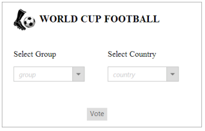
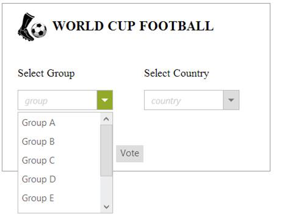
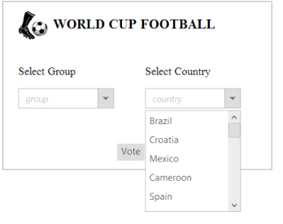
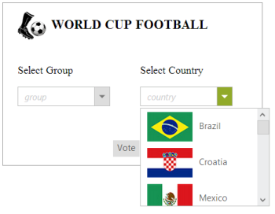
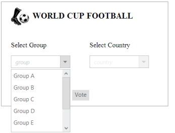
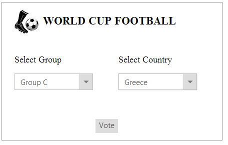
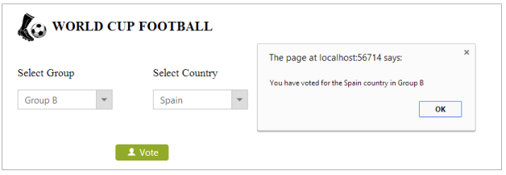

# Getting Started 

This section explains briefly how to create a DropDownList control in your application by using ASP.NET.

## Create your first DropDownList in ASP.NET

In this example, you can learn how to customize the DropDownList in a real-time Voting Selection Scenario of World Cup Football. This helps you to display the groups and its countries in the DropDownList Selection Item. 

The following screenshot illustrates the functionality of DropDownList with a Cascading Feature.

In the above screenshot, you can select a group from the first DropDownList control. After you select the group, the corresponding countries for that group are listed in the second DropDownList widget.Then, you can select a country and press the Vote option.  

### Create DropDownList control 

The ASP.NET DropDownList control basically renders with built-in features.

You can create an ASP.NET Project and add necessary Dll and script with the help of the given [ASP-Getting Started](http://docs.syncfusion.com/aspnetmvc/dropdownlist/getting-started ) Documentation.

You can add the following code example to the corresponding ASPX page to render the DropDownList.



    

        

            

            

            

                WORLD CUP FOOTBALL

             

            <table>

                <tr>

                    <td class="tdcls">

                        

                            <label>

                                Select Group</label>

                    </td>

                    <td class="tdcls">

                        

                            <label>

                                Select Country</label>

                    </td>

                </tr>

                <tr>

                    <td class="tdcls">

                        <ej:DropDownList ID="GroupsList" WatermarkText="group" runat="server" DataTextField="GroupName"></ej:DropDownList>

                                <td class="tdcls">

                                    <ej:DropDownList ID="CountryList" WatermarkText="country" runat="server" DataTextField="CountryName" DataSpriteCSSField="CountryFlag" PopupWidth="200px"></ej:DropDownList>

                        </tr>

            </table>

            

                <ej:Button ID="voter" Type="Button" Text="Vote" CssClass="e-btn" runat="server">

                </ej:Button>

            

        

    



Add the following style section for the DropDownList controls alignment. You can add the following location in the URL path for the background image [http://js.syncfusion.com/UG/Web/Content/football.png](http://js.syncfusion.com/UG/Web/Content/football.png)



         .control

        {

            height: 250px;

            width: 400px;

            border: 1px groove;

        }        

        .ball-icon

        {

            display: inline-block;

            background-image: url("http://js.syncfusion.com/UG/Web/Content/football.png");

            background-repeat: no-repeat;

            background-size: contain;

            height: 50px;

            width: 50px;

        }        

        .ball-txt

        {

            display: inline-block;

            font-size: 20px;

            font-weight: bolder;

            height: 50px;

            position: relative;

            text-align: center;

            top: -20px;

        }                

        .votebox

        {

            margin-left: 150px;

            margin-top: 50px;

        }        

        .txt

        {

            display: block;

            margin-bottom: 12px;

        }        

        .tdcls

        {

            width: 200px;

        }



Run the code to render the following output.

### Configure Data Source 

You can configure the DropDownList controls by using online services. Two different online data services for the two DropDownList controls are created. They are as follows, groups’ data service for the group selection DropDownList and countries data service for the country selection DropDownList. Both the data services are referred from the following service location.
[http://mvc.syncfusion.com/UGOdataServices/Northwnd.svc/](http://mvc.syncfusion.com/UGOdataServices/Northwnd.svc/)

In the above mentioned scenario, the given data source is mentioned in the Data Source property. In the first and second DropDownList controls, you can mention the Group controls and countries Data Source in the Data Source property respectively. When the Data Source has different field names, you can map the fields with the DataTextField property.

The following code example explains how to configure the Data Source.





<!--Use the following codes with in the above Html -->

<tr>

                    <td class="tdcls">

                                <ej:DropDownList ID="GroupsList" WatermarkText="group" Query="ej.Query().from('TeamGroups')" runat="server" DataTextField="GroupName"></ej:DropDownList>

                                <td class="tdcls">

                                    <ej:DropDownList ID="CountryList" WatermarkText="country" Query="ej.Query().from('TeamCountries')" runat="server" DataTextField="CountryName"></ej:DropDownList>                                   

</tr>





        protected void Page_Load(object sender, EventArgs e)

        {

            this.GroupsList.DataSource = "http://mvc.syncfusion.com/UGOdataServices/Northwnd.svc/";            

            this.CountryList.DataSource = "http://mvc.syncfusion.com/UGOdataServices/Northwnd.svc/";

        }





Execute the code to render the following output.

### Configure DropDownList with Sprite Icons

To style the DropDownList popup with the Country flag, you can create the Sprite CSS styles by using the flag icons from the following image source location.  You can add the following location in the URL path for the background image.

[http://js.syncfusion.com/UG/Web/Content/countryFootbal.png](http://js.syncfusion.com/UG/Web/Content/countryFootbal.png)

You can load the spirit image icons for the countries in a DropDownList by adding the following code example in styles section. 





<!--Use the following codes with in the above Html -->

<tr>

                            <td class="tdcls">

                                <ej:DropDownList ID="GroupsList" WatermarkText="group" Query="ej.Query().from('TeamGroups')" runat="server" DataTextField="GroupName"></ej:DropDownList>

                                <td class="tdcls">

                                    <ej:DropDownList ID="CountryList" WatermarkText="country" Query="ej.Query().from('TeamCountries')" runat="server" DataTextField="CountryName" DataSpriteCSSField="CountryFlag" PopupWidth="200px"></ej:DropDownList>

                        </tr>





    .flag

    {

        display: block;

        background-image: url(http://js.syncfusion.com/UG/Web/Content/countryFootbal.png);

        height: 46px;

        width: 70px;

        background-position: center center;

        background-repeat: no-repeat;

    }

    #<%=CountryList.CientID%>_popup_wrapper .e-align

    {

        display: inline-block;

        float: none;

        margin-left: 5px;

        margin-right: 10px;

        vertical-align: middle;

    }

    .flag.algeria

    {

        background-position: 0 0;

    }

    .flag.argentina

    {

        background-position: 0 -96px;

    }

    .flag.australia

    {

        background-position: 0 -192px;

    }

    .flag.belgium

    {

        background-position: 0 -288px;

    }

    .flag.bosnia

    {

        background-position: 0 -384px;

    }

    .flag.brazil

    {

        background-position: 0 -480px;

    }

    .flag.cameroon

    {

        background-position: 0 -576px;

    }

    .flag.chile

    {

        background-position: 0 -672px;

    }

    .flag.colombia

    {

        background-position: 0 -768px;

    }

    .flag.costarica

    {

        background-position: 0 -864px;

    }

    .flag.croatia

    {

        background-position: 0 -960px;

    }

    .flag.ecuador

    {

        background-position: 0 -1056px;

    }

    .flag.england

    {

        background-position: 0 -1152px;

    }

    .flag.france

    {

        background-position: 0 -1248px;

    }

    .flag.germany

    {

        background-position: 0 -1344px;

    }

    .flag.ghana

    {

        background-position: 0 -1440px;

    }

    .flag.greece

    {

        background-position: 0 -1536px;

    }

    .flag.honduras

    {

        background-position: 0 -1632px;

    }

    .flag.iran

    {

        background-position: 0 -1728px;

    }

    .flag.italy

    {

        background-position: 0 -1824px;

    }

    .flag.ivoriecote

    {

        background-position: 0 -1920px;

    }

    .flag.japan

    {

        background-position: -120px 0;

    }

    .flag.korea

    {

        background-position: -120px -96px;

    }

    .flag.mexico

    {

        background-position: -120px -192px;

    }

    .flag.netherlands

    {

        background-position: -120px -288px;

    }

    .flag.nigeria

    {

        background-position: -120px -384px;

    }

    .flag.portugal

    {

        background-position: -120px -480px;

    }

    .flag.russia

    {

        background-position: -120px -576px;

    }

    .flag.spain

    {

        background-position: -120px -672px;

    }

    .flag.swiss

    {

        background-position: -120px -768px;

    }

    .flag.uruguay

    {

        background-position: -120px -864px;

    }

    .flag.usa

    {

        background-position: -120px -960px;

    }





Run the above code example to render the following DropDownList with Data sources.

  

### Set the Cascading Option 

In the above scenario, you have to select the group in the first DropDownList and the corresponding countries for that group are listed in the country DropDownList. You can achieve this by setting the “cascadeTo” that points the DropDownList, where the data is loaded dynamically. You can disable the second DropDownList till the data is loaded dynamically.

The following code example explains how to set the Cascading Option.



<!--Use the following codes with in the above Html -->

<tr>

    <td class="tdcls">

        <ej:dropdownlist id="GroupsList" watermarktext="group" runat="server" datatextfield="GroupName"

            datavaluefield="GroupId" cascadeto="MainContent_CountryList"></ej:dropdownlist>

    </td>

    <td class="tdcls">

        <ej:dropdownlist id="CountryList" watermarktext="country" runat="server" datatextfield="CountryName"

            datavaluefield="CountryId" dataspritecssfield="CountryFlag" popupwidth="200px"

            enabled="false">

</ej:dropdownlist>

    </td>

</tr>



Run this code to render the DropDownList with Cascading Option.  
 

Initially, you can select the group from the popup of the first DropDownList. After you select the option, selected value is loaded. 

Based on the group selection in the first DropDownList, the Data Source in the second DropDownList is loaded and the corresponding Countries are shown on clicking the DropDown button as follows.

From the “Country” DropDownList, you can select your desired country.

 

### Set the Vote process in the DropDownList Widget

The voting process is done by clicking the Vote button. A button is customized to support the voting process. For more information about the button, you can refer to the following link: <http://docs.syncfusion.com/js>

The following code example explains how to set the Vote process in the DropDownList control.





                <ej:Button ID="voter" ContentType="TextAndImage" ShowRoundedCorner="true" PrefixIcon="e-uiLight e-userlogin"

                    ClientSideOnClick="selectVoted" Type="Button" Text="Vote" Width="80px" Height="25px"

                    runat="server">

                </ej:Button>

            





 function selectVoted() {

        alert("You have voted for the " + $("#<%=CountryList.ClientID%>").val() + " country in " + $("#<%=GroupsList.ClientID%>").val());

    }





When you run the above code example, it displays the DropDownList controls. You can select the value and click the Vote button. The button click event is processed and the values are displayed as follows.

