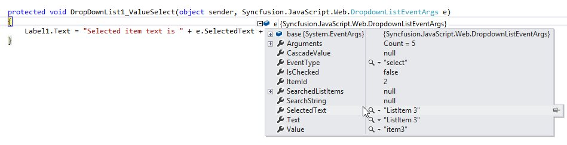
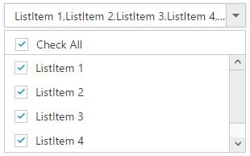
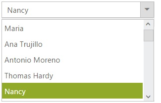

# How To

## Retrieve the selected item data from select event via arguments?

Bind the OnValueSelect event and you can retrieve the value from select event arguments in code behind. 



    
    
        <ej:DropDownList ID="DropDownList1" runat="server" OnValueSelect="DropDownList1_ValueSelect">
            <Items>
                <ej:DropDownListItem ID="DropDownListItem1" runat="server" Text="ListItem 1" Value="item1">
                </ej:DropDownListItem>
                <ej:DropDownListItem ID="DropDownListItem2" runat="server" Text="ListItem 2" Value="item2">
                </ej:DropDownListItem>
                <ej:DropDownListItem ID="DropDownListItem3" runat="server" Text="ListItem 3" Value="item3">
                </ej:DropDownListItem>
                <ej:DropDownListItem ID="DropDownListItem4" runat="server" Text="ListItem 4" Value="item4">
                </ej:DropDownListItem>
                <ej:DropDownListItem ID="DropDownListItem5" runat="server" Text="ListItem 5" Value="item5">
                </ej:DropDownListItem>
            </Items>
        </ej:DropDownList>
         
        <asp:Label runat="server" ID="Label1"></asp:Label>
          
	
    
    

        protected void DropDownList1_ValueSelect(object sender, Syncfusion.JavaScript.Web.DropdownListEventArgs e)
        {
            Label1.Text = "Selected item text is " + e.SelectedText + " and value is " + e.Value;
        }
 
    
    


In the following screenshot you can get the argument details for OnValueSelect event

## Add check all option in popup list?

You can use HeaderTemplate property to add any HTML element. Code snippet to add check all option is given below,



    

        <ej:DropDownList ID="DropDownList1" runat="server" DataTextField="Text" DataValueField="Value" ShowCheckbox="true" HeaderTemplate="
<input id ='check' type='checkbox'>
" ClientSideOnCreate="OnCreate">  </ej:DropDownList>
        
    

    

            .temp {
                height: 30px;
                display: block;
                padding-left: 13px;
                padding-top: 5px;
                border-bottom: 1px solid #c8c8c8;
            }
            .e-chkbox-wrap .e-text {
                font-size: 14px;
                padding-left: 10px;
            }

        
    

    

            function OnCreate(args) {

                $("#check").ejCheckBox({ text: "Check All", change: "Change" });

            }
            function Change(args) {
                window.flag = true;
                var obj = $("#<%=DropDownList1.ClientID%>").ejDropDownList("instance");
                if (args.isChecked) obj.checkAll();
                else obj.uncheckAll();
                window.flag = false;
            }

    

    
        
            protected void Page_Load(object sender, EventArgs e)
            {
                List<Data> DropdownData = new List<Data>();
                DropdownData.Add(new Data { Value = "item1", Text = "ListItem 1" });
                DropdownData.Add(new Data { Value = "item2", Text = "ListItem 2" });
                DropdownData.Add(new Data { Value = "item3", Text = "ListItem 3" });
                DropdownData.Add(new Data { Value = "item4", Text = "ListItem 4" });
                DropdownData.Add(new Data { Value = "item5", Text = "ListItem 5" });
                DropDownList1.DataSource = DropdownData;
                
            }
            public class Data
            {
                public string Value { get; set; }
                public string Text { get; set; }
            }
            
    



The following screenshot exhibits the output of the above code,

## Dynamically bind the data to the DropDownList using ASP.NET data bound method called “onDataBound” method

The items can be added to the DropDownList in DataBound event using a generic DataView and refresh the DataSource of DropDownList.



    
    
    <ej:DropDownList ID="DropDown" runat="server" DataSourceID="SqlDataSource1" Width="280px" 
           DataTextField="ContactName" DataValueField="CustomerID" OnDataBound="DropDown_DataBound"></ej:DropDownList>

    <asp:SqlDataSource ID="SqlDataSource1" runat="server" ConnectionString="<%$ ConnectionStrings:ConnectionString %>" SelectCommand="SELECT [CustomerID], [ContactName] FROM [Customers]"></asp:SqlDataSource>

    
    
     
        protected void DropDown_DataBound(object sender, EventArgs e)
        {
            // Create a DataView to get the current datasource from DropDownList
            DataView ddDataSource = (DataView)DropDown.DataSource;
            //Initialize a row element for the DataView created
            DataRow row = ddDataSource.Table.NewRow();
            if (sender == DropDown)
            {
                if (ddDataSource.Count == 0)
                {      
                    //Add the fields using the corresponding names     
                    row["CustomerID"] = "11011";
                    row["ContactName"] = "John Peter";
                    // Insert the new item to DataView Table
                    ddDataSource.Table.Rows.InsertAt(row, 0);
                }
                else
                {
                    row["CustomerID"] = "11012";
                    row["ContactName"] = "Nancy";
                    //Insert at the index of 4
                    ddDataSource.Table.Rows.InsertAt(row, 4);
                    
                }
            }
            else
            {
                throw new Exception("Invalid binder for drop down list items");
            }
            //Refresh the DropDownList DataSource with the DataView updated
            DropDown.DataSource = ddDataSource;
        }
        
        
        


In the OnDataBound event copy the current DataSource to a DataView instance and initiate a new row for the DataView table using DataRow instance. Based on the requirement add the dynamic items to the DataRow instance using the Data fields bound to the DropDownList control. Finally assign the updated DataView to the DropDownList data source. 

## Create user control as DropDownList, to set/get the items in DropDownList in code behind

A user control is a kind of composite control that works much like an ASP.NET Web page—you can add our Syncfusion web controls and markup to a user control, and define properties and methods for the control. You can then embed them in ASP.NET Web pages, where they act as a unit.

Step 1:  Add the Web user control in your form
Please refer the following links for more information: [Link](http://www.c-sharpcorner.com/uploadfile/jayendra/how-to-create-user-control-in-Asp-Net/)

In web user control, add DropDownList and Bind the data to it as follows



    <%@ Control Language="C#" AutoEventWireup="true" CodeBehind="myControl.ascx.cs" Inherits="UserControl.myControl" %>

    <ej:DropDownList ID="DropDownList1" DataTextField="FirstName" DataValueField="EmployeeID" runat="server">

    </ej:DropDownList>
    


In code behind, bind the data source to the DropDownList



    public partial class myControl : System.Web.UI.UserControl
    {
        protected void Page_Load(object sender, EventArgs e)
        {
            NORTHWNDEntities db = new NORTHWNDEntities();
            List<Employee> data = new List<Employee>();
            data = db.Employees.ToList();
            DropDownList1.DataSource = data;
        }
    }
    
 
 
 Step 2: To add the user control in your page 
 
To use the user control, make the web page aware of the control by using a Register directive that specified the tag prefix which will use, the tag name and the location of the user control's page



    <%@ Register Src="~/myControl.ascx" TagPrefix="my" TagName="DropDown" %> 

    <asp:Content ID="BodyContent" ContentPlaceHolderID="MainContent" runat="server">

     Select an Employee
        <my:DropDown id="empList" runat="server"></my:DropDown>
    </asp:Content>



## Select a specific item in dropdownlist via code behind as like asp dropdownlist FindByValue/FindByText method

You can select a specific item in dropdownlist via code behind by matching the search string with the dropdownlist item text. Initially, set the index value to dropdownlist by using the “SelectedIndex” property in the button click event as shown below code:



		protected void setValue_Click(object sender, EventArgs e) 
        { 
 
            selectCar.SelectedIndex = DropDownListIndex(selectCar.Items.ToList(), "Audi A6"); 
        } 



Now, index value will be return in the DropDownListIndex method by matching the search string with the dropdownlist item text as shown below code:  



		public int DropDownListIndex(List<Syncfusion.JavaScript.Web.DropDownListItem> dropdownList,string search) 
        { 
 
            int indexVal = dropdownList.Select((item, i) => new { Item = item, Index = i }) 
                .First(x => x.Item.Text == search).Index; 
            return indexVal; 
        } 



Please refer the following links for Sample: [Sample] ( http://www.syncfusion.com/downloads/support/directtrac/166189/ze/SyncfusionDropdown_(3)884590000 )

## MultiColumn and MultiRow items in dropdownlist

The DropDownList `template` property is used to load data source such as multiple columns and rows. Use CSS to customize the columns and rows in the drop-down-list template element. The drop-down-list pop up customization is shown in the following code.



    protected void Page_Load(object sender, EventArgs e)
    {
        List<Data> empl = new List<Data>();
        empl.Add(new Data { text = "10" });
        empl.Add(new Data { text = "30" });
        empl.Add(new Data { text = "101" });
        empl.Add(new Data { text = "50" });
        selectColumn.DataSource = empl;
    }
    public class Data
    {
        public string text { get; set; }
    }





  <ej:DropDownList ID="selectColumn" runat="server" Template="${text}pages" WatermarkText="Select the column" Width="600px" PopupHeight="500px" PopupWidth="600px" ClientSideOnCreate ="onCreate" ClientSideOnChange="onChange">
  </ej:DropDownList>

  
 



Please refer the  [link](http://www.syncfusion.com/downloads/support/directtrac/140579/ze/DropDown1353983443 ) for Sample
