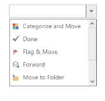

# Icons Support 

You can add the icons or images with list items in DropDown popup by using sprite CSS class. The following steps explain the configuration about the icons support with the DropDownList.

N> Images for this sample are available in ‘installed location /themes/images’ and you need to define images in the mentioned CSS. Henceforth, the images are displayed. 

In an ASPX page, add an element to configure the DropDownList.



    <ej:DropDownList ID="dropdownlist" TargetID="mailtoolslist" runat="server">

    </ej:DropDownList>

    

        <ul>

            <li>

                

                

                Categorize and Move</li>

            <li>

                

                

                Done</li>

            <li>

                

                

                Flag & Move</li>

            <li>

                

                

                Forward</li>

            <li>

                

                

                Move to Folder</li>

            <li>

                

                

                New E-mail</li>

            <li>

                

                

                New Meeting</li>

            <li>

                

                

                Reply & Delete</li>

        </ul>

    



Configure sprite CSS styles to the DropDownList.



    /*controls*/

    .mailtools

    {

        display: block;

        background-image: url('../images/iconsapps.png');

        height: 25px;

        width: 25px;

        background-position: center center;

        background-repeat: no-repeat;

    }

    .mailtools.done

    {

        background-position: 0 0;

    }

    .mailtools.movetofolder

    {

        background-position: 0 -22px;

    }

    .mailtools.categorize

    {

        background-position: 0 -46px;

    }

    .mailtools.flag

    {

        background-position: 0 -70px;

    }

    .mailtools.forward

    {

        background-position: 0 -94px;

    }

    .mailtools.newmail

    {

        background-position: 0 -116px;

    }

    .mailtools.reply

    {

        background-position: 0 -140px;

    }

    .mailtools.meeting

    {

        background-position: 0 -164px;

    }

    .control

    {

        margin-left: 20px;

    }

    .ctrllabel

    {

        padding-bottom: 3px;

    }



Output of the above step.

  

