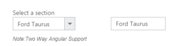
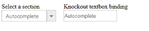

# Integration

## Angular Binding 

DropDownList widget contains two types of Angular JS supports namely, 

* One way binding
* Two way binding 

One way binding refers to the process of applying scope values to all the available properties of the DropDownList, but the changes made in DropDownList do not reflect or trigger in turn to the scope collection. This kind of binding applies to all the properties of the DropDownList.

Two-way binding supports both the processes – it applies the scope values to the DropDownList properties as well as the changes made in the DropDownList are also reflected back and triggered within the Angular scope change function.

To know more detail about the Angular binding, you can refer to the following link location,

[http://help.syncfusion.com/ug/js/documents/angularjs.htm](http://help.syncfusion.com/ug/js/documents/angularjs.htm)

The following example depicts the way to bind data to the DropDownList through Angular support.

Note: You need to include “ej.widget.angular.min.js” file library to achieve this behaviour and you need to pass the control properties as data attribute in input tag itself like data role behaviour.

In the ASPX page, add an element to configure the DropDownList



<body ng-controller="DropDownCtrl">

    

        

            

                

                    Select a section

                    

                        

                            <input id="dropdownlist" ej-dropdownlist e-datasource="dataList" e-value="value" />

                            <h6>

                                

                                    Note:Two Way Angular Support

                            </h6>

                        

                    

                    

                        <input type="text" id="dropValue" class="input ejinputtext" ng-model="value" />

                    

                

            

        

    

</body>





       var list = [

                   { Id: "cr1", Text: "Dodge Avenger" },

                   { Id: "cr2", Text: "Chrysler 200" },

                   { Id: "cr3", Text: "Ford Focus" },

                   { Id: "cr4", Text: "Ford Taurus", },

                   { Id: "cr5", Text: "Dazzler", },

                   { Id: "cr6", Text: "Chevy Spark", },

                   { Id: "cr7", Text: "Chevy Volt", },

                   { Id: "cr8", Text: "Honda Fit", },

                   { Id: "cr9", Text: "Honda Crosstour", },

                   { Id: "cr10", Text: "Acura RL", },

                   { Id: "cr11", Text: "Hyundai Elantra", },

                   { Id: "cr12", Text: "Mazda3", }

       ];

       angular.module('DropCtrl', ['ejangular'])

          .controller('DropDownCtrl', function ($scope) {

              $scope.dataList = list;

              $scope.value = "Ford Focus";

          });



Output of the above step.

  

## Knockout Binding

Knockout support allows you to bind the other elements against any of the available data model.

Two types of Knockout bindings are supported,

* One-way binding
* Two-way binding

One way binding refers to the process of applying observable values to all the available properties of the DropDownList, but the changes made in the widget do not reflect and trigger in turn to the observable collection. This kind of binding applies to all the properties of the DropDownList widget.

Two-way binding supports both the processes – it applies the observable values to the DropDownList properties as well as the changes made in the DropDownList widget are also reflected back and triggered within the observable collections. 

For more information about the Knockout binding, refer to the following online documentation in the following link location,

[http://help.syncfusion.com/ug/js/documents/knockoutjs.htm](http://help.syncfusion.com/ug/js/documents/knockoutjs.htm)

The following example depicts the way to bind data to the DropDownList through the Knockout support that enables and populates data to a DropDownList based on the value set to the other DropDown widget.

Note: You need to include the “ej.widget.knockout.min.js” file library to achieve this behaviour and you need to pass the control properties as data attribute in input tag itself like data role behaviour.

In an ASPX page, add an element to configure the DropDownList.



    

        Select a section

    <input id="dropdownlist" data-bind="ejDropDownList: { dataSource: dataList, value: value }">

    

        Knockout textbox binding

    <input type="text" id="Text4" class="input ejinputtext" data-bind="value: value" />





$(function () {

            var CarList = [

                { Id: "cr1", Text: "Accordion" },

                { Id: "cr2", Text: "Autocomplete" },

                { Id: "cr3", Text: "Button" },

                { Id: "cr4", Text: "Tab", },

                { Id: "cr5", Text: "Menu", },

                { Id: "cr6", Text: "Rating", },

                { Id: "cr7", Text: "Slider", },

                { Id: "cr8", Text: "Splitter", },

                { Id: "cr9", Text: "Tagcloud", },

                { Id: "cr10", Text: "Scroller", },

                { Id: "cr11", Text: "TreeView", },

                { Id: "cr12", Text: "WaitingPopup", }

            ];

            window.viewModel = {

                dataList: ko.observable(CarList),

                value: ko.observable("Button"),

            }

            ko.applyBindings(viewModel);

        });



Configure the styles. 



    .ejinputtext

    {

        background-color: #fff;

        border: 1px solid #bbbcbb;

        color: #5c5c5c;

        height: 30px;

        outline: medium none;

    }



Output of the above steps.

