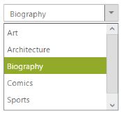

# Keyboard Interaction

You can use Keyboard shortcut keys as an alternative to the mouse by using the DropDown widget. DropDown widget allows you to perform all kind of actions by using keyboard shortcuts.

<table>
<tr>
<th>
Shortcut Key</th><th>
Description</th></tr>
<tr>
<td>
<a href="http://en.wikipedia.org/wiki/Access_key">Access key</a> + j	</td><td>
Focuses into the DropDown text box.</td></tr>
<tr>
<td>
Up</td><td>
Moves to previous item in pop up.</td></tr>
<tr>
<td>
Down</td><td>
Moves to next item in pop up.</td></tr>
<tr>
<td>
Enter</td><td>
Selects the focused item.</td></tr>
<tr>
<td>
Esc</td><td>
Closes the pop up window.</td></tr>
<tr>
<td>
Left </td><td>
Moves to previous item in pop up.</td></tr>
<tr>
<td>
Right </td><td>
Moves to next item in pop up.</td></tr>
<tr>
<td>
Home</td><td>
Navigates to the starting item.</td></tr>
<tr>
<td>
End</td><td>
Navigates to the end item.</td></tr>
<tr>
<td>
Alt + Up</td><td>
Closes the popup window.</td></tr>
<tr>
<td>
Alt +down </td><td>
Opens the popup window.</td></tr>
</table>

## Configure Keyboard Interaction

In an ASPX page, add an element to configure the DropDownList widget and enable keyboard interaction by setting the accesskey property



    <ej:DropDownList ID="dropdownlist" TargetID="list" Width="200px" AccessKey="j" runat="server">

    </ej:DropDownList>

    

        <ul>

            <li>Art</li>

            <li>Architecture</li>

            <li>Biography</li>

            <li>Comics</li>

            <li>Sports</li>

            <li>Science</li>

        </ul>

    



Run the sample, press Alt + J to focus in the DropDownList widget that enables it and you can navigate by using arrow keys and Esc key to close the popup.

 

