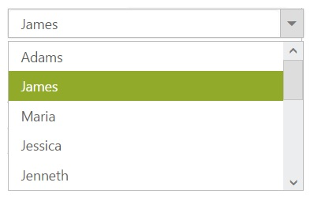
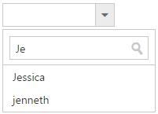
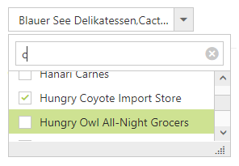
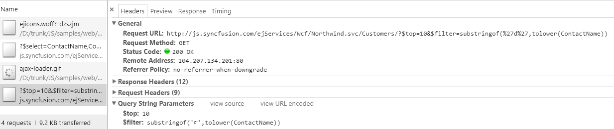

# Search

Items are searched based on the keyed in values to the textbox. There are two types of searches,

* Incremental Search
* Filter Search

## Incremental Search

Selects the item in the popup list based on the keyed in value. If the time taken to type exceeds 1000 milliseconds then filtered items will be reset based on the current input value. By default this mode of search is enabled. Incremental search can be case sensitive or case insensitive. To make case sensitive, you can use CaseSensitiveSearch property.



	
        <ej:DropDownList ID="DropDownList1" runat="server" DataTextField="Text" DataValueField="Value" EnableIncrementalSearch="true" CaseSensitiveSearch="true"></ej:DropDownList>
		
	
    
    
        protected void Page_Load(object sender, EventArgs e)
        {
            List<Data> DropDownData = new List<Data>();
            DropDownData.Add(new Data { Value = "emp1", Text = "Adams" });
            DropDownData.Add(new Data { Value = "emp2", Text = "James"});
            DropDownData.Add(new Data { Value = "emp3", Text = "Maria"});
            DropDownData.Add(new Data { Value = "emp4", Text = "Jessica"});
            DropDownData.Add(new Data { Value = "emp5", Text = "Jenneth" });
            DropDownList1.DataSource = DropDownData;
            
        }
        public class Data
        {
            public string Value { get; set; }
            public string Text { get; set; }
        }
    
    
    


## Filter search

You can quickly locate specific item within a large data source by filtering matches with a search box. A text box appears in the popup list for searching when EnableFilterSearch property is enabled. By default, filtering returns the matched items list based on text in search textbox. 
You can configure the search filter by using FilterType property. There is two types of filter options,

* Starts With 
* Contains

N> Items are filtered based on “contains” filter type by default.



	
        <ej:DropDownList ID="DropDownList1" runat="server" DataTextField="Text" DataValueField="Value" EnableFilterSearch="true" FilterType="StartsWith"></ej:DropDownList>
		
	
    
    
      protected void Page_Load(object sender, EventArgs e)
        {
            List<Data> DropDownData = new List<Data>();
            DropDownData.Add(new Data { Value = "emp1", Text = "Adams" });
            DropDownData.Add(new Data { Value = "emp2", Text = "James"});
            DropDownData.Add(new Data { Value = "emp3", Text = "Maria"});
            DropDownData.Add(new Data { Value = "emp4", Text = "Jessica"});
            DropDownData.Add(new Data { Value = "emp5", Text = "Jenneth" });
            DropDownList1.DataSource = DropDownData;
            
        }
        public class Data
        {
            public string Value { get; set; }
            public string Text { get; set; }
        }
    
    


I> When VirtualScrolling enabled with searching, then filter will be applied only on the DropDownList items available at the moment.

## Server Filtering

Server filtering for displaying only a fixed amount of dataset from the whole dataset. In general, [DropDownList](https://www.syncfusion.com/jquery/aspnet-web-forms-ui-controls/dropdown-list) displays just the data returned from the server. This feature is convenient for you to apply when the user does not want to see the whole dataset in the popup wrapper.
EnableServerFiltering If set to true, the filtering operations performed in the remote service and returns the result.



    
Select a Customer Name

    <ej:DropDownList ID="selectCompany" DataTextField="CompanyName"  DataValueField="ContactName" runat="server" Width="230" ShowCheckbox="true" EnableFilterSearch="true" EnableServerFiltering="true" EnablePopupResize="true" WatermarkText="Select a company">
        <DataManager URL="//js.syncfusion.com/demos/ejServices/Wcf/Northwind.svc/Customers" CrossDomain="true"  />
    </ej:DropDownList>



This sample raises the query on Customer service. Returns ContactName records for customers with ContactName containing the string “d”.

