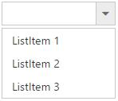
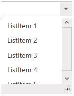
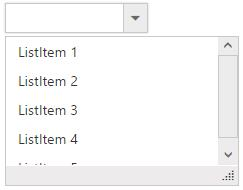

# Setting dimensions 

## control Sizing

### Fixed Size DropDownList control

You can customize the control dimensions using Width and Height properties. Fixed size values can be specified in pixel or percentage values. By default the DropDownList wrapper will be assigned with "143px" Width and "30px" Height.

### Fixed size popup list

You can customize the popup list dimensions using PopupWidth and PopupHeight properties. Fixed size values can be specified in pixel or percentage values. By default popup width is auto and popup height is "152px". 

### Auto Sizing

DropDownList is adaptive to mobile and web layout such that it is adjustable with screen resolution. The textbox will be rendered based on its parent containers dimensions on assigning 100% values to the width property. Default value for PopupWidth is auto, so when you assign 100% to PopupWidth then it will be rendered based on specified range.

### Limit the number of items

You can use ItemsCount property to fetch only the specific number of items from the data source. To fetch the remaining items you can enable [virtual scrolling](databinding#virtual-scrolling) support which loads the data on scrolling the data items in popup list. 

N> By default popup list is shown on DropDownList button click but you can display the list initially by enabling the ShowPopupOnLoad property. 



    
    
         <ej:DropDownList ID="DropDownList1" runat="server" DataTextField="Text" DataValueField="Value" ShowPopupOnLoad="true" ItemsCount="3"></ej:DropDownList>
            
	
    
    
    
        protected void Page_Load(object sender, EventArgs e)
        {
            List<Data> DropdownData = new List<Data>();
            DropdownData.Add(new Data { Value = "item1", Text = "ListItem 1" });
            DropdownData.Add(new Data { Value = "item2", Text = "ListItem 2" });
            DropdownData.Add(new Data { Value = "item3", Text = "ListItem 3" });
            DropdownData.Add(new Data { Value = "item4", Text = "ListItem 4" });
            DropdownData.Add(new Data { Value = "item5", Text = "ListItem 5" });
            DropDownList1.DataSource = DropdownData;
            
        }
        public class Data
        {
            public string Value { get; set; }
            public string Text { get; set; }
        }
        
    
    


## Popup resizing 

To show a resize handle in the popup list, use EnablePopupResize property. You can customize the resize functionality by setting dimensions to the following properties.

<table>
    <tr>
        <td>
            MinPopupWidth
        </td>
        <td>
            Default value is 0, once set you cannot resize below to the specified width
             
        </td>
    </tr>
    <tr>
        <td>
            MaxPopupWidth
        </td>
        <td>
            Default value is null, once set you cannot extend beyond to the specified width
             
        </td>
    </tr>
    <tr>
        <td>
            MinPopupHeight
        </td>
        <td>
            Default value is 0, once set you cannot resize below to the specified height
             
        </td>
    </tr>
    <tr>
        <td>
            MaxPopupHeight
        </td>
        <td>
            Default value is null, once set you cannot extend beyond to the specified height
             
        </td>
    </tr>
</table>



    
    
          <ej:DropDownList ID="DropDownList1" runat="server" DataTextField="Text" DataValueField="Value" MinPopupHeight="150px" MaxPopupHeight="550px" EnablePopupResize="true" MinPopupWidth="150px" MaxPopupWidth="550px"></ej:DropDownList>
            
	
    
    
    
       protected void Page_Load(object sender, EventArgs e)
        {
            List<Data> DropdownData = new List<Data>();
            DropdownData.Add(new Data { Value = "item1", Text = "ListItem 1" });
            DropdownData.Add(new Data { Value = "item2", Text = "ListItem 2" });
            DropdownData.Add(new Data { Value = "item3", Text = "ListItem 3" });
            DropdownData.Add(new Data { Value = "item4", Text = "ListItem 4" });
            DropdownData.Add(new Data { Value = "item5", Text = "ListItem 5" });
            DropDownList1.DataSource = DropdownData;
            
        }
        public class Data
        {
            public string Value { get; set; }
            public string Text { get; set; }
        }
        
    
    


