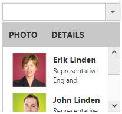

# Template Support

By default you can add any text or image to the DropDownList list item. To customize the items layout or to create your own visualized elements you can use this template support.

## Header Template

You can create the popup header by using HeaderTemplate property. You can add any HTML content in header template.

## Template Field

Create a set of div containers with common syntax or elements and assign it to the Template property. You can add any HTML mark-up element inside the DropDownList list using this property.

In the demo, a List data is created with Text, Image, Role and Country which is initialized with DataSource property. Content template is created by using the corresponding fields and assigned in template property. The content template is customized with images and custom CSS styles to visualize the items in popup.



	
    
        <ej:DropDownList ID="selectFolder" runat="server" Width="200px" Template="&lt;img class='eimg' src='../Content/images/Employee/${eimg}.png' alt='employee' height='50px' width='50px'/>
 ${text} 

 ${desig} 

 ${country} 
" WatermarkText="Select an item">
        </ej:DropDownList>
		
	
    
    

    	.eimg {
            margin: 0;
            padding: 3px 10px 3px 3px;
            border: 0 none;
            width: 60px;
            height: 60px;
            float: left;
        }

        .ename {
            font-weight: bold;
            padding: 6px 3px 1px 3px;
        }

        .desig, .cont {
            font-size: smaller;
            padding: 3px 3px -1px 0px;
        }

    
    
    
       
        protected void Page_Load(object sender, EventArgs e)
        {
            List<EmployeeSpecialists> empl = new List<EmployeeSpecialists>();
            empl.Add(new EmployeeSpecialists { text = "Erik Linden", eimg = "3", desig = "Representative", country = "England" });
            empl.Add(new EmployeeSpecialists { text = "John Linden", eimg = "6", desig = "Representative", country = "Norway" });
            empl.Add(new EmployeeSpecialists { text = "Louis", eimg = "7", desig = "Representative", country = "Australia" });
            empl.Add(new EmployeeSpecialists { text = "Lawrence", eimg = "8", desig = "Representative", country = "India" });
            selectFolder.DataSource = empl;
        }
        public class EmployeeSpecialists
        {
            public string text { get; set; }
            public string eimg { get; set; }
            public string desig { get; set; }
            public string country { get; set; }
        }
    
    
    


N> Images for this sample are available in (installed location)\Syncfusion\Essential Studio\{{ site.releaseversion }}\JavaScript\samples\web\themes\images 

