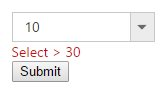
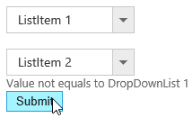
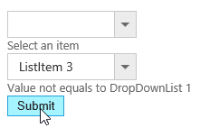
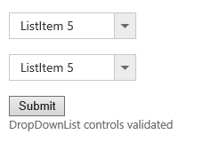

# Validation

DropDownList value can be validated in two ways,
1. Using jQuery Validator
2. ASP Validator

## jQuery Validator
 
You can validate the DropDownList value on form submission using jQuery Validator, by applying “ValidationRules” and “ValidationMessage” to the DropDownList. 

N> [jquery.validate.min](http://cdn.syncfusion.com/js/assets/external/jquery.validate.min.js) script file should be referred for validation, for more details, refer [here](http://jqueryvalidation.org/documentation).

### Validation Rules

The validation rules help you to verify the selected text by adding validation attributes to the input element. This can be set by using ValidationRules property.

### Validation Messages 

You can set your own custom error message by using ValidationMessage property. To display the error message, specify the corresponding annotation attribute followed by the message to display.

N> jQuery predefined error messages to that annotation attribute will be shown when this property is not defined. The below given example explain this behavior of ‘required’ attribute,

When the DropDownList control is rendered, it creates an input hidden element which is used to store the selected items value. Hence, the validation is performed based on the value stored in this hidden element.

Required field and min value validation is demonstrated in the below given example.



     <ej:DropDownList ID="DropDownList1" runat="server">
        <Items>
            <ej:DropDownListItem ID="DropDownListItem1" runat="server" Text="10" Value="10">
            </ej:DropDownListItem>
            <ej:DropDownListItem ID="DropDownListItem2" runat="server" Text="20" Value="20">
            </ej:DropDownListItem>
            <ej:DropDownListItem ID="DropDownListItem3" runat="server" Text="30" Value="30">
            </ej:DropDownListItem>
            <ej:DropDownListItem ID="DropDownListItem4" runat="server" Text="40" Value="40">
            </ej:DropDownListItem>
            <ej:DropDownListItem ID="DropDownListItem5" runat="server" Text="50" Value="50">
            </ej:DropDownListItem>
        </Items>
         <ValidationRule>
            <ej:KeyValue Key="required" Value="true" />
            <ej:KeyValue Key="min" Value="30" />
        </ValidationRule>
        <ValidationMessage>
            <ej:KeyValue Key="required" Value="* required" />
            <ej:KeyValue Key="min" Value="Select > 30" />
        </ValidationMessage>
    </ej:DropDownList>
    <asp:Button runat="server" ID="Button1" Text="Submit" />
    




        $.validator.setDefaults({
            ignore: [],
            errorClass: 'e-validation-error', // to get the error message on jquery validation
            errorPlacement: function (error, element) {
                $(error).insertAfter(element.closest(".e-widget"));
            }
            // any other default options and/or rules
        });
        //If necessary, we can create custom rules as below. here method defined for min
        $.validator.addMethod("min",
            function (value, element, params) {
                if (!/Invalid|NaN/.test(value)) {
                    return parseInt(value) > params;
                }
            }, 'Must be greater than 30.');
				


## Integration with ASP Validator

To use ASP.NET validator with DropDownList control, set the ID of the DropDownList as the value of the ControlToValidate property of the validator.



	
    
            <ej:DropDownList ID="DropDownList1" runat="server">
                <Items>
                    <ej:DropDownListItem ID="DropDownListItem1" runat="server" Text="ListItem 1" Value="item1">
                    </ej:DropDownListItem>
                    <ej:DropDownListItem ID="DropDownListItem2" runat="server" Text="ListItem 2" Value="item2">
                    </ej:DropDownListItem>
                    <ej:DropDownListItem ID="DropDownListItem3" runat="server" Text="ListItem 3" Value="item3">
                    </ej:DropDownListItem>
                    <ej:DropDownListItem ID="DropDownListItem4" runat="server" Text="ListItem 4" Value="item4">
                    </ej:DropDownListItem>
                    <ej:DropDownListItem ID="DropDownListItem5" runat="server" Text="ListItem 5" Value="item5">
                    </ej:DropDownListItem>
                </Items>
            </ej:DropDownList>
                <!-- DropDownList1 can't be left empty to submit the form -->
            <asp:RequiredFieldValidator runat="server" ID="RequiredFieldValidator1" ControlToValidate="DropDownList1" ErrorMessage="Select an item" ></asp:RequiredFieldValidator> 
            <ej:DropDownList ID="DropDownList2" runat="server">
                <Items>
                    <ej:DropDownListItem ID="DropDownListItem6" runat="server" Text="ListItem 1" Value="item1">
                    </ej:DropDownListItem>
                    <ej:DropDownListItem ID="DropDownListItem7" runat="server" Text="ListItem 2" Value="item2">
                    </ej:DropDownListItem>
                    <ej:DropDownListItem ID="DropDownListItem8" runat="server" Text="ListItem 3" Value="item3">
                    </ej:DropDownListItem>
                    <ej:DropDownListItem ID="DropDownListItem9" runat="server" Text="ListItem 4" Value="item4">
                    </ej:DropDownListItem>
                    <ej:DropDownListItem ID="DropDownListItem10" runat="server" Text="ListItem 5" Value="item5">
                    </ej:DropDownListItem>
                </Items>
            </ej:DropDownList>
                <!-- Compares the value of DropDownList1 and DropDownList2 to be equal -->
            <asp:CompareValidator runat="server" ID="CompareValidator1" ControlToCompare="DropDownList1" ControlToValidate="DropDownList2" ErrorMessage="Value not equals to DropDownList 1"></asp:CompareValidator> 
            <asp:Button runat="server" ID="Button1" Text="Submit" OnClick="Button1_Click" /> 
            <asp:Label runat="server" ID="Label1"></asp:Label>
		
	
    
    
    
        protected void Button1_Click(object sender, EventArgs e)
        {
            Label1.Text = "DropDownList controls validated";
        }
        
    
    
 
 
 Executing the above code will validate the DropDownList control values on every form submit before post back occurs as given below.
 
 
 
 
 
 Output after postback on form submit
 
 