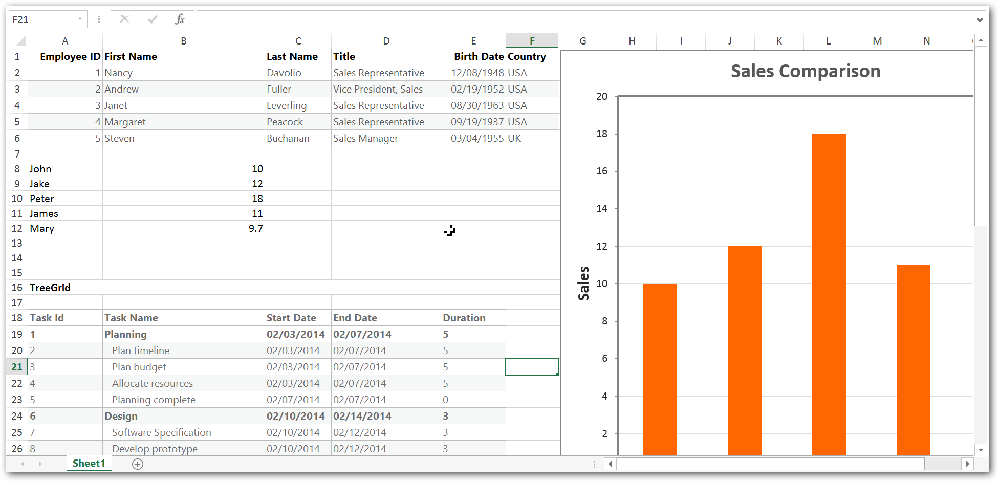

#  Exporting Multiple Syncfusion Controls

We can export multiple Syncfusion controls like Grid, Chart, TreeGrid, etc., in a single document. 
This can be achieved by calling `ej.exportAll` method. exportAll method accepts two necessary parameters; one for routing URL (either to export Excel or PDF) and other for passing multiple controls ID’s as an array.  
In the server side we can handle exporting multiple control either Excel or PDF exporting by calling `ExportAll` method

The following code example describes the above behavior.




 <asp:Content ID="BodyContent" runat="server" ContentPlaceHolderID="MainContent">

   <ej:Button ID="ExcelExport" runat="server" Size="Medium" ShowRoundedCorner="true" Type="Button" Text="Excel Export" ClientSideOnClick="Export">

   </ej:Button>
   
   <ej:Button ID="PdfExport" runat="server" Size="Medium" ShowRoundedCorner="true" Text="Pdf Export" ClientSideOnClick="PdfExport">

   </ej:Button>
   
   <ej:Grid ID="FlatGrid" AllowPaging="True" runat="server">
       <Columns>
          <ej:Column Field="EmployeeID" HeaderText="Employee ID" IsPrimaryKey="True" TextAlign="Right" Width="100" />
          <ej:Column Field="FirstName" HeaderText="First Name" TextAlign="Right" Width="100" />
          <ej:Column Field="LastName" HeaderText="Last Name" Width="100" />
          <ej:Column Field="Title" HeaderText="Title" TextAlign="Right" Width="90" />
          <ej:Column Field="BirthDate" HeaderText="Birth Date" TextAlign="Right" Width="100" Format="{0:MM/dd/yyyy}" />
          <ej:Column Field="Country" HeaderText="Country" Width="120" />
       </Columns>
   </ej:Grid>
  
   <ej:TreeGrid runat="server" ID="TreeGridControlDefault" ChildMapping="SubTasks" TreeColumnIndex="1" IsResponsive="true">
            <Columns>
                <ej:TreeGridColumn HeaderText="Task Id" Field="TaskID" Width="45" />
                <ej:TreeGridColumn HeaderText="Task Name" Field="TaskName" />
                <ej:TreeGridColumn HeaderText="Start Date" Field="StartDate" />
                <ej:TreeGridColumn HeaderText="End Date" Field="EndDate" />
                <ej:TreeGridColumn HeaderText="Duration" Field="Duration" />
                <ej:TreeGridColumn HeaderText="Progress" Field="Progress" />
            </Columns>
            <SizeSettings Width="100%" Height="450px" />
   </ej:TreeGrid>
   
   <ej:Chart ClientIDMode="Static" ID="Chart1" runat="server" Height="600" EnableCanvasRendering="true">
        <PrimaryXAxis Visible="true" MajorGridLines-Visible="true" Title-Text="Manager" />
        <PrimaryYAxis AxisLine-Visible="false" Title-Text="Sales" />
      <Series>
            <ej:Series Name="Person" EnableAnimation="True" Type="Column" XName="Xvalue" YName="YValue1"></ej:Series>
        </Series>
    </ej:Chart>

</asp:Content>
  




namespace Sample
{
    public partial class _Default : Page
    {
        private List<Employee> employee = new List<Employee>();

        protected void Page_Load(object sender, EventArgs e)
        {
            this.FlatGrid.DataSource = new NorthwindDataContext().EmployeeViews.Take(5).ToList();   //DataSource for Grid.
            this.FlatGrid.DataBind();
            
            TaskDetailsCollection TaskCollection = new TaskDetailsCollection();
            this.TreeGridControlDefault.DataSource = TaskCollection.GetDataSource();
            this.TreeGridControlDefault.DataBind();

            this.Chart1.PrimaryYAxis.Range.Min = 0;
            this.Chart1.PrimaryYAxis.Range.Max = 20000;
            this.Chart1.PrimaryYAxis.Range.Interval = 2000;

            List<ExportChartData> data = new List<ExportChartData>();

            data.Add(new ExportChartData("John", 10));
            data.Add(new ExportChartData("Jake", 12));
            data.Add(new ExportChartData("Peter", 18));
            data.Add(new ExportChartData("James", 11));
            data.Add(new ExportChartData("Mary", 9.7));

            //Binding DataSource to Chart
            this.Chart1.DataSource = data;
            this.Chart1.DataBind();
        }
        
        public class ExportChartData
        {
            public ExportChartData(string xval, double yvalue1)
            {
                this.Xvalue = xval;
                this.YValue1 = yvalue1;
            }
            public string Xvalue
            {
                get;
                set;
            }
            public double YValue1
            {
                get;
                set;
            }
            
        }
    
    }

}

public void ExcelExportAll()
{
    Dictionary<string, string> val = HttpContext.Current.Request.Params.AllKeys.Where(e => e.Contains("ej")).ToDictionary(k => k, v => HttpContext.Current.Request.Params[v]);

    ExcelExport exp = new ExcelExport();
    var EmployeeData = new NorthwindDataContext().EmployeeViews.Take(5).ToList();   //DataSource for Grid.
    
    TaskDetailsCollection TaskCollection = new TaskDetailsCollection();
    var treeData = TaskCollection.GetDataSource();                                  //DataSource for TreeGrid.

    List<ExportChartData> chartData = new List<ExportChartData>();
    chartData.Add(new ExportChartData("John", 10));
    chartData.Add(new ExportChartData("Jake", 12));
    chartData.Add(new ExportChartData("Peter", 18));
    chartData.Add(new ExportChartData("James", 11));
    chartData.Add(new ExportChartData("Mary", 9.7));
    var chartDataSource = chartData;                                                 //DataSource for Chart
            
    Dictionary<string, object> items = new Dictionary<string, object>();
    items.Add("ejGrid",EmployeeData);
    items.Add("ejTreeGrid", treeData);
    items.Add("ejChart", chartDataSource);
            
    exp.ExportAll(val, items, "Export.xlsx", ExcelVersion.Excel2010, "flat-saffron");
}

public void PdfExportAll()
{
    Dictionary<string, string> val = HttpContext.Current.Request.Params.AllKeys.Where(e => e.Contains("ej")).ToDictionary(k => k, v => HttpContext.Current.Request.Params[v]);

    EPdfExport exp = new PdfExport();
    var EmployeeData = new NorthwindDataContext().EmployeeViews.Take(5).ToList();   //DataSource for Grid.
    
    TaskDetailsCollection TaskCollection = new TaskDetailsCollection();
    var treeData = TaskCollection.GetDataSource();                                  //DataSource for TreeGrid.

    List<ExportChartData> chartData = new List<ExportChartData>();
    chartData.Add(new ExportChartData("John", 10));
    chartData.Add(new ExportChartData("Jake", 12));
    chartData.Add(new ExportChartData("Peter", 18));
    chartData.Add(new ExportChartData("James", 11));
    chartData.Add(new ExportChartData("Mary", 9.7));
    var chartDataSource = chartData;                                                 //DataSource for Chart
            
    Dictionary<string, object> items = new Dictionary<string, object>();
    items.Add("ejGrid",EmployeeData);
    items.Add("ejTreeGrid", treeData);
    items.Add("ejChart", chartDataSource);
            
    exp.ExportAll(val, items, "Export.xlsx", ExcelVersion.Excel2010, "flat-saffron");
}







 

The following output is displayed as a result of the above code example.

