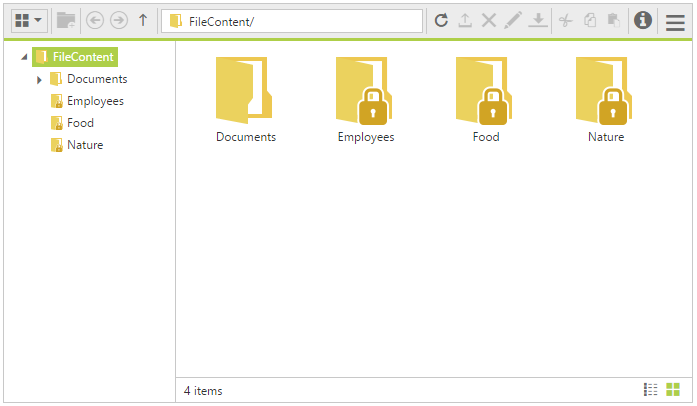

# Access Control

The FileExplorer provides method to assign permissions or access rights to specific users and group of users. It allows you to define access permissions for folders and files using a set of access rules to user(s).

The `FileAccessInfo` allows you to specify a Root **Path** and **Role**, and lists the permission (allow or deny) associated with this **Rules**. You can specify permissions to Copy, Download, Edit, Edit Contents, Path, Read, Role, and Upload a file/folder. The rule priority is determined by its index within an access rules collection.

### Syntax



    // For File rule
    new AccessRule { Path = "Documents/*.*", Role = "Document Manager", Read = Permission.Allow, Edit = Permission.Allow, Copy = Permission.Allow, Download = Permission.Allow },

    // For Folder rule
    new AccessRule { Path = "Documents/*", Role = "Document Manager", Read = Permission.Allow, Edit = Permission.Allow, Copy = Permission.Allow, EditContents = Permission.Allow, Upload = Permission.Allow },



The below table list out the `FileAccessInfo` properties:

<table>
<tr>
<th>
Properties
</th>
<th>
Description
</th>
</tr>
<tr>
<td>
Role
</td>
<td>
Specifies the which role is applied
</td>
</tr>
<tr>
<td>
Rules
</td>
<td>
Specifies the collections of rules for folder and files
</td>
</tr>
<tr>
<td>
RootPath
</td>
<td>
Specifies the root path of the folder’s which want to be secure
</td>
</tr>
</table>

The below table below list out the `AccessRule` properties which is available for file and folder access rules.

<table>
<tr>
<th>
Properties
</th>
<th>
Applicable for File
</th>
<th>
Applicable for Folder
</th>
<th>
Description
</th>
</tr>
<tr>
<td>
Copy
</td>
<td>
Yes
</td>
<td>
Yes
</td>
<td>
Specifies the permission to copy a file/folder
</td>
</tr>
<tr>
<td>
Download
</td>
<td>
Yes
</td>
<td>
No
</td>
<td>
Specifies the permission to download a file
</td>
</tr>
<tr>
<td>
Edit
</td>
<td>
Yes
</td>
<td>
Yes
</td>
<td>
Specifies the permission to edit a file/folder
</td>
</tr>
<tr>
<td>
EditContents
</td>
<td>
No
</td>
<td>
Yes
</td>
<td>
Specifies the permission to edit its content for folder
</td>
</tr>
<tr>
<td>
Path
</td>
<td>
Yes
</td>
<td>
Yes
</td>
<td>
Specifies the path to apply the rules which are defined
</td>
</tr>
<tr>
<td>
Read
</td>
<td>
Yes
</td>
<td>
Yes
</td>
<td>
Specifies the permission to read a file/folder content
</td>
</tr>
<tr>
<td>
Role
</td>
<td>
Yes
</td>
<td>
Yes
</td>
<td>
Specifies the role to which the rule is applied
</td>
</tr>
<tr>
<td>
Upload
</td>
<td>
No
</td>
<td>
Yes
</td>
<td>
Specifies the permission to upload files to a folder
</td>
</tr>
</table>

To specify the rule to be allow/deny, use the Permission enumeration values:

<table>
<tr>
<th>
Permission
</th>
<th>
Description
</th>
</tr>
<tr>
<td>
Allow
</td>
<td>
Specify the rule to be allowed
</td>
</tr>
<tr>
<td>
Deny
</td>
<td>
Specify the rule to be denied
</td>
</tr>
</table>

You can associate any number of access rules with specific security roles, it allows grouping related permissions together. To associate an access rule with a security role, assign the role's name to the `AccessRule's` Role property.

## FileAccessOperations

The **FileAccessOperations** class allows user to perform the most common file operations such as read, create, rename, copy, paste or move, delete and file searching. The class helps to handle the file access operations in server end. You implement a new custom class for handling file operations in server end by inheriting this class.

By default, we send following parameters in data field of corresponding AJAX request to handle the server side operation. The request parameter and response data are explained in following table.

<table>
<tr>
<th>
Operation
</th>
<th>
Default Request Parameter
</th>
<th>
Response data
</th>
<th>
Details
</th>
</tr>
<tr>
<td>
Read
</td>
<td>
string path, string filter, IEnumerable&lt;object&gt; selectedItems
</td>
<td>
It should be in JSON format with key name as <b>files</b> and <b>cwd</b>. The JSON fields contains the following field names '<b>name,  isFile, hasChild, permission</b>'.
 
For example:
 
    {"cwd":{"name":"FileContent","type":"Directory","size":0,"dateModified":"3/30/2016 9:19:27 PM","hasChild":true,"isFile":false,"filterPath":null,"permission":{"Copy":false,"Download":false,"Edit":false,"EditContents":false,"Read":true,"Upload":false}},
    "files":[{"name":"Documents","type":"Directory","size":0,"dateModified":"3/30/2016 9:20:10 PM","hasChild":false,"isFile":false,"filterPath":null,"permission":{"Copy":true,"Download":false,"Edit":false,"EditContents":true,"Read":true,"Upload":true}},
    {"name":"Nature","type":"Directory","size":0,"dateModified":"3/30/2016 9:19:27 PM","hasChild":false,"isFile":false,"filterPath":null,"permission":{"Copy":false,"Download":false,"Edit":false,"EditContents":false,"Read":false,"Upload":false}}],
    "details":null,
    "error":null}
</td>
<td>
It used to get all immediate files and sub-folders of the given path and it returns the matched type of files only, which are specified in '<b>filter</b>' parameter. 

(here <b>cwd</b> represents details of the given path and <b>files</b> represents details of the child files and folders of the given path)
</td>
</tr>
<tr>
<td>
CreateFolder
</td>
<td>
string path, string name, IEnumerable&lt;object&gt; selectedItems
</td>
<td>
It is in JSON format with key name as <b>files</b>. The '<b>name</b>' and '<b>permission</b>' fields are necessary on return JSON data.
 
For example:
 
    {"cwd":null,
    "files":[{"name":"New Folder", "type":"Directory","size":0,"dateModified":"4/6/2016 2:55:22 PM","hasChild":true,"isFile":false,"filterPath":null,"permission":{"Copy":true,"Download":false,"Edit":true,"EditContents":true,"Read":true,"Upload":true}}],
    "details":null,
    "error":null}
</td>
<td>
It used to create a new folder in given path with specified name.

(here <b>files</b> represents details of the newly added folder’s)
</td>
</tr>
<tr>
<td>
Paste
</td>
<td>
string sourceDir, string backupDir, string[] names, string option, IEnumerable&lt;CommonFileDetails&gt; commonFiles, IEnumerable&lt;object&gt; selectedItems, IEnumerable&lt;object&gt; targetFolder
</td>
<td>
It returns the pasted file details or null.
 
For example:
 
    {"cwd":null,
    "files":[{"name":"bird(1).jpg","type":"File","size":102182,"dateModified":"3/23/2016 6:05:32 PM","hasChild":false,"isFile":true,"filterPath":null,"permission":{"Copy":true,"Download":true,"Edit":true,"EditContents":true,"Read":true,"Upload":true}}],
    "details":null,
    "error":null}
</td>
<td>
This method helps to copy or move files from one location to another location.

(here <b>files</b> represents details of the pasted items)

</td>
</tr>
<tr>
<td>
Remove
</td>
<td>
string[] names, string path, IEnumerable&lt;object&gt; selectedItems
</td>
<td>
It returns the removed file details or null.
 
For example:
 
    {"cwd":null,
    "files":[{"name":"New folder", "type":"Directory","size":0,"dateModified":"4/6/2016 3:05:17 PM","hasChild":true,"isFile":false,"filterPath":null,"permission":{"Copy":true,"Download":false,"Edit":true,"EditContents":true,"Read":true,"Upload":true}}],
    "details":null,
    "error":null}
</td>
<td>
It helps to remove the specified items from given path. 

(here <b>files</b> represents details of the removed item)
</td>
</tr>
<tr>
<td>
Rename
</td>
<td>
string path, string oldName, string newName, IEnumerable&lt;CommonFileDetails&gt; commonFiles, IEnumerable&lt;object&gt; selectedItems
</td>
<td>
It returns the renamed file details or null.
 
For example:
 
    {"cwd":null,
    "files":[{"name":"my folder", "type":"Directory","size":0,"dateModified":"4/6/2016 3:05:17 PM","hasChild":true,"isFile":false,"filterPath":null,"permission":{"Copy":true,"Download":false,"Edit":true,"EditContents":true,"Read":true,"Upload":true}}],
    "details":null,
    "error":null}
</td>
<td>
This method helps to rename the file/folder, which is available in given path.

(here <b>files</b> represents details of the renamed items)
</td>
</tr>
<tr>
<td>
GetDetails
</td>
<td>
string path, string[] names, IEnumerable&lt;object&gt; selectedItems
</td>
<td>
It is in JSON data with key name as <b>details</b>.
 
For example:
 
    {"cwd":null,
    "files":null,
    "details":[{"Name":"green.jpg","Location":"C:\\Users\\XXX\\AppData\\Local\\Syncfusion\\EssentialStudio\\14.1.0.40\\MVC\\Samples\\web\\FileContent\\Documents\\green.jpg","Type":".jpg","Size":89894,"Created":"3/30/2016 9:19:25 PM","Modified":"3/23/2016 6:05:32 PM","Permission":{"Copy":true,"Download":true,"Edit":true,"EditContents":true,"Read":true,"Upload":true}}],
    "error":null}
</td>
<td>
This method used to get the details of the specified file or directory.

(here <b>details</b> represents details of the given path which is need to be showcased to user)
</td>
</tr>
<tr>
<td>
Download
</td>
<td>
string path, string[] names, IEnumerable&lt;object&gt; selectedItems
</td>
<td>
Void
</td>
<td>
This method helps to download the specified files in the given path.
</td>
</tr>
<tr>
<td>
Upload
</td>
<td>
IEnumerable&lt;System.Web.HttpPostedFileBase&gt; files, string path, IEnumerable&lt;object&gt; selectedItems
</td>
<td>
Void
</td>
<td>
This method helps to upload the specified files to given path.
</td>
</tr>
<tr>
<td>
Search
</td>
<td>
string path, string filter, string searchString,  bool caseSensitive, IEnumerable&lt;object&gt; selectedItems
</td>
<td>
It returns JSON data with key name as <b>files</b> and JSON fields need to be with following field names '<b>name, isFile, hasChild, permission</b>'.
 
For example:
 
    {"cwd":{"name":"FileContent","type":"Directory","size":0,"dateModified":"3/30/2016 9:19:27 PM","hasChild":true,"isFile":false,"filterPath":null,"permission":{"Copy":false,"Download":false,"Edit":false,"EditContents":false,"Read":true,"Upload":false}},    "files":[{"name":"bird.jpg","type":"File","size":102182,"dateModified":"1/9/2016 6:48:42 AM","hasChild":false,"isFile":true,"filterPath":null,"permission":{"Copy":false,"Download":false,"Edit":false,"EditContents":true,"Read":true,"Upload":false}},    {"name":"sea.jpg","type":"File","size":97145,"dateModified":"1/9/2016 6:48:42 AM","hasChild":false,"isFile":true,"filterPath":null,"permission":{"Copy":false,"Download":false,"Edit":false,"EditContents":false,"Read":true,"Upload":true}}],
    "details":null,
    "error":null}
</td>
<td>
It used to search all the matched files and sub-folders in the given folder path also it filters the specified files using it types.
</td>
</tr>
</table>

N> If needed, customer can also add additional data along with existing properties using **FileExplorerDirectoryContent** class

### Example

We can make a FileExplorer with access rule by doing following steps,

1.	Add the following code example to the corresponding ASPX page to render the FileExplorer.

    ~~~ csharp
    
    <ej:FileExplorer ID="fileexplorer" runat="server" Layout="LargeIcons" IsResponsive="true" Width="100%" AjaxAction="AccessControl.aspx/FileActionDefault" Path="~/FileContent/">
        <AjaxSettings>
            <Download Url="downloadFile.ashx{0}" />
            <Upload Url="uploadFiles.ashx{0}" />
        </AjaxSettings>
    </ej:FileExplorer>

    ~~~

2.	Add the following code example to the corresponding code behind page. The `FileAccessDefault` method triggers from AJAX request with specific ActionType value as parameter.

    ~~~ csharp
    
    public static object FileActionDefault(string ActionType, string Path, string ExtensionsAllow, string LocationFrom, string LocationTo, string Name, string[] Names, string NewName, string Action, bool CaseSensitive, string SearchString, IEnumerable<CommonFileDetails> CommonFiles)
    {
        AccessControl Rule = new AccessControl();
        FileAccessOperations operation = new FileAccessOperations(Rule.GetRules());
        switch (ActionType)
        {
            case "Read":
                return (operation.Read(Path, ExtensionsAllow));
            case "CreateFolder":
                return (operation.CreateFolder(Path, Name));
            case "Paste":
                operation.Paste(LocationFrom, LocationTo, Names, Action, CommonFiles);
                break;
            case "Remove":
                operation.Remove(Names, Path);
                break;
            case "Rename":
                operation.Rename(Path, Name, NewName, CommonFiles);
                break;
            case "GetDetails":
                return (operation.GetDetails(Path, Names));
            case "Search":
                return (operation.Search(Path, ExtensionsAllow, SearchString, CaseSensitive));
        }
        return "";
    }
    public FileAccessInfo GetRules()
    {
        FileAccessInfo rules = new FileAccessInfo();
        List<AccessRule> accessRules = new List<AccessRule> {
            // For Default User
            new AccessRule { Path = "*.*", Role = "Default User", Read = Permission.Deny, Edit = Permission.Deny, Copy = Permission.Deny, Download = Permission.Deny },
            new AccessRule { Path = "*", Role = "Default User", Read = Permission.Deny, Edit = Permission.Deny, Copy = Permission.Deny, EditContents = Permission.Deny, Upload = Permission.Deny },
            new AccessRule { Path = "", Role = "Default User", Read = Permission.Allow, Edit = Permission.Deny, Copy = Permission.Deny, EditContents = Permission.Deny, Upload = Permission.Deny },
            // For Administrator
            new AccessRule { Path = "*.*", Role = "Administrator", Read = Permission.Allow, Edit = Permission.Allow, Copy = Permission.Allow, Download = Permission.Allow },
            new AccessRule { Path = "*", Role = "Administrator", Read = Permission.Allow, Edit = Permission.Allow, Copy = Permission.Allow, EditContents = Permission.Allow, Upload = Permission.Allow },
            new AccessRule { Path = "", Role = "Administrator", Read = Permission.Allow, Edit = Permission.Deny, Copy = Permission.Allow, EditContents = Permission.Allow, Upload = Permission.Allow },
            // For Document Manager
            new AccessRule { Path = "*.*", Role = "Document Manager", Read = Permission.Deny, Edit = Permission.Deny, Copy = Permission.Deny, Download = Permission.Deny },
            new AccessRule { Path = "Documents/*.*", Role = "Document Manager", Read = Permission.Allow, Edit = Permission.Allow, Copy = Permission.Allow, Download = Permission.Allow },
            new AccessRule { Path = "*", Role = "Document Manager", Read = Permission.Deny, Edit = Permission.Deny, Copy = Permission.Deny, EditContents = Permission.Deny, Upload = Permission.Deny },
            new AccessRule { Path = "", Role = "Document Manager", Read = Permission.Allow, Edit = Permission.Deny, Copy = Permission.Deny, EditContents = Permission.Deny, Upload = Permission.Deny },
            new AccessRule { Path = "Documents", Role = "Document Manager", Read = Permission.Allow, Edit = Permission.Deny, Copy = Permission.Allow, EditContents = Permission.Allow, Upload = Permission.Allow },
            new AccessRule { Path = "Documents/*", Role = "Document Manager", Read = Permission.Allow, Edit = Permission.Allow, Copy = Permission.Allow, EditContents = Permission.Allow, Upload = Permission.Allow },
        };
        rules.Rules = accessRules;
        rules.Role = User.Identity.Name; // Specify the current user role
        rules.RootPath = "~/FileContent/";
        return rules;
    }
    
    ~~~

The following screenshot displays the output of the above code.

FileExplorer with Access Rule
{:.caption}
