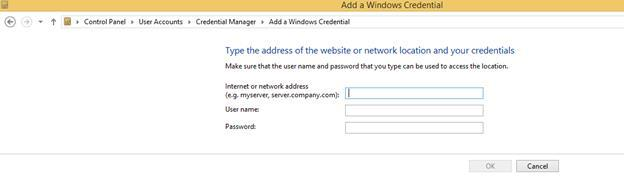

# Access shared folder using FileExplorer

Using “FileExplorer”, you can manage the files that are available in a shared folder of another system which is connected through LAN. Refer following steps, here you will see the details about accessing the shared folder with FileExplorer.

First you have to specify the shared folder path in any of following formats.

1. “\\Server\SharedFolder”
2. “\\Server”
3. “//Server/SharedFolder”
4. “//Server”

In the aspx page, add “FileExplorer” element and specify the shared path in following format.

    

        <ej:FileExplorer ID="fileexplorer1" 
            runat="server"       
            Layout="Tile" 
            AjaxAction="FileExplorerFeatures.aspx/FileActionDefault"
            Path="//Server/SharedFolder">
            <AjaxSettings>
                <Download Url="downloadFile.ashx{0}" />
                <Upload Url="uploadFiles.ashx{0}" />
            </AjaxSettings>
        </ej:FileExplorer>

    

**Authentication problem in shared folder**

If shared folder is restricted with authentication, that time you are not able to access this folder using our FileExplorer. Here you will get an exception like “**System.UnauthorizedAccessException, Please add your windows credential details to open ‘\\server\’**”. In order to solve this problem, you have to add the shared folder credential details in the windows credential manager that is available in your service hosted machine.

