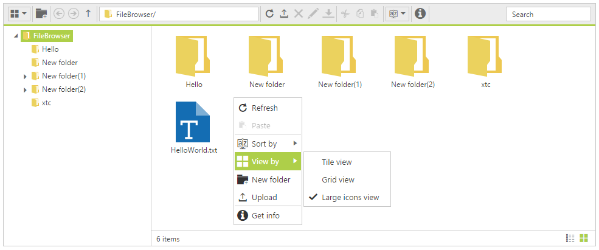

# Context Menu

The context-menu has [list of items](#context-menu-items) which helps to perform FileExplorer operations, and it appears based on the target such as file or folder.

## Context menu items

The below table shows the context menu items corresponding to the location where it is opened:
 
 
<table>
<tr>
<td>
Context menu location
</td>
<td>
Context menu items
</td>
<td>
Screenshot
</td>
</tr>
<tr>
<td>
While right click on treeview nodes (from navigation pane)  </td>
<td>
* New folder * Upload * Delete * Rename * Cut * Copy * Paste *Get info   </td>
<td>
    </td>
</tr>
<tr>
<td>
While right click on file / folder  </td>
<td>
* Open * Download * Upload * Delete * Rename * Cut * Copy * Paste * Get info *Open folder location    </td>
<td>
    </td>
</tr>
<tr>
<td>
While right click on layout (content pane)  </td>
<td>
* Refresh * Paste * Sort by * New folder * Upload  * Get info     </td>
<td>
    </td>
</tr>
</table>
The below table explains the behavior of each context menu item:
<table>
<tr>
<td>
Open  </td>
<td>
It opens the selected folder. When an image file selected it opens the preview of the image. For the remaining files this option becomes disabled.  </td>
</tr>
<tr>
<td>
Download  </td>
<td>
It downloads the selected file. When a file or number of files selected at that time only download option enabled.  If multiple files selected then it downloads all the files in a zip format.  </td>
</tr>
<tr>
<td>
Cut  </td>
<td>
It makes the copy of the selected files or folders into the clipboard. When the user paste the files in any location, the files are removed from the source location.  </td>
</tr>
<tr>
<td>
Copy  </td>
<td>
It makes the copy of the selected files or folders into the clipboard. When the user paste the files, the copy of the files only pasted in the target location.  </td>
</tr>
<tr>
<td>
Paste  </td>
<td>
It paste the files from the clipboard into the current selected folder. Note that when the files are copied into the clipboard at that time only it enabled.  </td>
</tr>
<tr>
<td>
Delete  </td>
<td>
It deletes the current selected file or folder. When you select any file or folder at that time only this option gets enabled.  If multiple files selected then it deletes all the selected items.  </td>
</tr>
<tr>
<td>
Rename  </td>
<td>
This is used to rename the current selected file or folder. When you select any file or folder at that time only this option gets enabled.  Even multiple files selected it renames the single file only.  </td>
</tr>
<tr>
<td>
New Folder  </td>
<td>
It creates a new folder on the current directory.  While click on the “New folder” item a dialog appears to get the folder name. Based on the user input, a new folder create on the current directory.  </td>
</tr>
<tr>
<td>
Upload  </td>
<td>
It uploads a file or list of files into the current directory.  </td>
</tr>
<tr>
<td>
Get info  </td>
<td>
It displays the details of the current selected file or folder.  </td>
</tr>
<tr>
<td>
Sort By  </td><td>
It's used to sorting the files and folders from the current directory.The sorting can be done based on the columns available from grid,in both ascending and descending order.  </td>
</tr>
<tr>
<td>
Open folder location
</td>
<td>
It helps to open a file location from the filtered list.
</td>
</tr>
</table>

## Context menu Visibility

The presence of the context menu can be controlled by the “[ShowContextMenu](http://help.syncfusion.com/js/api/ejfileexplorer#members:showcontextmenu)” property. This was enabled by default, and by disabling this property you can prevent our built-in context menu.

In the view page, add FileExplorer element and specify the context menu visibility as false.

    
    
    
        <ej:FileExplorer
            ID="fileexplorer"
            runat="server"
            AjaxAction="DefaultFunctionalities.aspx/FileActionDefault"
            Path="~/FileBrowser/" 
            ShowContextMenu="false">        
            <AjaxSettings>
                <Download Url="downloadFile.ashx{0}" />
                <Upload Url="uploadFiles.ashx{0}" />
            </AjaxSettings>  
        </ej:FileExplorer>
        
    
    
## Enable / Disable the Context menu Item

The context menu items can be enabled or disabled through the client side public methods. It enables or disables the item from all the context menu where it is present.

For example, if you disable the “Upload” item, it disables in all places wherever it appears such as open navigation pane, open on file/ folder, and open on layout.

* [enableMenuItem](http://help.syncfusion.com/js/api/ejfileexplorer#methods:enablemenuitem)
* [disableMenuItem](http://help.syncfusion.com/js/api/ejfileexplorer#methods:disablemenuitem)

These methods only accepts the context menu item name as the parameter.
    
    
    
            $(function () {
                var fileExpObj = $("#fileexplorer").data("ejFileExplorer");
                // this disables the New folder item
                fileExpObj.disableMenuItem("New folder");
                // this disables the Download item
                fileExpObj.disableMenuItem("Download");
            });
            
    
    
## Context Menu Customization

You can customize the ContextMenu of FileExplorer control by using [ContextMenuSettings](https://help.syncfusion.com/api/js/ejfileexplorer#members:contextmenusettings) property. 

You can add your own context menu items and its action along with default context menu items of FileExplorer control. You can also remove the default context menu items in FileExplorer control. 

To add/remove/re-arrange context menu items, you need to use [ContextMenuSettings.Items](https://help.syncfusion.com/api/js/ejfileexplorer#members:contextmenusettings-items) property and to bind required actions for newly added menu items and add sub menu items, use [ContextMenuSettings.CustomMenuFields](https://help.syncfusion.com/api/js/ejfileexplorer#members:contextmenusettings-custommenufields) property.

Add the following code example to the corresponding code behind page.



[System.Web.Services.WebMethod]
public static object FileActionContextMenu(string ActionType, string Path, string ExtensionsAllow, string LocationFrom, string LocationTo, string Name, string[] Names, string NewName, string Action, bool CaseSensitive, string SearchString, IEnumerable<CommonFileDetails> CommonFiles)
{
    FileExplorerOperations operation = new FileExplorerOperations();
    switch (ActionType)
    {
        case "Read":
            return (operation.Read(Path, ExtensionsAllow));
        case "CreateFolder":
            return (operation.CreateFolder(Path, Name));
        case "Paste":
            operation.Paste(LocationFrom, LocationTo, Names, Action, CommonFiles);
            break;
        case "Remove":
            operation.Remove(Names, Path);
            break;
        case "Rename":
            operation.Rename(Path, Name, NewName, CommonFiles);
            break;
        case "GetDetails":
            return (operation.GetDetails(Path, Names));
        case "Search":
            return (operation.Search(Path, ExtensionsAllow, SearchString, CaseSensitive));
    }
    return "";
}



In the ASPX page, add FileExplorer element with following properties.



<ej:FileExplorer ID="fileexplorer" runat="server" IsResponsive="true" Width="100%" MinWidth="150px" 
    AjaxAction="CustomContextMenu.aspx/FileActionContextMenu" Path="~/FileBrowser/"
    ClientSideOnLayoutChange="onLayoutChange" ClientSideOnMenuOpen="onMenuOpen">
    <AjaxSettings>
        <Download Url="downloadFile.ashx{0}" />
        <Upload Url="uploadFiles.ashx{0}" />
    </AjaxSettings>
    <ContextMenuSettings>
        <Items Navbar="Upload,|,Delete,Rename,|,Cut,Copy,Paste,|,Getinfo"
            Cwd="Refresh,Paste,|,SortBy,View,|,NewFolder,Upload,|,Getinfo"
            Files="Open,Download,|,Delete,Rename,|,Cut,Copy,Paste,|,OpenFolderLocation,Getinfo" />
        <CustomMenuFields>
            <ej:FileExplorerCustomMenuFields Id="View" Text="View by" SpriteCssClass="custom-grid">
                <Child>
                    <ej:FileExplorerCustomMenuFields Id="tile" Text="Tile view" Action="onLayout">
                    </ej:FileExplorerCustomMenuFields>
                    <ej:FileExplorerCustomMenuFields Id="grid" Text="Grid view" Action="onLayout">
                    </ej:FileExplorerCustomMenuFields>
                    <ej:FileExplorerCustomMenuFields Id="largeIcons" Text="Large icons view" Action="onLayout">
                    </ej:FileExplorerCustomMenuFields>
                </Child>
            </ej:FileExplorerCustomMenuFields>
        </CustomMenuFields>
    </ContextMenuSettings>
</ej:FileExplorer>



Icons of context menu items can be customized by overriding the default context menu item style. The following code example illustrates how to customize the icon of context menu items.





The following screenshot displays the customization of context menu in FileExplorer control.

## Context Menu Events

You would be notified with events when you try to open the context menu items (**ClientSideOnMenuBeforeOpen**), after context menu items is opened (**ClientSideOnMenuOpen**) and when you click the menu items (**ClientSideOnMenuClick**). The following code example illustrates how to define those events.



<ej:FileExplorer ID="fileexplorer" runat="server" AjaxAction="CustomContextMenu.aspx/FileActionContextMenu" Path="~/FileBrowser/" ClientSideOnMenuBeforeOpen="menuBeforeOpen" ClientSideOnMenuOpen="menuOpen" ClientSideOnMenuClick="menuClick"></ej:FileExplorer>





function menuBeforeOpen(args) {
    //you add/remove the context menu items in run time
    //do your custom action here.
    args.dataSource.pop();
}
function menuOpen(args) {
    //you can also identify which context menu is opened by 
    if (args.contextMenu == "cwd") {
        //do your custom action here.
    }
}
function menuClick(args) {
    switch (args.text) {
        case "largeicons":
            //do your custom action here.
            break;
    }
}


