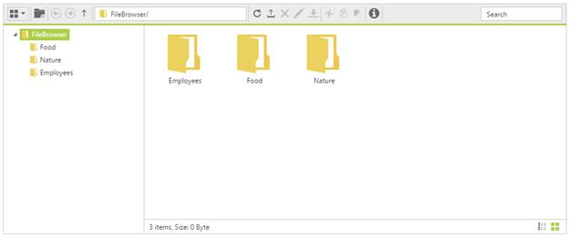

# Getting Started

The following section is briefly explain the things to get started with FileExplorer control.

## A new ASP Web Application and required assemblies with dependent files

To get start with ASP.NET Web EJ FileExplorer, create a new ASP Web Application and add the required assemblies in references and then refer the below specified dependent CSS file as well as scripts

To create an ASP Web Project and add necessary assemblies you can use the help of the given [ASP Web-Getting Started](http://help.syncfusion.com/aspnet/getting-started#) documentation.

## Adding the references

To include the control in the application the following references need to be added:

* CSS references

* Script references

CSS file

* [ej.web.all.min.css](http://cdn.syncfusion.com/13.4.0.58/js/web/flat-azure/ej.web.all.min.css#) includes all widgets styles (To know more about theme refer [Theming in Essential JavaScript Component](http://help.syncfusion.com/js/theming-in-essential-javascript-components#))

N> Essential JS widgets having the support for 13 built-in themes, to know more please check [here](http://docs.syncfusion.com/js/theming-in-essential-javascript-components#)

### Script references

The external script dependencies of the FileExplorer widget are,

* [jQuery 1.7.1](http://jquery.com/#) or later versions.

* [jsrender](https://www.jsviews.com/#jsrender) – for grid view template.

And the internal script dependencies of the FileExplorer widget are:

<table>
<tr>
<td>
File
</td>
<td>
Description/Usage
</td>
</tr>
<tr>
<td>
ej.core.min.js  </td>
<td>
Must be referred always before using all the JS controls.  </td>
</tr>
<tr>
<td>
ej.data.min.js  </td>
<td>
Used to handle data operation and should be used while binding data to JS controls.  </td>
</tr>
<tr>
<td>
ej.touch.min.js
</td>
<td>
Used to handle touch operations
</td>
</tr>
<tr>
<td>
ej. draggable.min.js
</td>
<td>
Used to handle the drag and drop functionality  </td>
</tr>
<tr>
<td>
ej.scroller.min.js  </td>
<td>
Used to show the scrollbar in the layout area  </td>
</tr>
<tr>
<td>
ej.button.min.js  </td>
<td>
Used to display the buttons in the toolbar  </td>
</tr>
<tr>
<td>
ej.checkbox.min.js
</td>
<td>
Used to display the checkbox in files items

</td>
</tr>
<tr>
<td>
ej.splitbutton.min.js
</td>
<td>
Used to display the split buttons in the toolbar  </td>
</tr>
<tr>
<td>
ej.treeview.min.js  </td>
<td>
Used to display the “TreeView” in the navigation pane  </td>
</tr>
<tr>
<td>
ej.uploadbox.min.js  </td>
<td>
Used to perform the upload functionality   </td>
</tr>
<tr>
<td>
ej.waitingpopup.min.js  </td>
<td>
Used to showcase the waiting popup  </td>
</tr>
<tr>
<td>
ej.dialog.min.js  </td>
<td>
Used to create the alert windows   </td>
</tr>
<tr>
<td>
ej.splitter.min.js  </td>
<td>
Used as the body section to separate the navigation and layout area  </td>
</tr>
<tr>
<td>
ej.toolbar.min.js  </td>
<td>
Used to showcase the hearer section  </td>
</tr>
<tr>
<td>
ej.menu.min.js  </td>
<td>
Used to showcase the context menu  </td>
</tr>
<tr>
<td>
ej.grid.min.js  </td>
<td>
Used to showcase the grid layout view  </td>
</tr>
<tr>
<td>
ej.fileexplorer.min.js
</td>
<td>
FileExplorer plugin
</td>
</tr>
<tr>
<td>
ej.globalize.min.js
</td>
<td>
Used to working with different localization culture formats

</td>
</tr>
</table>

You can use the “**ej.web.all.min.js**” file, which encapsulates all the EJ Web controls and frameworks in one single file

N> To add required assembly references, scripts and CSS files automatically into your application, please refer following link [http://help.syncfusion.com/aspnet/getting-started#configuring-syncfusion-nuget-packages-in-visual-studio](http://help.syncfusion.com/aspnet/getting-started#configuring-syncfusion-nuget-packages-in-visual-studio) 

## Create your FileExplorer

In the view page, add FileExplorer element as shown below.

    
    
        <ej:FileExplorer
            ID="fileexplorer"
            runat="server"
            AjaxAction="DefaultFunctionalities.aspx/FileActionDefault"
            Path="~/FileBrowser/">
            <AjaxSettings>
                <Download Url="downloadFile.ashx{0}" />
                <Upload Url="uploadFiles.ashx{0}" />
            </AjaxSettings>
        </ej:FileExplorer>
    
    
    
In above code block, “Path” denotes the URL of filesystem that are to be explored in "FileExplorer" and “AjaxAction” specifies the URL of server side AJAX handling method that handles the file operations of FileExplorer control. So “[Path](http://help.syncfusion.com/js/api/ejfileexplorer#members:path)” and “[AjaxAction](http://help.syncfusion.com/js/api/ejfileexplorer#members:ajaxaction)” are the mandatory configuration at here along with that you have to specify handler file names in “[AjaxSettings](http://help.syncfusion.com/js/api/ejfileexplorer#members:ajaxsettings)” API to perform “download” and “upload” operation.

Add the following code example to the corresponding code behind page. 
    
    
    
            [System.Web.Services.WebMethod]
            public static object FileActionDefault(string ActionType, string Path, string ExtensionsAllow, string LocationFrom, string LocationTo, string Name, string[] Names, string NewName, string Action, bool CaseSensitive, string SearchString, IEnumerable<CommonFileDetails> CommonFiles)
            {
                FileExplorerOperations operation = new FileExplorerOperations();
                switch (ActionType)
                {
                    case "Read":
                        return (operation.Read(Path, ExtensionsAllow));
                    case "CreateFolder":
                        return (operation.CreateFolder(Path, Name));
                    case "Paste":
                        operation.Paste(LocationFrom, LocationTo, Names, Action, CommonFiles);
                        break;
                    case "Remove":
                        operation.Remove(Names, Path);
                        break;
                    case "Rename":
                        operation.Rename(Path, Name, NewName, CommonFiles);
                        break;
                    case "GetDetails":
                        return (operation.GetDetails(Path, Names));
                    case "Search":
                        return (operation.Search(Path, ExtensionsAllow, SearchString, CaseSensitive));
                }
                return "";
            }
    
    

For handling upload and download operations in FileExplorer, you have to create two handler files (“downloadFile.ashx” and “uploadFiles.ashx”) and include the following code blocks on it.

Include following code block in “downloadFile.ashx.cs” file.
    
    
    
        /// 

        /// Summary description for downloadFile
        /// 

        public class downloadFile : IHttpHandler
        {
    
            public void ProcessRequest(HttpContext context)
            {
                HttpRequest request = context.Request;
                string path= request.QueryString["Path"];
                string[] names = request.QueryString.GetValues("Names");
                FileExplorerOperations operation = new FileExplorerOperations();
                operation.Download(path, names);                        
            }
            
            public bool IsReusable
            {
                get
                {
                    return false;
                }
            }
        }
        
    
    
 Include following code block in “uploadFiles.ashx.cs” file
    
    
    
        /// 

        /// Summary description for uploadFiles
        /// 

        public class uploadFiles : IHttpHandler
        {
    
            public void ProcessRequest(HttpContext context)
            {
                HttpRequest request = context.Request;
                string targetFolder = HttpContext.Current.Server.MapPath(request.QueryString["Path"]);
                if (!Directory.Exists(targetFolder))
                {
                    Directory.CreateDirectory(targetFolder);
                }
                HttpFileCollection uploadedFiles = request.Files;
                if (uploadedFiles != null && uploadedFiles.Count > 0)
                {
                    for (int i = 0; i < uploadedFiles.Count; i++)
                    {
                        string fileName = uploadedFiles[i].FileName;
                        int index = fileName.LastIndexOf("\\");
                        if (index > -1)
                        {
                            fileName = fileName.Substring(index + 1);
                        }
                        uploadedFiles[i].SaveAs(targetFolder + "\\" + fileName);
                    }
                }           
            }
            public bool IsReusable
            {
                get
                {
                    return false;
                }
            }
        }
        
    
    
Once you have completed the above steps, you will get an output like below.

N> In the [section](how-to#file-handling-operations), you can know the details about file handling operations, which are performed at server side of “FileExplorer”.