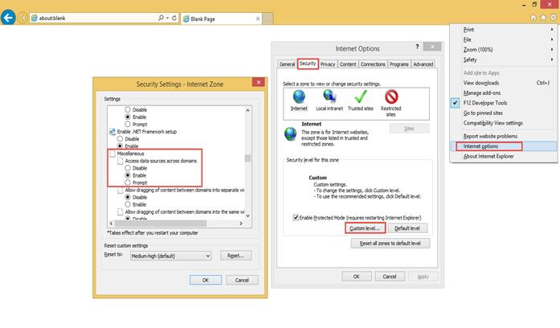

# How To

## File handling operations

In code behind page, we have specified some built-in classes at "**FileActionDefault**" action method. It helps to perform the server side operation of FileExplorer and you can find the details about these classes at below.

When you have made AJAX request on client-side, “FileActionDefault” method is triggered and it calls the corresponding built-in methods of “[FileExplorerOperations](http://help.syncfusion.com/CR/aspnet/Syncfusion.JavaScript.FileExplorerOperations.html#)” class using “ActionType” property.

**BasicFileOperations class**

“BasicFileOperations” is an abstract class and it is useful for handling file operations in server end. By inheriting this class, easily you can implement a new custom class for handling file operations in server end. Refer [class reference](http://help.syncfusion.com/CR/aspnet/Syncfusion.JavaScript.BasicFileOperations.html#) of “BasicFileOperations”.

**FileExplorerOperations class**

This class is useful for handling file operations in server end. This class inherits the “BasicFileOperations” class and its abstract methods has been implemented here for managing files in **underlying machine's physical file system**. Refer [class reference](http://help.syncfusion.com/CR/aspnet/Syncfusion.JavaScript.FileExplorerOperations.html#) of “FileExplorerOperations”.

N> Here “ActionType” specifies following operations such as “Read”, “CreateFolder”, “Paste”, “Remove”, “Rename”, “GetDetails”, “Download”, “Upload”, “Search”. Following [section](#abstract-methods-in-basicfileoperations-class) contains the details about each operation.

 

## Customizing AJAX handling functions

In FileExplorer, server side functionalities are necessary to handle the AJAX request of FileExplorer. Here “Syncfusion.EJ” assembly contains built-in “[BasicFileOperations](http://help.syncfusion.com/CR/aspnet/Syncfusion.JavaScript.BasicFileOperations.html#)” abstract class and implementation of “[FileExplorerOperations](http://help.syncfusion.com/CR/aspnet/Syncfusion.JavaScript.FileExplorerOperations.html#)” class for providing the content to FileExplorer and handling AJAX requests. If is it necessary, you can customize the server side functionalities of FileExplorer as per your requirement. 

### Override the existing Syncfusion.JavaScript.FileExplorerOperations class

Using “[FileExplorerOperations](http://help.syncfusion.com/CR/aspnet/Syncfusion.JavaScript.FileExplorerOperations.html#)” class, you can manage the underlying machine's physical file system with the help of FileExplorer control. Here you can override the necessary methods that is available in “**FileExplorerOperations**” by sub classing the existing “**FileExplorerOperations**” class.

Below code example shows how to override “**GetDetails**” method, which is available in “**FileExplorerOperations**”

    
    
    
        public class FileExplorerCustomOperations : FileExplorerOperations
        {
            FileExplorerOperations operation = new FileExplorerOperations();
            CustomFileExplorerResponse customDetails = new CustomFileExplorerResponse();        
            public override object GetDetails(string path, string[] names, IEnumerable<object> selectedItems = null)
            {
                FileExplorerResponse response = (FileExplorerResponse) operation.GetDetails(path, names);            
                FileDetails fDetails = response.details.ElementAt(0) ;            
                CustomFileDetails cfDetails =new CustomFileDetails() ;
                CustomFileDetails[] responseDetails = new CustomFileDetails[1];
                cfDetails.Name= fDetails.Name;
                cfDetails.Location= fDetails.Location;            
                cfDetails.Size= fDetails.Size;
                cfDetails.Created= fDetails.Created;            
                cfDetails.IsFile = (fDetails.Type == "File Folder"? "false" : "true");
                responseDetails[0] = cfDetails;
                customDetails.details = responseDetails;
                return customDetails;
            }
        }
        public class CustomFileDetails
        {
            public string Name { get; set; }
            public string Location { get; set; }        
            public long Size { get; set; }
            public string Created { get; set; }        
            public string IsFile { get; set; }
        }
        public class CustomFileExplorerResponse
        {
            public IEnumerable<FileExplorerDirectoryContent> files { get; set; }
            public IEnumerable<CustomFileDetails> details { get; set; }
            public object error { get; set; }
        }
    
    
    
    
### Implement a new custom class to handle AJAX request and provide content for FileExplorer

When overriding the particular methods were not enough, you can create a new custom class using “[BasicFileOperations](http://help.syncfusion.com/CR/aspnet/Syncfusion.JavaScript.BasicFileOperations.html#)” abstract class. It helps to provide different file sources to be used the content for FileExplorer control, such as database system, physical system or online storage system such as Azure. 

#### Notes to Implementers

When you implement a derived class of “BasicFileOperations”, you must provide implementations for following methods and its details has been given in this [section](#abstract-methods-in-basicfileoperations-class)

* Read
* CreateFolder
* Remove
* Rename
* Paste
* Upload
* Download
* GetDetails
* GetImage
* Search

 

### Abstract methods in BasicFileOperations class

<table>
<tr>
<td>
{{'**Operation and Request Parameter**'| markdownify }}
</td>
<td>
{{'**Response data**'| markdownify }}
</td>
<td>
{{'**Details**'| markdownify }}
</td>
</tr>
<tr>
<td>
{{'**Operation**'| markdownify }}: Read 
  
{{'**Request Parameter**'| markdownify }}
 
{{'**Name**'| markdownify }}: path
 
{{'**Type  :** '| markdownify }}String
 
{{'**Description:**'| markdownify }}
Specifies the path of selected folder
  
{{'**Name**'| markdownify }}: filter
 
{{'**Type  :** '| markdownify }}String
 
{{'**Description:**'| markdownify }}
Specifies the file types that need to be filter
  
{{'**Name**'| markdownify }}: selectedItems
 
{{'**Type  :** '| markdownify }}IEnumerable&lt;object&gt;
 
{{'**Description:**'| markdownify }}
It contains the details about selected folder
  
</td>
<td>
Response data should be in JSON format with key name as "{{'**files**'| markdownify }}" and JSON fields should be with following field names
 
 
 {{'*“name,  isFile, hasChild”.*'| markdownify }}
  
{{'*For example:*'| markdownify }}
 
{
"{{'**files**'| markdownify }}":[{"{{'**name":"bird.jpg**'| markdownify }}","type":"File","size":102182,"dateModified":"1/9/2016 6:48:42 AM","{{'**hasChild":false,"isFile":true**'| markdownify }},"filterPath":null},
{"{{'**name":"sea.jpg**'| markdownify }}","type":"File","size":97145,"dateModified":"1/9/2016 6:48:42 AM","{{'**hasChild":false,"isFile":true**'| markdownify }},"filterPath":null }],
"details":null,
"error":null
}
  

Note: If needed, customer can also add additional data along with existing properties of “{{'[FileExplorerDirectoryContent](https://help.syncfusion.com/cr/aspnet/Syncfusion.JavaScript.FileExplorerDirectoryContent.html#)'| markdownify }}” class.
 
</td>
<td>
It used to get all immediate files and sub-folders of the given path and it returns the matched type of files only, which are specified in “filter” parameter.

</td>
</tr>
<tr>
<td>
{{'**Operation**'| markdownify }}: CreateFolder  
{{'**Request Parameter**'| markdownify }}
 
{{'**Name**'| markdownify }}: path 
{{'**Type  :** '| markdownify }}String 
{{'**Description:**'| markdownify }}
Specifies the path of selected folder  
{{'**Name**'| markdownify }}: name 
{{'**Type  :** '| markdownify }}String 
{{'**Description:**'| markdownify }}
specifies the name of new folder   
{{'**Name**'| markdownify }}: selectedItems 
{{'**Type  :** '| markdownify }}IEnumerable&lt;object&gt; 
{{'**Description:**'| markdownify }}
It contains the details about selected folder
  
</td>
<td>
Response data should be in JSON format with key name as "{{'**files**'| markdownify }}". 
  
In that returning JSON, “{{'**name**'| markdownify }}” field is necessary.
 
 
{{'*For example:*'| markdownify }}
 
{"files":[{"{{'**name":"New folder**'| markdownify }}","type":"Directory","size":0,"dateModified":"2/25/2016 7:31:02 AM","hasChild":true,"isFile":false,"filterPath":null}],"details":null,"error":null}
  
</td>
<td>
It used to create a new folder in given path with specified name

</td>
</tr>
<tr>
<td>
{{'**Operation:**'| markdownify }}Remove  
{{'**Request Parameter**'| markdownify }}
 
{{'**Name:**'| markdownify }}names 
{{'**Type  :** '| markdownify }}String[] 
{{'**Description:**'| markdownify }}
specifies the selected item names, which is going to be removed   
{{'**Name**'| markdownify }}: path 
{{'**Type  :** '| markdownify }}String 
{{'**Description:**'| markdownify }}
specifies the parent folder path of selected items   
{{'**Name**'| markdownify }}: selectedItems 
{{'**Type  :** '| markdownify }}IEnumerable&lt;object&gt; 
{{'**Description:**'| markdownify }}
It contains the details about selected items, which is going to be removed  
</td>
<td>
Here you may return the removed file details or empty.

</td>
<td>
It helps to remove the specified items from given path.
</td>
</tr>
<tr>
<td>
{{'**Operation:**'| markdownify }}Rename  
{{'**Request Parameter**'| markdownify }}
 
{{'**Name**'| markdownify }}: path 
{{'**Type  :** '| markdownify }}String 
{{'**Description:**'| markdownify }}
specifies the parent folder path of renaming item   
{{'**Name**'| markdownify }}: oldName 
{{'**Type  :** '| markdownify }}String 
{{'**Description:**'| markdownify }}
specifies the existing file name    
{{'**Name**'| markdownify }}: newName 
{{'**Type  :** '| markdownify }}String 
{{'**Description:**'| markdownify }}
specifies the new file name   
{{'**Name**'| markdownify }}: selectedItems 
{{'**Type  :** '| markdownify }}IEnumerable&lt;object&gt; 
{{'**Description:**'| markdownify }}
It contains the details about selected items, which is going to be renamed  
{{'**Name**'| markdownify }}: commonFiles 
{{'**Type  :** '| markdownify }}IEnumerable<{{'[CommonFileDetails](http://help.syncfusion.com/CR/aspnet/Syncfusion.JavaScript.CommonFileDetails.html#)'| markdownify }}> 
{{'**Description:**'| markdownify }}
It contains the details about already existing files, which contains same name and type as given in new file with same parent folder.  

</td>
<td>
Here you may return the renamed file details or empty.

</td>
<td>
This method helps to rename the file/folder, which is available in given path.
</td>
</tr>
<tr>
<td>
{{'**Operation:**'| markdownify }}Paste  
{{'**Request Parameter**'| markdownify }}
 
{{'**Name**'| markdownify }}: sourceDir 
{{'**Type  :** '| markdownify }}String 
{{'**Description:**'| markdownify }}
specifies the path of source directory   
{{'**Name**'| markdownify }}: backupDir 
{{'**Type  :** '| markdownify }}String 
{{'**Description:**'| markdownify }}
specifies the path of destination directory   
{{'**Name**'| markdownify }}: names 
{{'**Type  :** '| markdownify }}String[] 
{{'**Description:**'| markdownify }}
Specifies the name of file/ folders, which are going to be pasted in destination folder.  
{{'**Name**'| markdownify }}: option 
{{'**Type  :** '| markdownify }}String 
{{'**Description:**'| markdownify }}
specifies the operation type “move” or “copy”.  
{{'**Name**'| markdownify }}: selectedItems 
{{'**Type  :** '| markdownify }}IEnumerable&lt;object&gt; 
{{'**Description:**'| markdownify }}
It contains the details about selected items, which is going to be pasted   
{{'**Name**'| markdownify }}: commonFiles 
{{'**Type  :** '| markdownify }}IEnumerable<{{'[CommonFileDetails](http://help.syncfusion.com/CR/aspnet/Syncfusion.JavaScript.CommonFileDetails.html#)'| markdownify }}> 
{{'**Description:**'| markdownify }}
It contains the details about already existing files in destination folder, which contains the files in same name and type as same as newly copied files.  
{{'**Name**'| markdownify }}: targetFolder 
{{'**Type  :** '| markdownify }}IEnumerable&lt;object&gt; 
{{'**Description:**'| markdownify }}
It contains the details about target folder, where the files are going to be pasted.
  
</td>
<td>
Here you may return the pasted file details or empty.

</td>
<td>
This method helps to copy or move files from one location to another location.
</td>
</tr>
<tr>
<td>
{{'**Operation:**'| markdownify }}Upload  
{{'**Request Parameter**'| markdownify }}
 
{{'**Name**'| markdownify }}: files 
{{'**Type  :** '| markdownify }}IEnumerable&lt;System.Web.HttpPostedFileBase&gt; 
{{'**Description:**'| markdownify }}
Specifies the file details that is going to be uploaded   
{{'**Name**'| markdownify }}: path 
{{'**Type  :** '| markdownify }}String  
{{'**Description:**'| markdownify }}
specifies the path of destination directory, where the files need to be uploaded   
{{'**Name**'| markdownify }}: selectedItems 
{{'**Type  :** '| markdownify }}IEnumerable&lt;object&gt; 
{{'**Description:**'| markdownify }}
It contains the details about selected items, which is going to be uploaded.  
</td>
<td>
Return type of this method is “void”

</td>
<td>
This method helps to upload the specified files to given directory 

</td>
</tr>
<tr>
<td>
{{'**Operation:**'| markdownify }}Download  
{{'**Request Parameter**'| markdownify }}
 
{{'**Name**'| markdownify }}: path 
{{'**Type  :** '| markdownify }}String  
{{'**Description:**'| markdownify }}
Specifies the parent directory path of selected files, which is going to be download   
{{'**Name**'| markdownify }}: names 
{{'**Type  :** '| markdownify }}String [] 
{{'**Description:**'| markdownify }}
specifies the name of files that is need to be downloaded   
{{'**Name**'| markdownify }}: selectedItems 
{{'**Type  :** '| markdownify }}IEnumerable&lt;object&gt; 
{{'**Description:**'| markdownify }}
It contains the details about files, which is going to be downloaded.  
</td>
<td>
Return type of this method is “void”

</td>
<td>
This method helps to download the specified files.
</td>
</tr>
<tr>
<td>
{{'**Operation:**'| markdownify }}GetDetails  
{{'**Request Parameter**'| markdownify }}
 
{{'**Name**'| markdownify }}: path 
{{'**Type  :** '| markdownify }}String  
{{'**Description:**'| markdownify }}
Specifies the parent directory path of selected file   
{{'**Name**'| markdownify }}: names 
{{'**Type  :** '| markdownify }}String [] 
{{'**Description:**'| markdownify }}
Specifies the name of files in order to get it’s details   
{{'**Name**'| markdownify }}: selectedItems 
{{'**Type  :** '| markdownify }}IEnumerable&lt;object&gt; 
{{'**Description:**'| markdownify }}
It contains the basic details about selected files  
</td>
<td>
Response data should be in JSON format like below
  
{{'*For example:*'| markdownify }}
 
{details:[{CreationTime:"4/28/2015 9:44:32 AM", Extension:".png", Format:"Archive", FullName:"F:\All samples\FileExplorer_Custom\FileExplorerContent\human.png", LastAccessTime:"4/28/2015 9:44:32 AM", LastWriteTime:"3/31/2015 3:16:35 PM", Length:11059, Name:"human.png"}]}
  
Note: Here you may add additional date fields along with existing JSON data using “FileDetails” class.

</td>
<td>
This method used to get the details of the specified file or directory.

</td>
</tr>
<tr>
<td>
{{'**Operation:**'| markdownify }}GetImage  
{{'**Request Parameter**'| markdownify }}
 
{{'**Name**'| markdownify }}: path 
{{'**Type  :** '| markdownify }}String  
{{'**Description:**'| markdownify }}
specifies the path of image file   
{{'**Name**'| markdownify }}: selectedItems 
{{'**Type  :** '| markdownify }}IEnumerable&lt;object&gt; 
{{'**Description:**'| markdownify }}
It contains the details about selected image   
</td>
<td>
Return type of this method is void.
</td>
<td>
This method helps to get an image using “HttpResponse” option 

</td>
</tr>
<tr>
<td>
{{'**Operation:**'| markdownify }}Search  
{{'**Request Parameter**'| markdownify }}
 
{{'**Name**'| markdownify }}: path 
{{'**Type  :** '| markdownify }}String 
{{'**Description:**'| markdownify }}
specifies the directory path   
{{'**Name**'| markdownify }}: filter 
{{'**Type  :** '| markdownify }}String 
{{'**Description:**'| markdownify }}
Specifies the file types that need to be filter  
{{'**Name**'| markdownify }}: searchString 
{{'**Type  :** '| markdownify }}String 
{{'**Description:**'| markdownify }}
specifies the search string   
{{'**Name**'| markdownify }}: caseSensitive 
{{'**Type  :** '| markdownify }}String 
{{'**Description:**'| markdownify }}
specifies the case sensitive option  
{{'**Name**'| markdownify }}: selectedItems 
{{'**Type  :** '| markdownify }}IEnumerable&lt;object&gt; 
{{'**Description:**'| markdownify }}
It contains the details about selected folder  
</td>
<td>
It should return data in JSON format with key name as "{{'**files**'| markdownify }}" and JSON fields need to be with following field names
  
 "{{'*name,  isFile, hasChild, filterPath.*'| markdownify }}"
  
{{'*For example:*'| markdownify }}
 
{
"{{'**files**'| markdownify }}":[{"{{'**name":"bird.jpg**'| markdownify }}","type":"File","size":102182,"dateModified":"1/9/2016 6:48:42 AM","{{'**hasChild":false,"isFile":true**'| markdownify }},"filterPath":null},
{"{{'**name":"sea.jpg**'| markdownify }}","type":"File","size":97145,"dateModified":"1/9/2016 6:48:42 AM","{{'**hasChild":false,"isFile":true**'| markdownify }},"filterPath":null }],
"details":null,
"error":null
}
 
</td>
<td>
It used to search all the matched files and sub-folders in the given folder path also it filters the specified files using it types.

</td>
</tr>
</table>

Here you need to implement new class by sub classing the existing “**BasicFileOperations”**abstract class.

    
    
    
    public class NewClass : BasicFileOperations
        {
    
            public override object CreateFolder(string path, string name, IEnumerable<object> selectedItems = null)
            {
                throw new NotImplementedException();
            }
    
            public override void Download(string path, string[] names, IEnumerable<object> selectedItems = null)
            {
                throw new NotImplementedException();
            }
    
            public override object GetDetails(string path, string[] names, IEnumerable<object> selectedItems = null)
            {
                throw new NotImplementedException();
            }
    
            public override void GetImage(string path, IEnumerable<object> selectedItems = null)
            {
                throw new NotImplementedException();
            }
    
            public override object Paste(string sourceDir, string targetDir, string[] names, string option, IEnumerable<CommonFileDetails> commonFiles, IEnumerable<object> selectedItems = null, IEnumerable<object> targetFolder = null)
            {
                throw new NotImplementedException();
            }
    
            public override object Read(string path, string filter, IEnumerable<object> selectedItems = null)
            {
                throw new NotImplementedException();
            }
    
            public override object Remove(string[] names, string path, IEnumerable<object> selectedItems = null)
            {
                throw new NotImplementedException();
            }
    
            public override object Rename(string path, string oldName, string newName, IEnumerable<CommonFileDetails> commonFiles, IEnumerable<object> selectedItems = null)
            {
                throw new NotImplementedException();
            }
    
            public override object Search(string path, string filter, string searchString, bool caseSensitive, IEnumerable<object> selectedItems = null)
            {
                throw new NotImplementedException();
            }
    
            public override void Upload(IEnumerable<HttpPostedFileBase> files, string path, IEnumerable<object> selectedItems = null)
            {
                throw new NotImplementedException();
            }
        }
    
    
    

Also we have option to configure the AJAX request in client side, please refer link: [http://help.syncfusion.com/js/fileexplorer/behavior-settings#customize-the-ajax-request-settings](http://help.syncfusion.com/js/fileexplorer/behavior-settings#customize-the-ajax-request-settings) 

### Managing files that is available in SQL database

You can manage the files that are available in database using our FileExplorer control. Here you may use this custom “**SQLFileExplorerOperations**" class for handling file management related operations using SQL database. This class is used to simplify the process on server side. It contains some built-in methods that are used to handle file operations (like read, copy, move, delete, etc.) using SQL database. This class is created by inheriting the abstract class “[BasicFileOperations](http://help.syncfusion.com/CR/aspnet/Syncfusion.JavaScript.BasicFileOperations.html#)”. If is it necessary, you may override the methods in “**SQLFileExplorerOperations**” class.

* To make connection with SQL database (FileManager.mdf) services, please specify connection string in "Web.config" file as specified in the following code example. 

    
    
    
    <add name="FileExplorerConnection" connectionString="Data Source=(LocalDB)\v11.0;AttachDbFilename=|DataDirectory|\FileManager.mdf;Integrated Security=True;Trusted_Connection=true" />
    
    
    

* In code behind part, you need to create an object of "**SQLFileExplorerOperations**" class as shown in the following code example.

    
    
    
    //Here "FileExplorerConnection" is a connection string name, which is defined in Web.config file.
    
    //"Product" is a table name, which is defined in SQL database
    
    SQLFileExplorerOperations sqlObj = new SQLFileExplorerOperations("FileExplorerConnection", "Product");
    
    
    

After creating the object for “SQLFileExplorerOperations” class in code behind part, you have to call the corresponding built-in file operation handling methods available in “SQLFileExplorerOperations” class based on the file operation type.

We have prepared the following sample based on this, [FileExplorer SQL sample](http://www.syncfusion.com/downloads/support/directtrac/general/7z/SQLFE-1995168054.7z#)

## Cross-origin resource sharing support for FileExplorer

**Cross-origin request**

The FileExplorer can browse and manage files on remote servers, which is located in other domains. If a server is located on a different domain, on a different port or using different protocol (HTTP / HTTPS) such requests are considered to be “**cross-origin requests**”. These type requests are prohibited by IE9 and its earlier browsers.

**Enabling cross-origin request in IE8 and IE9**

By default, Internet Explorer 9 and earlier prohibits cross-origin requests for Internet Zone, also it ignores "Access-Control-Allow headers". To enable cross-origin in IE8 and IE9, we have specified two type of options. As per the requirements, you can use any option that is mentioned below.

**Option 1: Enabling cross-origin in IE through browser settings**

To enable cross-origin access using settings of IE browser, go to Tools->Internet Options->Security tab, click on “Custom Level” button. Find the Miscellaneous and select “Enable” option, which is available under “Access data sources across domains” settings.

If your server is located in Intranet Zone, In IE Browser, confirmation dialog will be popped during first cross-domain request as “*This page is accessing information that is not under its control. This poses a security risk. Do you want to continue*?”

To suppress this warning, you need to specify the "*Access data sources across domains*" setting to “allow”.

**Option 2: Using JSONP for cross-origin request**

Using JSONP data type, you can perform cross origin-request. To enable cross-origin request, in your FileExplorer, you have to specify “**AjaxDataType”**as “**jsonp**”. And we have provided “**doJSONPAction**” method to handle “jsonp” type AJAX request on server side. 

In the view page, add FileExplorer element and specify “**AjaxDataType**” as “**jsonp**”.
    
    
    
        <ej:FileExplorer
            ID="fileexplorer"
            runat="server"
            AjaxAction="http://js.syncfusion.com/demos/ejServices/api/FileExplorer/FileOperations"
            Path="http://js.syncfusion.com/demos/ejServices/Content/FileBrowser/" 
            AjaxDataType="jsonp">      
        </ej:FileExplorer>
        
    
    
If we specify “AjaxDataType” as “jsonp”, data will be received in string format while calling “doJSONPAction” method of Web API Controller, here you need to deserialize the received “json” data into FileExplorerParams object. After performing corresponding operations, you have to specify the response data in serialized format with wrapped callback function. Please refer below code snippet to handle “jsonp” operations on server.
    
    
    
        [HttpGet]
        [ActionName("doJSONPAction")]
        public object doJSONPAction(string callback, string json)
        {	
            object Data = null;
            var serializer = new JavaScriptSerializer();
            FileExplorerParams args = (FileExplorerParams)serializer.Deserialize(json, typeof(FileExplorerParams));
            try
            {            
                switch (args.ActionType)
                {
                    case "Read":
                        Data = FileExplorerOperations.ReadData(args.Path, args.ExtensionsAllow);
                        break;
                    case "Search":
                        Data = FileExplorerOperations.Search(args.Path, args.ExtensionsAllow, args.SearchString, args.CaseSensitive);
                        break;
                    case "CreateFolder":
                        Data = FileExplorerOperations.NewFolder(args.Path, args.Name);
                        break;
                    case "Paste":
                        Data = FileExplorerOperations.Paste(args.LocationFrom, args.LocationTo, args.Names, args.Action, args.CommonFiles);
                        break;
                    case "Remove":
                        Data = FileExplorerOperations.Remove(args.Names, args.Path);
                        break;
                    case "Rename":
                        Data = FileExplorerOperations.Rename(args.Path, args.Name, args.NewName, args.CommonFiles);
                        break;
                    case "GetDetails":
                        Data = FileExplorerOperations.GetDetails(args.Path, args.Names);
                        break;
                }
                HttpContext.Current.Response.Write(string.Format("{0}({1});", callback, serializer.Serialize(Data)));
                return "";
            }
            catch (Exception e)
            {
                FileExplorerResponse Response = new FileExplorerResponse();
                Response.error = e.GetType().FullName + ", " + e.Message;
                HttpContext.Current.Response.Write(string.Format("{0}({1});", callback, serializer.Serialize(Response)));
                return "";
            }
        }
            [HttpPost]
            [ActionName("doJSONPAction")]
            public void doJSONPAction()
            {
                if (HttpContext.Current.Request.Files.Count > 0)
                    FileExplorerOperations.Upload(HttpContext.Current.Request.Files,    HttpContext.Current.Request.QueryString.GetValues("Path")[0]);
            }
            [HttpGet]
            [ActionName("doJSONPAction")]
            public void doJSONPAction(string ActionType, string Path, string SelectedItems)
            {
                if (ActionType == "Download")
                FileExplorerOperations.Download(Path, HttpContext.Current.Request.QueryString.GetValues("Names"));
            else if (ActionType == "GetImage")
                FileExplorerOperations.GetImage(Path);
            }
            
    
    
In IE8 and IE9 Browser, These options helps to render our FileExplorer control with cross-origin resource support.

## Access static physical path using FileExplorer control

Using FileExplorer, you can manage the files that are available in local file system also by referring its physical path. Please refer below example to achieve this.

In the view page, add FileExplorer element and specify the physical path as below shown format.
    
    
    
        <ej:FileExplorer
            ID="fileexplorer"
            runat="server"
            AjaxAction="DefaultFunctionalities.aspx/FileActionDefault"
            Path="C:/FileBrowser"> 
            <AjaxSettings>
                <Download Url="downloadFile.ashx{0}" />
                <Upload Url="uploadFiles.ashx{0}" />
                <GetImage Url="GetImage.ashx{0}" />
            </AjaxSettings>
        </ej:FileExplorer>
        
    
    
To get image from server, you have to create a handler file “getImage.ashx” and include the following code block on it. This handling function is necessary to render the images in FileExplorer, while physical path has been used.
    
    
    
        /// 

        /// Summary description for getImage
        /// 

        public class getImage : IHttpHandler
        {
    
            public void ProcessRequest(HttpContext context)
            {
                HttpRequest request = context.Request;
                string path = request.QueryString["Path"];
                FileExplorerOperations operation = new FileExplorerOperations();
                operation.GetImage(path);
            }
    
            public bool IsReusable
            {
                get
                {
                    return false;
                }
            }
        }
        
    
    
## Adding Custom column in grid view of FileExplorer

You can add custom column in grid view of FileExplorer. To achieve this requirement, in the code behind page you have to add the custom column with existing AJAX response by overriding the “Read” method, which is available in “[FileExplorerOperations](http://help.syncfusion.com/CR/aspnet/Syncfusion.JavaScript.FileExplorerOperations.html#)”. 

Add the following code example in code behind page to specify the custom column in grid view of FileExplorer.
    
    
    
            [System.Web.Services.WebMethod]
            public static object FileActionDefault(string ActionType, string Path, string ExtensionsAllow, string LocationFrom, string LocationTo, string Name, string[] Names, string NewName, string Action, bool CaseSensitive, string SearchString, IEnumerable<CommonFileDetails> CommonFiles)
            {
                FileExplorerCustomOperations customOperation = new FileExplorerCustomOperations();
                FileExplorerOperations operation = new FileExplorerOperations();
                switch (ActionType)
                {
                    case "Read":
                        return (customOperation.Read(Path, ExtensionsAllow));
                    case "CreateFolder":
                        return (operation.CreateFolder(Path, Name));
                    case "Paste":
                        operation.Paste(LocationFrom, LocationTo, Names, Action, CommonFiles);
                        break;
                    case "Remove":
                        operation.Remove(Names, Path);
                        break;
                    case "Rename":
                        operation.Rename(Path, Name, NewName, CommonFiles);
                        break;
                    case "GetDetails":
                        return (operation.GetDetails(Path, Names));
                    case "Search":
                        return (operation.Search(Path, ExtensionsAllow, SearchString, CaseSensitive));               
                }
                return "";
            }
        }
        public class FileExplorerCustomOperations : FileExplorerOperations
        {
            public override object Read(string path, string filter, IEnumerable<object> selectedItems = null)
            {
                CustomFileExplorerResponse ReadResponse = new CustomFileExplorerResponse();
                try
                {
                    var directory = new DirectoryInfo(GetPhysicalPath(ToAbsolute(path)));
                    filter = filter.Replace(" ", "");
                    var extensions = (filter ?? "*").Split(",|;".ToCharArray(), System.StringSplitOptions.RemoveEmptyEntries);
                    var files = extensions.SelectMany(directory.GetFiles)
                        .Select(file => new CustomFileExplorerDirectoryContent
                        {
                            name = file.Name,
                            isFile = true,
                            size = file.Length,
                            type = "File",
                            dateModified = file.LastWriteTime.ToString(),
                            hasChild = false,
                            //assign the value in extension property
                            extension = file.Extension
                        });
    
                    var directories = directory.GetDirectories().Select(subDirectory => new CustomFileExplorerDirectoryContent
                    {
                        name = subDirectory.Name,
                        size = 0,
                        isFile = false,
                        type = "Directory",
                        dateModified = subDirectory.LastWriteTime.ToString(),
                        hasChild = subDirectory.GetDirectories().Length > 0 ? true : false,
                        extension = ""
                    });
    
                    object fileDetails = files.concat(directories);
                    ReadResponse.files = (IEnumerable<CustomFileExplorerDirectoryContent>)fileDetails;
                    return ReadResponse;
                }
                catch (Exception e)
                {
                    ReadResponse.error = e.GetType().FullName + ", " + e.Message;
                    return ReadResponse;
                }
            }
        }
        public class CustomFileExplorerDirectoryContent
        {
            public string name { get; set; }
            public string type { get; set; }
            public long size { get; set; }
            public string dateModified { get; set; }
            public bool hasChild { get; set; }
            public bool isFile { get; set; }
            //add custom property
            public string extension { get; set; }
        }
    
        //customize the FileExplorer response
        public class CustomFileExplorerResponse
        {
            public IEnumerable<CustomFileExplorerDirectoryContent> files { get; set; }
            public IEnumerable<FileDetails> details { get; set; }
            public object error { get; set; }
        }
        
    
    
In the view page, add the custom column in grid using “[GridSettings](http://help.syncfusion.com/js/api/ejfileexplorer#members:gridsettings)” API of FileExplorer.
    
    
    
        <ej:FileExplorer
            ID="fileexplorer"
            runat="server"
            AjaxAction="DefaultFunctionalities.aspx/FileActionDefault"
            Path="~/FileBrowser/">
            <AjaxSettings>
                <Download Url="downloadFile.ashx{0}" />
                <Upload Url="uploadFiles.ashx{0}" />
            </AjaxSettings>
            <GridSettings>
                <Columns>
                    <ej:Column Field="name" HeaderText="Name" Width="30%" ></ej:Column>
                    <ej:Column Field="type" HeaderText="Type" ></ej:Column>
                    <ej:Column Field="extension" HeaderText="Extention" ></ej:Column>
                    <ej:Column Field="size" HeaderText="Size" ></ej:Column>
                    <ej:Column Field="dateModified" HeaderText="Date Modified" ></ej:Column>
                </Columns>
            </GridSettings>
        </ej:FileExplorer>
        
    
    
## Customize the Root Folder name in FileExplorer

You can set the alias name to the root folder of FileExplorer by using 'rootFolderName' API. It is used to replace the actual root folder name in the FileExplorer UI. Refer to the below code block to set the alias name for the root folder of FileExplorer.


    
        <ej:FileExplorer
            ID="fileexplorer"
            runat="server"
            AjaxAction="DefaultFunctionalities.aspx/FileActionDefault"
            Path="~/FileBrowser/" 
            RootFolderName ="This PC">        
            <AjaxSettings>
                <Download Url="downloadFile.ashx{0}" />
                <Upload Url="uploadFiles.ashx{0}" />
            </AjaxSettings>       
        </ej:FileExplorer>
        
    

## Use the FTP connection using FileExplorer

You can access your FTP service using our FileExplorer component and can manage your files easily.

### FTP Login

First you will need the FTP account login information. You can connect with the primary username and password or an FTP account. The FTP server is open to the public, using anonymous access. But most of the FTP servers are password protected. 
Username: username or user@example.com
Password: The password that was created for the user you are using.

### FTP with FileExplorer server

In this FTP application, we have provided “FTPFileOperationController” file, which contains “FileActionDefault” action method. When you make AJAX request to this controller part, “FileActionDefault” method will be called after based on ActionType” parameter value, then it calls the corresponding built-in FTP file handling methods such as ‘Read’, ‘Search’, ‘Download’, ‘Upload’, ‘Remove’, ‘Rename’ which are available in our “FTPFileExplorerOperations” class.

### Steps to create FileExplorer application to access FTP server

**Step 1:** Create a new ASP.NET Web project using Visual Studio.

**Step 2:** Include **“FTPFileExplorerOperations”** file in that application. This file contains built-in file handling methods which helps to connect our FileExplorer with FTP service.

[http://www.syncfusion.com/downloads/support/directtrac/general/ze/FTPFileExplorerOperations901960089.zip](http://www.syncfusion.com/downloads/support/directtrac/general/ze/FTPFileExplorerOperations901960089.zip#)

**Step 3:** Add **“FileExplorerController.cs”** file in the controller part of FTP project.

This file, contains action handler methods. Based on the request parameters, it helps to call the built-in file handling methods of **FTPFileExplorerOperations** and perform corresponding actions.



public static object FileActionDefault(string ActionType, string Path, string ExtensionsAllow, string LocationFrom, string LocationTo, string Name, string[] Names, string NewName, string Action, bool CaseSensitive, string SearchString, IEnumerable<CommonFileDetails> CommonFiles)
        {
            FTPFileExplorerOperations operation = new FTPFileExplorerOperations();
            switch (ActionType)
            {
                case "Read":
                    return (operation.Read(Path, ExtensionsAllow));
                case "CreateFolder":
                    return (operation.CreateFolder(Path, Name));
                case "Paste":
                    operation.Paste(LocationFrom, LocationTo, Names, Action, CommonFiles);
                    break;
                case "Remove":
                    operation.Remove(Names, Path);
                    break;
                case "Rename":
                    operation.Rename(Path, Name, NewName, CommonFiles);
                    break;
                case "GetDetails":
                    return (operation.GetDetails(Path, Names));
                case "Search":
                    return (operation.Search(Path, ExtensionsAllow, SearchString, CaseSensitive));
            }
            return "";
        }  



**Step 4:** Add FTP Storage path that is viewed by FileExplorer.
You will create FTP URL like “ftp://localhost/FileBrowser/” (Port number may vary).
After that, you need to specify the FTP folder path and AJAX action handler name as shown in below code block.



<ej:FileExplorer ID="fileexplorer" runat="server" IsResponsive="true" Width="100%" AjaxAction="FileExplorerFeatures.aspx/FileActionDefault" Path="ftp://localhost/FileBrowser/" Locale="en-US" FileTypes="*.png, *.gif, *.jpg, *.jpeg, *.doc, *.docx">
        <AjaxSettings>
            <Download Url="downloadFile.ashx{0}" />
            <Upload Url="uploadFiles.ashx{0}" />
            <GetImage Url="getImages.ashx{0}" />
        </AjaxSettings>
  </ej:FileExplorer>



We have prepared a demo based on above steps, please refer this.

[http://www.syncfusion.com/downloads/support/directtrac/general/ze/FTPASPNET-1612924042.zip](http://www.syncfusion.com/downloads/support/directtrac/general/ze/FTPASPNET-1612924042.zip#)

## Render FileExplorer inside Dialog

FileExplorer can be rendered directly inside `<DialogContent>` tag of Dialog. `adjustSize` method of FileExplorer has to be invoked in open event of Dialog to display the FileExplorer with proper dimensions within Dialog. Refer to the following code



    <ej:Dialog runat="server" ID="dialog1" Width="880" Height="500" ClientSideOnOpen="Open" Title="FileExplorer">
            <DialogContent>
                <ej:FileExplorer ID="fileexplorer" runat="server" IsResponsive="true" AjaxAction="FileExplorerFeatures.aspx/FileActionDefault" Path="~/content/images/FileExplorer/" Locale="en-US" Layout="Tile" EnableResize="false">
                    <AjaxSettings>
                        <Download Url="downloadFile.ashx{0}" />
                        <Upload Url="uploadFiles.ashx{0}" />
                    </AjaxSettings>
                </ej:FileExplorer>
            </DialogContent>
        </ej:Dialog>
    

    



Sample can be downloaded [here](https://www.syncfusion.com/downloads/support/directtrac/general/ze/FileExplorer168234357)
