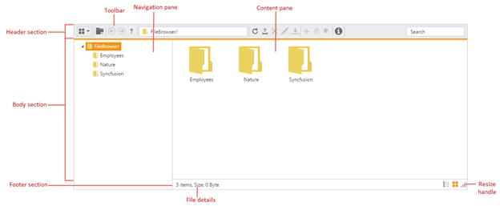

# User Interface

FileExplorer UI combined of several sections like header, body and footer. Each section having the corresponding components to perform the FileExplorer related operations.

* The **header section** contains the toolbar which having the list of tools to perform the file and navigation related operations.
* The **body section** is the main area which explores the filesystem contents. It separated into
  * **Navigation pane** which contains the tree view to showcase the folder hierarchy
  * **Content pane** which show cases the files from the file system. The files in the content pane can be viewable in the following modes
    * Grid
    * Tile
    * Large Icons
* The **footer section** contains the status bar which showcases the file details.

The following screenshot shows the diagrammatic detail of FileExplorer UI:

From above screenshot, you can see FileExplorer has several subcomponents for different functionalities. The upcoming sections explains the brief details of each components and their customizations.
