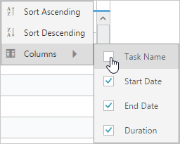

# Columns

The TreeGrid column displays the information from a bounded data source and it will be editable to update the task details through TreeGrid.

## Column Resizing 

You can change the width of the column in TreeGrid to show the entire text of the column by resizing the column. The following code example shows you how to enable the Column Resize feature at Gantt initialize.



<ej:Gantt id="Gantt" runat="server" 

      AllowColumnResize="true">

</ej:Gantt>



## Column Template

Column template is used to customize the column’s look and feel, based on requirement. 

The following code example shows you how to display the icon in the TreeGrid column.





using System;

using System.Collections.Generic;

using System.Linq;

using System.Web;

using System.Web.UI;

using System.Web.UI.WebControls;

namespace ASP_Doc.Gantt

{

    public partial class Gantt : System.Web.UI.Page

    {

        protected void Page_Load(object sender, EventArgs e)

        {

            this.GanttContainer.DataSource = this.GetDataSource();

            this.GanttContainer.DataBind();

        }

      private List<Data> GetDataSource()

        {

            List<Data> DataCollection = new List<Data>();

            Data ParentData = new Data()

            {

                TaskId = 1,

                PlatForm="ASP.NET",

                TaskName = "Volume 1 Release",

                StartDate = new DateTime(2014, 01, 06),                

                Duration = 5,

                Progress="30"

            };

            Data ChildData = new Data()

            {

                TaskId = 2,

                PlatForm="Volume1Sprint1",

                TaskName = "Volume1Sprint1",

                StartDate = new DateTime(2014, 01, 06),                        

                Duration = 5,

                Progress = "100",                

            };

            ParentData.SubTasks = new List<Data>();

            ParentData.SubTasks.Add(ChildData);

            ChildData = new Data()

            {

                TaskId = 3,

                PlatForm="JS",

                TaskName = "Volume1Sprint2",

                StartDate = new DateTime(2014, 01, 13),                                                

                Duration = 5,

                Progress = "100"                

            };

            ParentData.SubTasks.Add(ChildData);

            ChildData = new Data()

            {

                TaskId = 4,

                PlatForm="Mobile MVC",

                TaskName = "Volume1Sprint3",

                StartDate = new DateTime(2014, 01, 20),                                

                Duration = 5,

                Progress = "100"        

            };

            ParentData.SubTasks.Add(ChildData);

            ChildData = new Data()

            {

                TaskId = 5,

                PlatForm="Silverlight",

                TaskName = "Volume1Sprint4",

                StartDate = new DateTime(2014, 01, 27),               

                Duration = 5,

                Progress="100"

            };

            ParentData.SubTasks.Add(ChildData);

            ChildData = new Data()

            {

                TaskId = 6,

                PlatForm="Windows Forms",

                TaskName = "Volume1Sprint5",

                StartDate = new DateTime(2014, 02, 3),               

                Duration = 5,

                Progress="100"

            };

            ParentData.SubTasks.Add(ChildData);

            ChildData = new Data()

            {

                TaskId = 7,

                PlatForm="Windows Phone",

                TaskName = "Volume1Sprint6",

                StartDate = new DateTime(2014, 02, 10),               

                Duration = 5,

                Progress="100"

            };

            ParentData.SubTasks.Add(ChildData);

            DataCollection.Add(ParentData);

            return DataCollection;

        }

        public class Data

        {

            public int TaskId { get; set; }

            public string TaskName { get; set; }

            public string PlatForm { get; set; }

            public DateTime StartDate { get; set; }

            public int Duration { get; set; }

            public List<Data> SubTasks { get; set; }

            public string Progress { get; set; }

            public string Predecessor { get; set; }

        }

    }

    }




<%@ Page Language="C#" AutoEventWireup="true" CodeBehind="Gantt.aspx.cs" Inherits="ASP_Doc.Gantt.Gantt" %>

<!DOCTYPE html>

<html xmlns="http://www.w3.org/1999/xhtml">

<head runat="server">

    <title>Gantt ASP sample</title>

    <%--Script Reference--%>

</head>

<body>

    

        

      <form id="form1" runat="server">

    <ej:Gantt ID="GanttContainer" runat="server" 

        TaskIdMapping="TaskId"

        TaskNameMapping="TaskName"

        StartDateMapping="StartDate"

        DurationMapping="Duration"

        ProgressMapping="Progress"

        ChildMapping="SubTasks"

        ScheduleStartDate="1/06/2014"

        ScheduleEndDate="02/28/2014"

        Load="load"

        TreeColumnIndex="1">

    </ej:Gantt>

    </form>

</body>

</html>





The following screenshot displays the customized column in Gantt control.

Customized column
{:.caption}

## Column Chooser

Gantt supports enabling and disabling the visibility of the columns dynamically with the ShowColumnChooser property. The visibility of the custom columns can also be toggled with this property. Column chooser option is rendered as a sub menu item within the column menu in the Gantt columns. 

Column menu with column chooser  
{:.caption} 

The column menu is enabled with the ShowColumnChooser property, where the default value for this property is false.

### The column menu provides the following options:

* Sort Ascending
* Sort Descending
* Columns 

Sort Ascending and Sort Descending options can be enabled or disabled with the AllowSorting property. Single level sorting can be performed with these options. To perform multilevel sorting, AllowMultiSorting property should be enabled. You can also disable the visibility of a particular column in the column collection manually by setting the Visible property to false.



<ej:Gantt ID="gantt" runat="server" ShowColumnChooser="true"

             AllowSorting="true" AllowMultiSorting="true" >

        // ...

        // ...

</ej:Gantt>



The following screenshot displays the column chooser in the Gantt control.

Column chooser in Gantt control
{:.caption}

