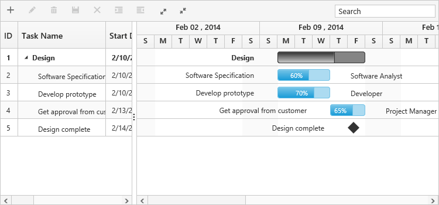
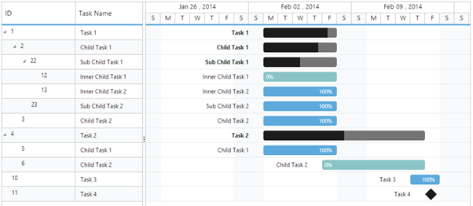

# Data Binding

Data binding is the process that establishes a connection between the application and different kinds of data sources such as business objects.

## Local Data Binding

In the application that uses Gantt control, you can connect the data source generated by that application itself.

## Hierarchy Data-source Binding

The following code example shows how to bind the hierarchical local data into the Gantt control.





using System;

using System.Collections.Generic;

using System.Linq;

using System.Web;

using System.Web.UI;

using System.Web.UI.WebControls;

namespace ASP_Doc.Gantt

{

    public partial class Gantt : System.Web.UI.Page

    {

        protected void Page_Load(object sender, EventArgs e)

        {

            this.GanttContainer.DataSource = this.GetDataSource();

            this.GanttContainer.DataBind();

        }

        private List<Data> GetDataSource()

            {

            List<Data> DataCollection = new List<Data>();

            Data ParentData = new Data()

            {

                TaskId = 1,

                TaskName = "Design",

                StartDate = new DateTime(2014, 02, 10),

                EndDate = new DateTime(2014, 02, 14),

                BaselineStartDate = new DateTime(2014, 02, 10),

                BaselineEndDate = new DateTime(2014, 02, 12),

                Duration = 5

            };

            Data ChildData = new Data()

            {

                TaskId = 2,

                TaskName = "Software Specification",

                StartDate = new DateTime(2014, 02, 10),

                EndDate = new DateTime(2014, 02, 12),

                BaselineStartDate = new DateTime(2014, 02, 10),

                BaselineEndDate = new DateTime(2014, 02, 12),

                Duration = 4,

                Progress = "60",

                ResourceId = new List<int>() { 2 }

            };

            ParentData.SubTasks = new List<Data>();

            ParentData.SubTasks.Add(ChildData);

            ChildData = new Data()

            {

                TaskId = 3,

                TaskName = "Develop prototype",

                StartDate = new DateTime(2014, 02, 10),

                EndDate = new DateTime(2014, 02, 12),

                BaselineStartDate = new DateTime(2014, 02, 10),

                BaselineEndDate = new DateTime(2014, 02, 12),

                Duration = 4,

                Progress = "70",

                ResourceId = new List<int>() { 3 }

            };

            ParentData.SubTasks.Add(ChildData);

            ChildData = new Data()

            {

                TaskId = 4,

                TaskName = "Get approval from customer",

                StartDate = new DateTime(2014, 02, 12),

                EndDate = new DateTime(2014, 02, 14),

                BaselineStartDate = new DateTime(2014, 02, 10),

                BaselineEndDate = new DateTime(2014, 02, 12),

                Duration = 2,

                Progress = "80",

                ResourceId = new List<int>() { 1 },

                Predecessor = "3FS"

            };

            ParentData.SubTasks.Add(ChildData);

            ChildData = new Data()

            {

                TaskId = 5,

                TaskName = "Design complete",

                StartDate = new DateTime(2014, 02, 14),

                EndDate = new DateTime(2014, 02, 14),

                BaselineStartDate = new DateTime(2014, 02, 10),

                BaselineEndDate = new DateTime(2014, 02, 12),

                Duration = 0,

                Predecessor = "4FS"

            };

            ParentData.SubTasks.Add(ChildData);

            DataCollection.Add(ParentData);

            return DataCollection;

        }

        public class Data

        {

            public int TaskId { get; set; }

            public string TaskName { get; set; }

            public DateTime StartDate { get; set; }

            public DateTime EndDate { get; set; }

            public DateTime BaselineStartDate { get; set; }

            public DateTime BaselineEndDate { get; set; }

            public int Duration { get; set; }

            public List<Data> SubTasks { get; set; }

            public string Progress { get; set; }

            public List<int> ResourceId { get; set; }

            public string Predecessor { get; set; }

        }

    }

}





<%@ Page Language="C#" AutoEventWireup="true" CodeBehind="Gantt.aspx.cs" Inherits="ASP_Doc.Gantt.Gantt" %>

<!DOCTYPE html>

<html xmlns="http://www.w3.org/1999/xhtml">

<head runat="server">

    <title>Gantt ASP sample</title>

<%--Script Reference--%>

</head>

<body>

    <form id="form1" runat="server">

    <ej:Gantt ID="GanttContainer" runat="server" 

        TaskIdMapping="TaskId"

        TaskNameMapping="TaskName"

        StartDateMapping="StartDate"

        DurationMapping="Duration"

        ProgressMapping="Progress"

        ChildMapping="SubTasks"

        ScheduleStartDate="02/01/2014"

        ScheduleEndDate="03/14/2014"

        TreeColumnIndex="1">

    </ej:Gantt>

    </form>

</body>

</html>





The output of the above steps is as follows.

Data Binding
{:.caption}

## Self-Referential Data Binding (Flat Data)

Gantt can be rendered from self-referential data structures, by providing two fields: ID field and parent ID field.

* ID Field- This field must contain unique values used to identify nodes. Its name should be assigned to the TaskIdMapping property.
* Parent ID Field- This field must contain values that indicate parent nodes. Its name should be assigned to the ParentTaskIdMapping property.





using System;

using System.Collections.Generic;

using System.Linq;

using System.Web;

using System.Web.UI;

using System.Web.UI.WebControls;

namespace ASP_Doc.Gantt

{

    public partial class Gantt : System.Web.UI.Page

    {

        protected void Page_Load(object sender, EventArgs e)

        {

            this.GanttContainer.DataSource = GanttData.GetData();

            this.GanttContainer.DataBind();

        }

       public class GanttData

          {

            public static List<Data> GetData()

            {

                List<Data> list = new List<Data>();

                list.Add(new Data()

                {

                  Id= 1,

                 Name= "Task 1",

                 StartDate= "02/03/2014", 

                  Duration= 5

                });

                list.Add(new Data()

                {

                    Id = 2,

                    Name = " Child Task 1",

                    ParentId=1,

                    StartDate = "02/03/2014",

                    Duration = 5,

                });

                list.Add(new Data()

                {

                    Id = 3,

                    ParentId=1,

                    Name = "Child Task 2",

                    StartDate = "02/03/2014",

                    Duration = 5,

                    PercentDone = 100,      

                });

               list.Add(new Data()

                {

                    Id = 22,

                    ParentId=2,

                    Name = " Sub Child Task 1",

                    StartDate = "02/03/2014",

                    Duration = 5,

                    PercentDone = 40,

                });

                list.Add(new Data()

                {

                    Id = 23,

                    ParentId=2,

                    Name = " Sub Child Task 2",

                    StartDate = "02/03/2014",

                    Duration = 5,

                    PercentDone = 100,

                });

                list.Add(new Data()

                {

                    Id = 12,

                    ParentId=22,

                    Name = " Inner Child Task 1",

                    StartDate = "02/03/2014",

                    Duration = 5,

                });

                list.Add(new Data()

                {

                    Id = 13,

                    ParentId=22,

                    Name = " Inner Child Task 2",

                    StartDate = "02/03/2014",

                    Duration = 5,

                    PercentDone = 100,

                });

                list.Add(new Data()

                {

                    Id = 4,

                    Name = " Task 2",

                    StartDate = "02/03/2014",

                    Duration = 5,

                    PercentDone = 100,

                });

                list.Add(new Data()

                {

                    Id = 5, 

                    ParentId=4,

                    Name = " Child Task 1",

                    StartDate = "02/03/2014",

                    Duration = 5,

                    PercentDone = 100,

                });

                list.Add(new Data()

                {

                    Id = 6, 

                    ParentId=4,

                    Name = " Child Task 2",

                    StartDate = "02/07/2014",

                    Duration = 5,

                });

                list.Add(new Data()

                {

                    Id = 7, 

                    ParentId=6,

                    Name = " Sub Child Task 1",

                    StartDate = "02/07/2014",

                    Duration = 5,

                });

                list.Add(new Data()

                {

                    Id = 8, 

                    ParentId=7,

                    Name = " Inner Child Task 1",

                    StartDate = "02/10/2014",

                    Duration = 3,

                    PercentDone = 60,

                });

                list.Add(new Data()

                {

                    Id = 9, 

                    ParentId=7,

                    Name = " Inner Child Task 2",

                    StartDate = "02/10/2014",

                    Duration = 3,

                    PercentDone = 100,

                });

                list.Add(new Data()

                {

                    Id = 10, 

                    Name = " Task 3",

                    StartDate = "02/13/2014",

                    Duration = 2,

                    PercentDone = 100,

                });

                list.Add(new Data()

                {

                    Id = 11, 

                    Name = " Task 4",

                    StartDate = "02/14/2014",

                    Duration = 0,

                });

                return list;

            }

        }

        public class Data

        {

            public string StartDate { get; set; }

            public int Id { get; set; }

            public int ParentId { get; set; }

            public string Name { get; set; }

            public int Duration { get; set; }

            public int PercentDone { get; set; }

            public List<Data> Children { get; set; }

            public string Predescessor { get; set; }

        }

    }

}




<%@ Page Language="C#" AutoEventWireup="true" CodeBehind="Gantt.aspx.cs" Inherits="ASP_Doc.Gantt.Gantt" %>

<!DOCTYPE html>

<html xmlns="http://www.w3.org/1999/xhtml">

<head runat="server">

    <title>Gantt ASP sample</title>

    <%--Script Reference--%>

</head>

<body>

    <form id="form1" runat="server">

    <ej:Gantt ID="GanttContainer" runat="server" 

        TaskIdMapping="Id"

        TaskNameMapping="Name"

        StartDateMapping="StartDate"

        DurationMapping="Duration"

        ProgressMapping="PercentDone"

        ChildMapping="Children"

        ScheduleStartDate="02/03/2014"

        ScheduleEndDate="03/09/2014"

        ParentTaskIdMapping="ParentId"

        TreeColumnIndex="1">

    </ej:Gantt>

    </form>

</body>

</html>





The following screenshot shows the output of the above steps.

 

Self-Referential Data Binding
{:.caption}

## Remote data

### OData

OData is a standardized protocol for creating and consuming data. You can provide the OData service URL directly to the ej.DataManager class and then you can assign it to Gantt dataSource.

The following code example describes the above behavior.



<%@ Page Language="C#" AutoEventWireup="true" CodeBehind="Gantt.aspx.cs" Inherits="ASP_Doc.Gantt.Gantt" %>

<!DOCTYPE html>

<html xmlns="http://www.w3.org/1999/xhtml">

<head runat="server">

    <title>Gantt ASP sample</title>

<%--Script Reference--%>

</head>

<body>

<form id="form1" runat="server">
 <ej:Gantt ID="Gantt" runat="server"
    TaskIdMapping="TaskID"   
    TaskNameMapping="TaskName" 
    StartDateMapping="StartDate" 
    EndDateMapping="EndDate"             
    ProgressMapping="PercentDone"
    ParentTaskIdMapping="ParentID"
    DurationMapping="Duration"> 
    <DataManager URL="http://js.syncfusion.com/demos/ejServices/Wcf/TreeGridGantt/TreeGantt.svc/SelfReferenceDatas"></DataManager>
</ej:Gantt>  
</form>

</body>

</html>



The following output is displayed for the code above,

### WebAPI

You can bind WebApi service data to Gantt. The data from WebApi service must be returned as object that has property Items with its value as datasource and this object can be pass to dataSource property of Gantt control.

The following code example describes the above behavior.



 <ej:Gantt ID="Gantt" runat="server"
    TaskIdMapping="TaskID"   
    TaskNameMapping="TaskName" 
    StartDateMapping="StartDate" 
    EndDateMapping="EndDate"             
    ProgressMapping="PercentDone"
    ParentTaskIdMapping="ParentID"
    DurationMapping="Duration"> 
    <DataManager URL="api/Home/GetGanttData"></DataManager>
</ej:Gantt> 





using System;
using System.Collections.Generic;
using System.Linq;
using System.Net;
using System.Net.Http;
using System.Web.Http;
using GanttExportService.Models;
namespace GanttExportService {
    public class HomeController: ApiController {
        GanttDataEntities data = new GanttDataEntities();
        public object GetGanttData() {
            var Data = data.Table1.ToList();
            return Data;
        }
    }
}



The following output is displayed as a result of the above code example.

