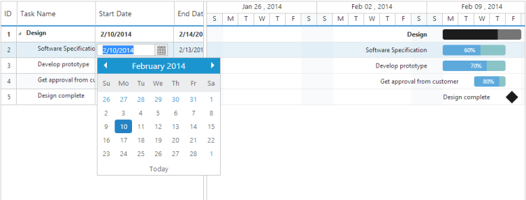

## Editing

The Gantt control provides built-in support to add, insert and update the task inside Gantt. Gantt provides three types of editing, they are:

* Cell Editing
* Normal Editing
* Taskbar Editing
* Predecessor Editing

Cell Editing

Update the task details through grid cell editing by setting EditMode as CellEditing.

The following code example shows you how to enable CellEditing in Gantt control.



<ej:Gantt ID="GanttContainer" runat="server" > //…

        <EditSettings AllowEditing="true" EditMode="cellEditing" />

    </ej:Gantt>



The output of Gantt with CellEditing is as follows.

{  | markdownify }
{:.image }

Normal Editing

Update the task details through edit dialog by setting EditMode as normal.

The following code example shows you how to enable normal editing in Gantt control.



<ej:Gantt ID="GanttContainer" runat="server"> //…

        <EditSettings AllowEditing="true" EditMode="normal" />

 </ej:Gantt>



The following screenshot shows the output of normal editing.

{  | markdownify }
{:.image }

Taskbar Editing

Update the task details by interactions such as resizing and dragging the taskbar. The following code example shows you how to enable taskbar resizing in Gantt control.



<ej:Gantt ID="GanttContainer" runat="server" AllowGanttChartEditing="true">

</ej:Gantt>



Predecessor Editing

Update the predecessor details of a task using mouse interactions. The following code example shows how to enable predecessor editing.



<ej:Gantt ID="Gantt" runat="server" 

          AllowGanttChartEditing="true"

          PredecessorMapping="predecessor">

 </ej:Gantt>



The following screen shot shows the predecessor editing in Gantt control.

{  | markdownify }
{:.image }

_Figure_ _39__: Predecessor Editing_

