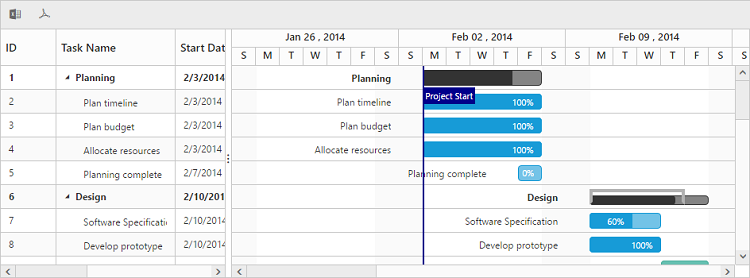

# Export

Exporting feature provides support to export Gantt content to excel and PDF files. To export the contents, the `ExcelExport` and `PdfExport` toolbar items must be added in the toolbar using the `ToolbarItems` property of `ToolbarSettings`. When you click, the toolbar exporting icons, it internally invokes the export public method of Gantt object to export.

The below code snippet explains the above behavior,




<ej:Gantt runat="server" ID="GanttControlExporting" OnServerPdfExporting="GanttControlExporting_ServerPdfExporting" OnServerExcelExporting="GanttControlExporting_ServerExcelExporting">
<ToolbarSettings ShowToolbar="true" ToolbarItems="pdfExport, excelExport" />
</ej:Gantt>





    public partial class GanttExporting : System.Web.UI.Page
    {
        protected void Page_Load(object sender, EventArgs e)
        {
            TaskDetailsCollection TaskCollection = new TaskDetailsCollection();
            this.GanttControlExporting.DataSource = TaskCollection.GetDataSource();
            this.GanttControlExporting.DataBind();
        }

        protected void GanttControlExporting_ServerExcelExporting(object sender, Syncfusion.JavaScript.Web.GanttEventArgs e)
        {
            ExcelExport exp = new ExcelExport();
            GanttExportSettings settings = new GanttExportSettings();
            settings.Theme = ExportTheme.FlatLime;
            exp.Export(this.GanttControlExporting.Model, (IEnumerable)this.GanttControlExporting.DataSource, "Export.xlsx", ExcelVersion.Excel2010, new GanttExportSettings() { Theme = ExportTheme.FlatLime });
        }

        protected void GanttControlExporting_ServerPdfExporting(object sender, Syncfusion.JavaScript.Web.GanttEventArgs e)
        {
            PdfExport exp = new PdfExport();
            GanttPdfExportSettings settings = new GanttPdfExportSettings();
            settings.EnableFooter = true;
            settings.ProjectName = "Project Tracker";
            settings.Locale = e.Arguments["locale"].ToString();
            settings.Theme = GanttExportTheme.FlatLime;
            exp.Export(this.GanttControlExporting.Model, (IEnumerable)this.GanttControlExporting.DataSource, settings, "Gantt");
        }
    }


 

The below screen shot shows Gantt with excel and PDF exporting enabled.

## Server dependencies
Export Helper functions are available in the Assembly `Syncfusion.EJ.Export`, which is available in the Essential Studio & Essential ASP.NET builds. The list of assemblies needed for Gantt Export as follows

* Syncfusion.EJ
* Syncfusion.EJ.Export
* Syncfusion.Linq.Base
* Syncfusion.Compression.Base
* Syncfusion.XlsIO.Base
* Syncfusion.PDF.Base

## Supported Export Types
Currently server helper function allows following two types of exporting.

* Excel
* PDF

## Multiple exporting
Multiple export is used for export more than one Gantt object in the same file. 

The following code example describes exporting multiple Gantt

 


 <ej:Gantt runat="server" ID="GanttControlExporting" ChildMapping="SubTasks" TreeColumnIndex="1" IsResponsive="true" 
            OnServerExcelExporting="GanttControlExporting_ServerExcelExporting" 
            OnServerPdfExporting="GanttControlExporting_ServerPdfExporting"
            Load="load">
            <ToolbarSettings ShowToolbar="true" ToolbarItems="excelExport, pdfExport" />
 </ej:Gantt>

 <ej:Gantt runat="server" ID="GanttControlDesign" ChildMapping="SubTasks" TreeColumnIndex="1" Load="load">

 </ej:Gantt>

 <ej:Gantt runat="server" ID="GanttControlImplementation" ChildMapping="SubTasks" TreeColumnIndex="1" Load="load">
 
 </ej:Gantt>





    public partial class GanttMultipleExporting : System.Web.UI.Page
    {
        protected void Page_Load(object sender, EventArgs e)
        {
            ExportTaskDetailsCollection TaskCollection = new ExportTaskDetailsCollection();
            this.GanttControlExporting.DataSource = TaskCollection.GetDataSource();
            this.GanttControlExporting.DataBind();
            this.GanttControlDesign.DataSource = TaskCollection.GetDesignPhaseDataSource();
            this.GanttControlDesign.DataBind();
            this.GanttControlImplementation.DataSource = TaskCollection.GetImplementationPhaseDataSource();
            this.GanttControlImplementation.DataBind();
        }
        protected void GanttControlExporting_ServerExcelExporting(object sender, Syncfusion.JavaScript.Web.GanttEventArgs e)
        {
            ExcelExport exp = new ExcelExport();
            IWorkbook document = exp.Export(this.GanttControlExporting.Model, (IEnumerable)this.GanttControlExporting.DataSource, new GanttExportSettings() { Theme = ExportTheme.FlatLime }, true, "Planning Phase");
            document = exp.Export(this.GanttControlDesign.Model, (IEnumerable)this.GanttControlDesign.DataSource, new GanttExportSettings() { Theme = ExportTheme.FlatLime }, "Export", document, true, "Design Phase");
            exp.Export(this.GanttControlImplementation.Model, (IEnumerable)this.GanttControlImplementation.DataSource, new GanttExportSettings() { Theme = ExportTheme.FlatLime }, "Export.xlsx", document, false, "Implementation Phase");
        }

        protected void GanttControlExporting_ServerPdfExporting(object sender, Syncfusion.JavaScript.Web.GanttEventArgs e)
        {
            PdfExport exp = new PdfExport();
            GanttPdfExportSettings settings = new GanttPdfExportSettings();
            settings.Theme = GanttExportTheme.FlatLime;
            settings.Locale = e.Arguments["locale"].ToString();
            PdfDocument document = exp.Export(this.GanttControlExporting.Model, (IEnumerable)this.GanttControlExporting.DataSource, settings, false);
            document = exp.Export(this.GanttControlDesign.Model, (IEnumerable)this.GanttControlDesign.DataSource, settings, document, false);
            exp.Export(this.GanttControlImplementation.Model, (IEnumerable)this.GanttControlImplementation.DataSource, settings, "Gantt", document, true);
        }

    }


 

## Export Theme
The Gantt export supports the below themes, 

* flat-azure
* flat-azure-dark
* flat-lime
* flat-lime-dark
* flat-saffron
* flat-saffron-dark
* gradient-azure
* gradient-azure-dark
* gradient-lime
* gradient-lime-dark
* gradient-saffron
* gradient-saffron-dark
* bootstrap-theme

The desired theme should be passed as a parameter to the Export method and the code snippet for this as follows



        protected void GanttControlExporting_ServerExcelExporting(object sender, Syncfusion.JavaScript.Web.GanttEventArgs e)
          {
            ExcelExport exp = new ExcelExport();
            GanttExportSettings settings = new GanttExportSettings();
            settings.Theme = ExportTheme.FlatLime;
            exp.Export(this.GanttControlExporting.Model, (IEnumerable)this.GanttControlExporting.DataSource, "Export.xlsx", ExcelVersion.Excel2010, new GanttExportSettings() { Theme = ExportTheme.FlatLime });
          }



## Customization

In Gantt, we can customize Grid cells, taskbars in Excel and PDF files by using exporting events. While exporting the Gantt as Excel or PDF files, events are triggered to customize the Grid cells and taskbars.

### Customize Excel cell

Excel cells can be customized by using `ServerExcelQueryCellInfo` event, in this event we can get the details about current record, Excel cell and current column information. Using this information we can customize the background color, font color and value of Excel cell, please find the event argument details below.

<table>
<tr>
<th>Name</th><th>Description</th><th>Type</th>
</tr>
<tr>
<td>Data</td><td>Returns the current row details </td><td>GanttRecordDetails</td>
</tr>
<td>Cell</td><td>Returns current Excel cell information</td><td>IRange</td>
</tr>
<tr>
<td>Column</td><td>Returns current column information</td><td>GanttColumn</td>
</tr>
</table>

The following code snippets shows how to bind `ServerExcelQueryCellInfo` event in code behind and how to customize Excel cell using this event.
 

    <ej:Gantt runat="server" ID="GanttControlExporting"
        //...
        OnServerExcelExporting="GanttConditionalExporting_ServerExcelExporting" 
        OnServerExcelQueryCellInfo="GanttConditionalExporting_ServerExcelQueryCellInfo"
        >
        <ToolbarSettings ShowToolbar="true" ToolbarItems="excelExport, pdfExport" />
    </ej:Gantt>





    public partial class ConditionalExporting : System.Web.UI.Page
    {
        protected void Page_Load(object sender, EventArgs e)
        {
            //...
        }

        protected void GanttConditionalExporting_ServerExcelExporting(object sender, Syncfusion.JavaScript.Web.GanttEventArgs e)
        {
            ExcelExport exp = new ExcelExport();
            GanttExportSettings settings = new GanttExportSettings();
            settings.Theme = ExportTheme.FlatLime;
            exp.Export(this.GanttConditionalExporting.Model, (IEnumerable)this.GanttConditionalExporting.DataSource, "Export.xlsx", ExcelVersion.Excel2010, new GanttExportSettings() { Theme = ExportTheme.FlatLime });
        }

        protected void GanttConditionalExporting_ServerExcelQueryCellInfo(object model, object args)
        {
            var record = (GanttRecordDetails)((Dictionary<string, object>)args)["Data"];
            var cell = (IRange)((Dictionary<string, object>)args)["Cell"];
            var column = (GanttColumn)((Dictionary<string, object>)args)["Column"];
            var ganttModel = (GanttProperties)model;
            
            if (column.MappingName == ganttModel.ProgressMapping && !record.IsParentRow)
            {
                if (float.Parse(cell.Value) > 80)
                    cell.CellStyle.Color = ColorConversion.GetColor(new PdfColor(165, 105, 189));
                else if (float.Parse(cell.Value) < 20)
                    cell.CellStyle.Color = ColorConversion.GetColor(new PdfColor(240, 128, 128));
            }
        }
    }


 

[Click](https://asp.syncfusion.com/demos/web/gantt/GanttConditionalExporting.aspx) here to view the online demo sample with above code example.

N> Refer this [link](https://help.syncfusion.com/cr/aspnetmvc/Syncfusion.XlsIO.IExtendedFormat.html) to know more about what are the properties are available in Excel cell and it's type values.

### Customize PDF cell

PDF cells in Gantt can be customized by using `ServerPdfQueryCellInfo` event, in this event we can get the details about current record, PDF cell and current column information. Using this information we can customize the background color and font color of PDF cells, please find the event argument details below.

<table>
<tr>
<th>Name</th><th>Description</th><th>Type</th>
</tr>
<tr>
<td>Data</td><td>Returns the current row details </td><td>GanttRecord</td>
</tr>
<td>Cell</td><td>Returns current Excel cell information</td><td>PdfTreeGridCell</td>
</tr>
<tr>
<td>Column</td><td>Returns current column information</td><td>GanttColumn</td>
</tr>
</table>

The following code snippets shows how to bind `ServerPdfQueryCellInfo` event in Web API controller and how to customize PDF cell using this event.

 

    <ej:Gantt runat="server" ID="GanttControlExporting"
        //...
        OnServerPdfExporting="GanttConditionalExporting_ServerPdfExporting"
        OnServerPdfQueryCellInfo="GanttConditionalExporting_ServerPdfQueryCell"
        >
        <ToolbarSettings ShowToolbar="true" ToolbarItems="excelExport, pdfExport" />
    </ej:Gantt>





    public partial class ConditionalExporting : System.Web.UI.Page
    {
        protected void Page_Load(object sender, EventArgs e)
        {
            //...
        }
        
        protected void GanttConditionalExporting_ServerPdfExporting(object sender, Syncfusion.JavaScript.Web.GanttEventArgs e)
        {
            PdfExport exp = new PdfExport();
            GanttPdfExportSettings settings = new GanttPdfExportSettings();
            settings.EnableFooter = true;
            settings.ProjectName = "Project Tracker";
            settings.Locale = e.Arguments["locale"].ToString();
            settings.Theme = GanttExportTheme.FlatLime;
            settings.IsFitToWidth = true;
            exp.Export(this.GanttConditionalExporting.Model, (IEnumerable)this.GanttConditionalExporting.DataSource, settings, "Gantt");
        }

        protected void GanttConditionalExporting_ServerPdfQueryCell(object model, object args)
        {
            var record = (GanttRecord)((Dictionary<string, object>)args)["Data"];
            var cell = (PdfTreeGridCell)((Dictionary<string, object>)args)["Cell"];
            var column = (GanttColumn)((Dictionary<string, object>)args)["Column"];
            var ganttModel = (GanttProperties)model;

            if (column.MappingName == ganttModel.ProgressMapping && !record.IsParentRow)
            {
                if (record.Progress > 80)
                {
                    PdfBrush color = new PdfSolidBrush(new PdfColor(165, 105, 189));
                    cell.Style.BackgroundBrush = color;
                }
                else if (record.Progress < 20)
                {
                    PdfBrush color = new PdfSolidBrush(new PdfColor(240, 128, 128));
                    cell.Style.BackgroundBrush = color;
                }

            }
        }
    }




[Click](https://asp.syncfusion.com/demos/web/gantt/GanttConditionalExporting.aspx) here to view the online demo sample with above code example.

N> Refer this [link](http://help.syncfusion.com/cr/aspnet/Syncfusion.EJ.Export.PdfTreeGridCellStyle.html) to know more about what are the properties are available in PDF cell and it's type values.

### Customize PDF taskbar

PDF taskbars in Gantt can be customized by using `ServerPdfQueryTaskbarInfo` event, in this event we can get the details about current record and taskbar information. Using this information we can customize the background color of taskbar and progress bar, please find the event argument details below.

<table>
<tr>
<th>Name</th><th>Description</th><th>Type</th>
</tr>
<tr>
<td>Data</td><td>Returns the current row details </td><td>GanttRecord</td>
</tr>   
<td>Taskbar</td><td>Returns current Excel cell information</td><td>PdfGanttTaskbar</td>
</tr>
</table>

The following code snippets shows how to bind `ServerPdfQueryTaskbarInfo` event in Web API controller and how to customize PDF taskbar using this event.

 

    <ej:Gantt runat="server" ID="GanttControlExporting"
        //...
        OnServerPdfExporting="GanttConditionalExporting_ServerPdfExporting"
        OnServerPdfQueryTaskbarInfo="GanttConditionalExporting_ServerPdfTaskbarInfo"
        >
        <ToolbarSettings ShowToolbar="true" ToolbarItems="excelExport, pdfExport" />
    </ej:Gantt>





    public partial class ConditionalExporting : System.Web.UI.Page
    {
        protected void Page_Load(object sender, EventArgs e)
        {
            //...
        }
        
        protected void GanttConditionalExporting_ServerPdfExporting(object sender, Syncfusion.JavaScript.Web.GanttEventArgs e)
        {
            PdfExport exp = new PdfExport();
            GanttPdfExportSettings settings = new GanttPdfExportSettings();
            settings.EnableFooter = true;
            settings.ProjectName = "Project Tracker";
            settings.Locale = e.Arguments["locale"].ToString();
            settings.Theme = GanttExportTheme.FlatLime;
            settings.IsFitToWidth = true;
            exp.Export(this.GanttConditionalExporting.Model, (IEnumerable)this.GanttConditionalExporting.DataSource, settings, "Gantt");
        }

        protected void GanttConditionalExporting_ServerPdfTaskbarInfo(object model, object args)
        {
            var record = (GanttRecord)((Dictionary<string, object>)args)["Data"];
            var taskbar = (PdfGanttTaskbar)((Dictionary<string, object>)args)["Taskbar"];
            if (!record.IsParentRow)
            {
                if (record.Progress > 80)
                {
                    taskbar.ProgressColor = new PdfColor(108, 52, 131);
                    taskbar.TaskBorderColor = taskbar.TaskColor = new PdfColor(165, 105, 189);
                }
                else if (record.Progress < 20)
                {
                    taskbar.ProgressColor = new PdfColor(205, 92, 92);
                    taskbar.TaskBorderColor = taskbar.TaskColor = new PdfColor(240, 128, 128);
                }
            }
        }
    }




[Click](https://asp.syncfusion.com/demos/web/gantt/GanttConditionalExporting.aspx) here to view the online demo sample with above code example.
