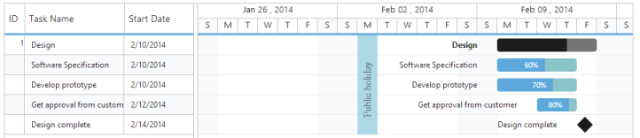

# Holidays

Holidays in Gantt control is used to highlight the non-working days in Gantt control and it can be initialized with Gantt control by using the following code example.



                  

        <ej:Gantt ID="GanttControlDefault" runat="server">

            <Holidays>

             <ej:Holiday Day="02/24/2014" Background="lime" Label="Local Holiday" />

            </Holidays>

        </ej:Gantt>        

    
   



The following screenshot shows the output of Holidays in Gantt control.

 

Holidays
{:.caption}

