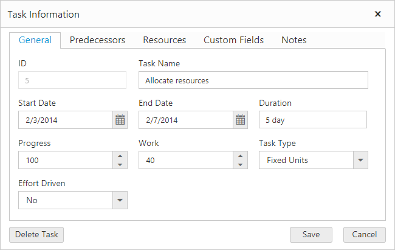
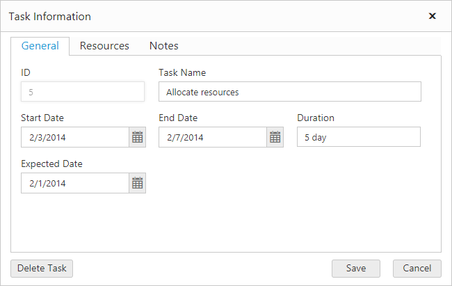

# Display custom fields in general tab
Gantt add and edit dialogs groups the data sources fields in five different tabs such as `General`, `Predecessors`, `Resources`, `Custom Fields` and `Notes`.

The custom fields are usually displayed in `Custom Fields` tab, but it is also possible to display the custom fields in general tab using `DisplayInGeneralTab` property in Gantt. By default, its value is false.

The following code example explains how to display custom fields in general tab



<ej:Gantt ID="gantt" runat="server">
      <AddDialogFields>
                <ej:AddDialogField Field="TaskID" />
                <ej:AddDialogField Field="TaskName" />
                <ej:AddDialogField Field="EndDate" />
                <ej:AddDialogField Field="Duration" />
                <ej:AddDialogField Field="notes" />
                <ej:AddDialogField Field="ExpectedDate" DisplayInGeneralTab="true" />
      </AddDialogFields>
      <EditDialogFields>
                <ej:EditDialogField Field="TaskID" />
                <ej:EditDialogField Field="TaskName" />
                <ej:EditDialogField Field="EndDate" />
                <ej:EditDialogField Field="Duration" />
                <ej:EditDialogField Field="notes" />
                <ej:EditDialogField Field="ExpectedDate" DisplayInGeneralTab="true" />
      </EditDialogFields>
</ej:Gantt>


The above code example makes Fridays and Saturdays as non-working days in a week.

The above screen shot shows custom column field “Expected Date” displayed in General tab.
{:.caption}

