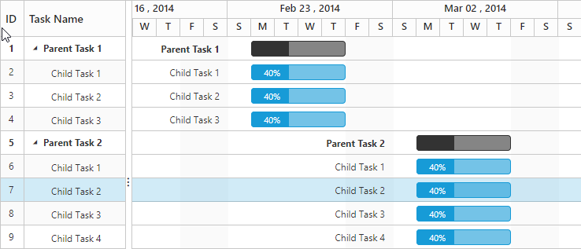

## Change workweek/working days in a week
Non-working days/weekend are used to represent the non-productive days in a project. It is possible to change the non-working days in a week using the `WorkWeek` property in Gantt.

By default, Saturdays and Sundays are considered as non-working days/weekend in a project. 

The following code example explains how to change weekend/non-working days



<ej:Gantt ID="gantt" runat="server" WorkWeek="Sunday,Monday,Tuesday,Wednesday,Thursday">
      
</ej:Gantt>


The above code example makes Fridays and Saturdays as non-working days in a week.

The above screen shot will be displayed after changing the non-working days in Gantt.
{:.caption}

