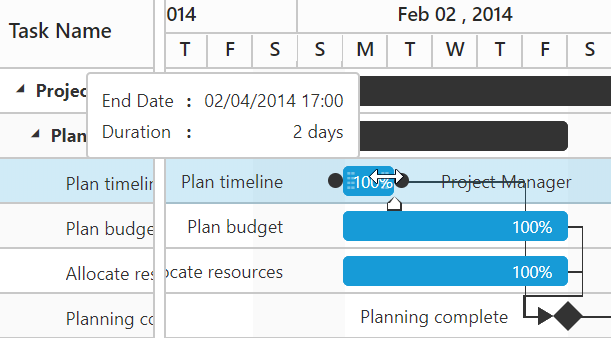
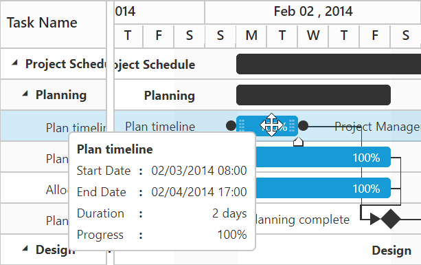

## Round-off start date, end date and duration value on taskbar editing
In Gantt start date, end date and duration values can be round-off as per current `ScheduleHeaderSettings.ScheduleHeaderType` value on taskbar resizing and dragging actions. This can be achieved by setting `roundOffDuration` argument value as `true` in `TaskbarEditing` event.

The below code example explains how to achieve this requirement. 



< ej:Gantt ID=" Gantt "  runat="server"

TaskbarEditing = "taskbarEditing">
  
</ej:Gantt> 

<script type="text/javascript">
	function taskbarEditing(args) {
		args.roundOffDuration = true
	}
<script>



Before resizing

{:.caption}

After resizing

{:.caption} 
