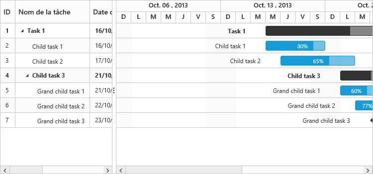
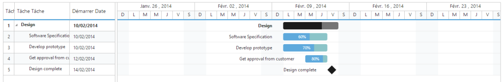
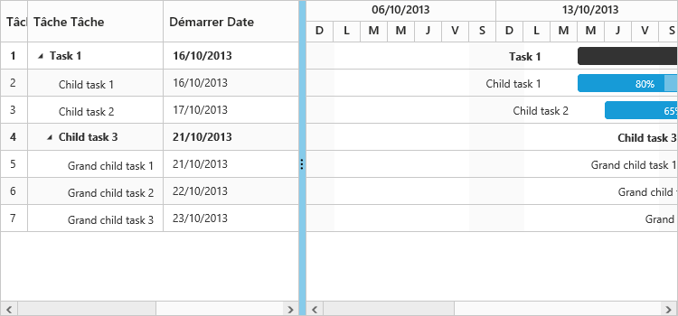

# Localization

Localization is the process of customizing the User Interface (UI) based on a culture, specific to a particular country or region, in order to display regional data. The culture is represented by a unique string like `en``-``US` for US English and `fr``-``FR` for French.

Localization is the key feature that provides solutions to global customers with the help of localized control. It is necessary to include the specific culture script files (ej.culture.fr-FR.min.js file for French culture) in the reference section, which is available in the following location.

`(installed location)\Syncfusion\Essential Studio\{{ site.releaseversion }}\JavaScript\assets\scripts\i18n`

Also it is possible to localize all the texts in the Gantt control with specific culture by referring the ej.localetexts.fr-FR.min.js file which is available in the following location.

`(installed location)\Syncfusion\Essential Studio\{{ site.releaseversion }}\JavaScript\assets\scripts\i10n`

The following code example explains on how to localize the control in French culture



<head>

//…

</head>

<ej:Gantt ID="GanttContainer" runat="server" Locale="fr-FR"> </ej:Gantt>



Which will localize all the text and date formats to French culture. If we still need to customize the localized text, we can define them locally in the sample as explained below.



<ej:Gantt ID="GanttContainer" runat="server" Locale="fr-FR"></ej:Gantt>



## Date format

The default date format used in the Gantt control is “MM/dd/yyyy”. Date formats will be changed based on the culture referred in the control. But if you still need to change the date format we can define the desired format using the dateFormat property. The same have been explained in the following code example.



<ej:Gantt ID="GanttContainer" runat="server" DateFormat="dd/MM/yyyy" Locale="fr-FR">

    <ScheduleHeaderSettings WeekHeaderFormat="dd/MM/yyyy" />

</ej:Gantt>



