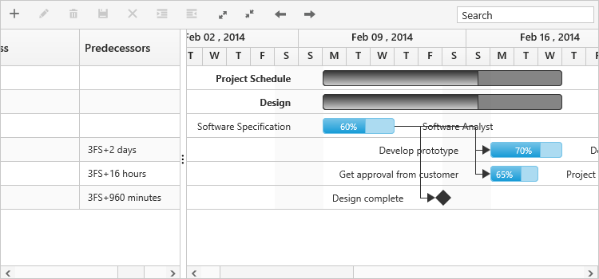
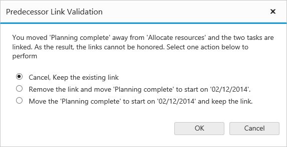

# Predecessor

## Predecessor offset with duration units

In Gantt, predecessor offset can be defined with the following duration units, 

* Day
* Hour
* Minute

We can define offset with various offset duration units for predecessors by using below code example



var data = [
    //...
    Predecessor: "3FS+2d" { 
        //...
        Predecessor: "3FS+16h"
    },
    { 
        //...
        Predecessor: "3FS+960m"
    }
];

<ej:Gantt ID="Gantt" runat="server" PredecessorMapping="Predescessor" //...>
</ej:Gantt>    



The following screen shot depicts the duration unit support in the predecessor offset.

## Validate predecessor links on editing

In Gantt, it is possible to validate the taskbar editing based on the predecessor connections. Below are the following ways to validate the taskbar editing

* Using ActionBegin event 
* Using validation dialog

### Using ActionBegin event

ActionBegin event with requestType argument as **validateLinkedTask** will be triggered when editing a task with predecessor links.

And it is possible to validate the editing within the ActionBegin event using the **validateMode** event argument. The validateMode event argument has the following properties,

<table>
<tr>
<td>
Argument  </td><td>
Default value  </td><td>
Description  </td></tr>
<tr>
<td>
args.validateMode.respectLink  </td><td>
false  </td><td>
In this validation mode, the predecessor links will be considered as high priority. With this mode enabled, when the successor task is moved before predecessor task’s end date, the editing will be reverted and dates will be validated based on the dependency links.    </td></tr>
<tr>
<td>
args.validateMode.removeLink  </td><td>
false  </td><td>
In this validation mode, the taskbar editing will be considered as high priority, where in the case of inappropriate task dates the dependency links will be removed and tasks will be moved to the edited date.    </td></tr>
<tr>
<td>
args.validateMode.preserveLinkWithEditing  </td><td>
true  </td><td>
In this validation mode, taskbar editing will be considered along with the dependency links. There will be no validations in task editing.    </td></tr>
</table>

By default, the **preserveLinkWithEditing** validation mode will be enabled, thus the validations will not occur when editing the linked tasks. 

The below code snippet explains enabling the **respectLink** validation mode while editing the linked tasks in the ActionBegin event.



<ej:Gantt ID="Gantt" runat="server"
	//... 
	ActionBegin="actionBegin">
</ej:Gantt>   
 



### Using validation dialog:

When disabling all the validation modes in the ActionBegin event, a validation popup will be displayed prompting the user to select the validation mode to validate taskbar editing.

This validation popup will display different options based on the successor task’s start date after editing.

If the user moved the successor task, that starts after predecessor task’s end date then the dialog will be rendered with below options,

* Cancel, Keep the existing link
* Remove the link and move the task to start on edited date.
* Move the task to start on edited date and keep the link.

If the user moved the successor task, that starts before the predecessor task’s end date then the dialog will be rendered with below options.

* Cancel, Keep the existing link
* Remove the link and move the task to start on edited date.

The following code example explains this.



<ej:Gantt ID="Gantt" runat="server"
	//... 
	ActionBegin="actionBegin">
</ej:Gantt>

 



In this case, if the user dragging action violated the predecessor type then the following dialog will be rendered to perform operation.

