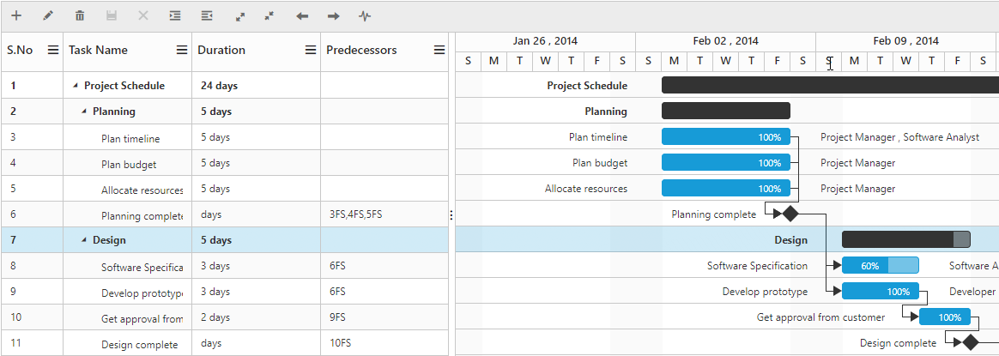

# Serial Number

The serial or sequence number support in Gantt is used to index the tasks in a project. The Serial number column can be rendered by enabling the `EnableSerialNumber` property. On enabling this property the serial number column will be displayed and the Task Id column will be hidden, the tasks will be identified using the serial numbers. Further the column values for task predecessors will also be displayed using the serial numbers of the corresponding tasks, instead of task IDs.

Code snippets for enabling serial number 



                  

   <ej:Gantt ID="GanttSerialNumber" runat="server" EnableSerialNumber="true">

   </ej:Gantt>        

   



The following screenshot displays the Serial number column in Gantt control.

 

Figure : Serial Number
{:.caption}

The serial number column will be resequenced automatically on performing any actions which will change the row indexes of the tasks such as row drag and drop, deleting, adding.

