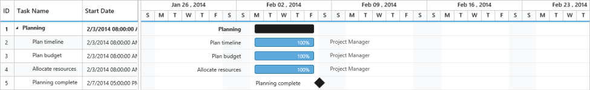

# Time Options

Start date and End date in the datasource defines the starting point and ending point of a task in the project. It can be of two data types,

* Date 
* Datetime

The datetime data type for start date and end date defines the exact starting point and ending point of a task along with time details of a day. There are two types of time scales available based on working hours,

* TimeScale8Hours  for 8 hour working scale
* TimeScale24Hours for 24 hour working scale

Use the following code example for setting different time scales of working hours.



<ej:Gantt ID="GanttControlDefault" runat="server" WorkingTimeScale="TimeScale24Hours">

 </ej:Gantt>



Use the following code example for including time options in start date and end date of a task.





using System;

using System.Collections.Generic;

using System.Linq;

using System.Web;

using System.Web.UI;

using System.Web.UI.WebControls;

namespace ASP_Doc.Gantt

{

    public partial class Gantt : System.Web.UI.Page

    {

        protected void Page_Load(object sender, EventArgs e)

        {

            this.GanttContainer.DataSource = this.GetDataSource();

            this.GanttContainer.DataBind();

        }

        private List<Data> GetDataSource()

            {

            List<Data> DataCollection = new List<Data>();

            Data ParentData = new Data()

            {

                TaskId = 1,

                TaskName = "Planning",

                StartDate = "02/03/2014 08:00:00 AM",

                EndDate = "02/07/2014 05:00:00 PM",

                Duration = 5

            };

            Data ChildData = new Data()

            {

                TaskId = 2,

                TaskName = "Plan timeline",

                StartDate = "02/03/2014 08:00:00 AM",

                EndDate = "02/07/2014 05:00:00 PM",

                Duration = 5,

                Progress = "100",

            };

            ParentData.SubTasks = new List<Data>();

            ParentData.SubTasks.Add(ChildData);

            ChildData = new Data()

            {

                TaskId = 3,

                TaskName = "Plan Budget",

                StartDate = "02/03/2014 08:00:00 AM",

                EndDate = "02/07/2014 05:00:00 PM",

                Duration = 5,

                Progress = "100",

            };

            ParentData.SubTasks.Add(ChildData);

            ChildData = new Data()

            {

               TaskId = 4,

                TaskName = "Allocate Resources",

                StartDate = "02/03/2014 08:00:00 AM",

                EndDate = "02/07/2014 05:00:00 PM",

                Duration = 5,

                Progress = "100",

            };

            ParentData.SubTasks.Add(ChildData);

            ChildData = new Data()

            {

                TaskId = 5,

                TaskName = "Planing complete",

                StartDate = "02/07/2014 08:00:00 AM",

                EndDate = "02/07/2014 05:00:00 PM",                

                Duration = 0,

            };

            ParentData.SubTasks.Add(ChildData);

            DataCollection.Add(ParentData);

            return DataCollection;

        }

        public class Data

        {

            public int TaskId { get; set; }

            public string TaskName { get; set; }

            public DateTime StartDate { get; set; }

            public DateTime EndDate { get; set; }

            public int Duration { get; set; }

            public List<Data> SubTasks { get; set; }

            public string Progress { get; set; }

        }

    }

}



<%@ Page Language="C#" AutoEventWireup="true" CodeBehind="Gantt.aspx.cs" Inherits="ASP_Doc.Gantt.Gantt" %>

<!DOCTYPE html>

<html xmlns="http://www.w3.org/1999/xhtml">

<head runat="server">

    <title>Gantt ASP sample</title>

<%--Script Reference--%>

</head>

<body>

    <form id="form1" runat="server">

    <ej:Gantt ID="GanttContainer" runat="server"

        TaskIdMapping="TaskId"

        TaskNameMapping="TaskName"

        StartDateMapping="StartDate"

        DurationMapping="Duration"

        ProgressMapping="Progress"

        ChildMapping="SubTasks"

        DateFormat="M/d/yyyy hh:mm:ss tt"

        ScheduleStartDate="02/01/2014 00:00:00 AM "

        ScheduleEndDate="03/14/2016 00:00:00 PM "

        TreeColumnIndex="1">

    </ej:Gantt>

    </form>

</body>

</html>





Execute the above code to render the following output.

Gantt with Time Options
{:.caption}

