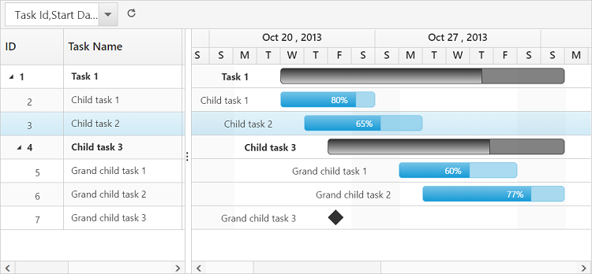

# Toolbar

In Gantt we can show/hide the Toolbar by using [`toolbarSettings.showToolbar`](https://help.syncfusion.com/api/js/ejgantt#members:toolbarsettings-showtoolbar "showToolbar") property.We can add default toolbar items by [`toolbarSettings.toolbarItems`](https://help.syncfusion.com/api/js/ejgantt#members:toolbarsettings-toolbaritems "toolbarItems"). User can also create a custom toolbar items by using [`toolbarSettings.customToolbarItems`](https://help.syncfusion.com/api/js/ejgantt#members:toolbarsettings-customToolbarItems "customToolbarItems").

## Default Toolbar Items
Using Gantt default toolbar items we can perform below operations.

* **Add**- To add new task.

* **Edit**-To edit a selected task.

* **Delete**- To delete a selected task.
		   
* **Cancel**- To cancel the edited changes in a task.
		   
* **Update**- To save the edited changes in a task.
		   
* **ExpandAll**- To expand all the Gantt rows.
		   
* **CollapseAll**- To collapse all the Gantt rows.

* **Indent**- To indent the selected task in Gantt.
		   
* **Outdent**- To outdent the selected task in Gantt.
		   
* **CriticalPath**- To support critical path in Gantt.

* **PrevTimeSpan**- To navigate the Gantt timeline to previous time span.

* **NextTimeSpan**- To navigate the Gantt timeline to Next time span.

* **Search**- To perform search operation in Gantt.
		   
* **ExcelExport**- To export Gantt in Excel format.

* **PDFExport**- To export Gantt in PDF format.

We can enable Gantt toolbar by using below code example:

  <ej:Gantt ID="GanttControlEditing" >           
            <ToolbarSettings ShowToolbar="true" ToolbarItems="add,edit,delete,update,cancel,indent,outdent,expandAll,collapseAll,prevTimeSpan,nextTimeSpan,excelExport,pdfExport,search />            
  </ej:Gantt>

The following screenshot displays the toolbar option in Gantt control.

N> To perform add,edit,delete,cancel,update,indent,outdent using Toolbar items we need to enable add/edit/delete/indent using [`editSettings`](https://help.syncfusion.com/api/js/ejGantt#members:editsettings "editSettings").
 
## Custom Toolbar Items

CustomToolbarItems allows us to insert custom icons and custom template in Gantt toolbar. By using below properties we can customize Gantt toolbar as per our requirement.

* **text**- To insert the custom icons in toolbar using CSS class name selector.

* **templateID**-To insert the custom icons in toolbar using script templates. Using this property we can bind HTML elements and other EJ controls to Gantt toolbar.

* **tooltipText**-Displays tooltip text for the custom icons.

To insert EJ Controls in Gantt toolbar we need to initiate the control in [`create`](https://help.syncfusion.com/api/js/ejgantt#events:create "create") client side event.In [`toolbarClick`](https://help.syncfusion.com/api/js/ejgantt#events:toolbarclick "toolbarclick") client side event we can bind actions to the custom toolbar items.


     <ej:Gantt ID="GanttControlToolbarTemplate" ToolbarClick="toolbarClick" Create="create">          
            <ToolbarSettings ShowToolbar="true">
                <CustomToolbarItems>
                    <ej:GanttCustomToolbarItem TemplateID="#ColumnVisibility" TooltipText="Column Visibility" />
                    <ej:GanttCustomToolbarItem Text="Reset" TooltipText="Reset" />
                </CustomToolbarItems>                
            </ToolbarSettings>
        </ej:Gantt>          
    
    
     


