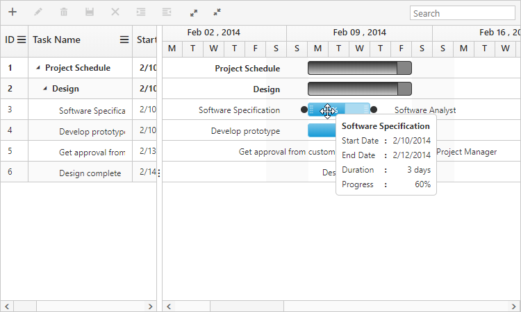
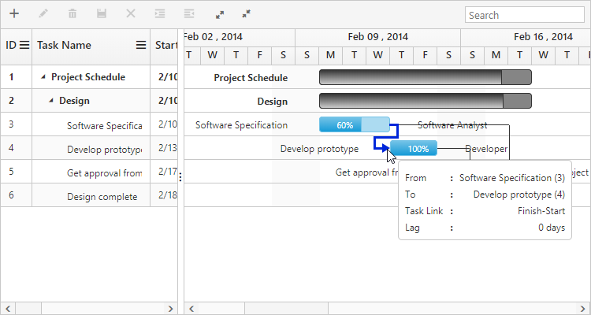
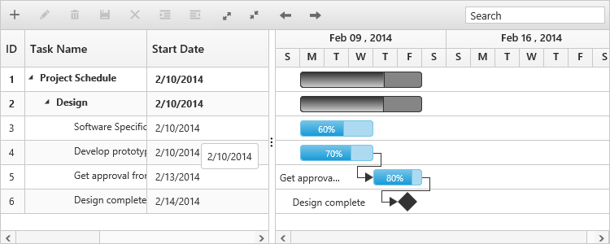
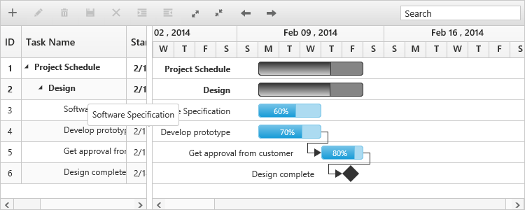

# Tooltip

The Gantt has support to display tooltip for both taskbars and for column cells.

## Taskbar and dependency line tooltip

In Gantt, you can enable or disable taskbar and dependency line mouse hover tooltip by using the `EnableTaskbarTooltip` property. The default value of this property was `true`. The following code example shows, how to enable the taskbar and dependency line tooltip in Gantt.



<ej:Gantt ID="GanttContainer" runat="server"
    EnableTaskbarTooltip="true"
    PredecessorMapping="Predecessors"
    //...>
</ej:Gantt>



Taskbar tooltip can be customized by using the `TaskbarTooltipTemplate` property and  dependency line tooltip can be customized by using the `PredecessorTooltipTemplate` property, these properties are described briefly in the [customization](/aspnet/gantt/customizations) section.

Taskbar Tooltip
{:.caption}

Dependency Tooltip
{:.caption}

## Taskbar drag tooltip

It is possible to enable or disable the tooltip while performing editing actions on taskbar (left resizing, right resizing, dragging and progress resizing) by using the `EnableTaskbarDragTooltip` property. By default, this property is set to `true`. The following code example explains this behavior.



<ej:Gantt ID="GanttContainer" runat="server"
    EnableTaskbarDragTooltip="true"
    //...>
</ej:Gantt>



## Cell tooltip

It is possible to enable or disable the TreeGrid cell tooltip in mouse hover by using the `ShowGridCellTooltip`  property. By default, this property is set to `true`. The following code example explains how to enable disable this property.



<ej:Gantt ID="GanttContainer" runat="server"
    ShowGridCellTooltip="true"
    //...>
</ej:Gantt>



This tooltip can be customized using the `CellTooltipTemplate` property, which is described briefly in the [customization](/aspnet/gantt/customizations) section.

## Tree column (Expander column) tooltip 

It is also possible to display tooltip only for expander column by setting the `ShowGridExpandCellTooltip` property. The following code example shows you to enable expander column tooltip in Gantt.



<ej:Gantt ID="GanttContainer" runat="server"
    ShowGridExpandCellTooltip="true"
    //...>
</ej:Gantt>



