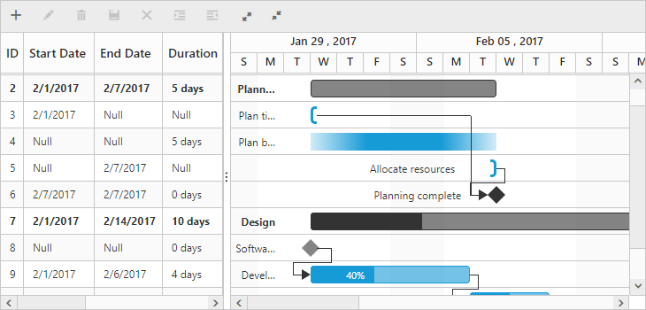

# Unscheduled Tasks

Unscheduled tasks are planned for a project but do not have definite schedule dates.  Now, the Gantt control supports rendering the unscheduled tasks. You can create or update the tasks with anyone of start date, end date and duration values or none. You can enable or disable the unscheduled tasks by using the `AllowUnscheduledTask` property.

## Unscheduled Task Types

Unscheduled tasks have various task types with only either start date, end date or duration.

#### Start Date Only

#### End Date Only

#### Duration Only

#### Milestone

The milestone task, one without a start and end date, but having a duration value of zero is represented as follows.

## Define unscheduled tasks in data source

You can define the various types of unscheduled tasks in the data source as follows.



public List<GanttTaskDetails> GetUnscheduledData()
        {
            List<GanttTaskDetails> tasks = new List<GanttTaskDetails>();

            // Start Date only
            tasks[0].SubTasks[0].SubTasks.Add(new GanttTaskDetails()
            {
                TaskID = 3,
                TaskName = "Plan timeline",
                StartDate = "02/01/2017",      
                Duration = null,
                EndDate = null,
                Progress = "100",
                ResourceID = new List<object>() { 1 }
            });
            //Duration only
            tasks[0].SubTasks[0].SubTasks.Add(new GanttTaskDetails()
            {
                TaskID = 4,
                TaskName = "Plan budget",   
                StartDate = null,
                EndDate = null,
                Duration = 5,
                Progress = "100",
                ResourceID = new List<object>() { 5 }
            });
            //End date only
            tasks[0].SubTasks[0].SubTasks.Add(new GanttTaskDetails()
            {
                TaskID = 5,
                TaskName = "Allocate resources",     
                StartDate = null,
                EndDate = "02/7/2017",   
                Duration = null,
                Progress = "100",
                ResourceID = new List<object>() { 6 }
            });                        
            // Milestone
            tasks[0].SubTasks[1].SubTasks.Add(new GanttTaskDetails()
            {
                TaskID = 8,
                TaskName = "Software Specification",  
                StartDate = null,
                EndDate = null,
                Duration = 0,
                Progress = "60",                
                ResourceID = new List<object>() { 2 }
            });

            //...
            return tasks;
        }




<ej:Gantt ID="GanttContainer" runat="server" 
//…
AllowUnscheduledTask ="true"> 
</ej:Gantt>



The following screenshot displays the output of the above code. 

N> If the `AllowUnscheduledTask` property is set to `false` for unplanned task, the Gantt control will automatically calculate the scheduled dates with a default value of duration 1 and the project scheduled start date is considered as the start date for the task.

## Show/hide null text in Gantt columns

You can show/hide the null text cell value for start date, end date and duration columns by using the `showNullText` column property. This can be customized in load event of Gantt. You can change the `Null` string by using the `nullText` property in the localization text file of the Gantt control. The following code snippets explain this behavior.



<ej:Gantt ID="GanttContainer" runat="server" 
//…
AllowUnscheduledTask ="true"
Load = "loadEvent"> 
</ej:Gantt>





function loadEvent(args) {
   //…
   var columns = this.getColumns();
       columns[1].showNullText = true;
       columns[2].showNullText = true;
       column[3].showNullText = false;
}
ej.Gantt.Locale["en-Us"] = {
   nullText: "null"
}



The following screenshot displays the output of the above code. 

