# Manual Integration of Syncfusion ASP.NET controls into the new/existing Application

This topic mainly focuses on how to integrate the Syncfusion ASP.NET controls manually into the newly created/existing ASP.NET Web Forms application. Let’s look onto the procedure for making use of any of our ASP.NET controls within the ASP.NET Web application.

## Creation of First ASP.NET Web Application

Follow the below steps to create a normal ASP.NET Web application

1. Start the Visual Studio. Create a new Web Forms application by selecting File -> New -> Project and save it with a meaningful name as shown in the following.

2. ASP.NET Web application is created successfully. Now you can build and run your application by pressing Ctrl+F5, it shows something similar to the following screenshot in your web browser.

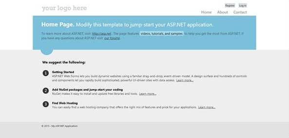

You have successfully created your first simple ASP.NET web application and now it is time to add some other essential things to your application that allows you to make use of our Syncfusion ASP.NET controls into it.

## For Existing Applications

If you want to add our Syncfusion ASP.NET controls into your existing application, open your existing application and proceed with the following steps.

## Adding required CSS files

To render the Syncfusion ASP.NET controls with its unique style and theme, it is necessary to refer to the required CSS files into your application. You need to copy all the required CSS files into your application from the following location.

N> <installed location>\Syncfusion\Essential Studio\{{ site.releaseversion }}\JavaScript\assets\css\web
N> For example, If you have installed the Essential Studio within C:\Program Files (x86), navigate to the following location.
N> C:\Program Files (x86)\Syncfusion\Essential Studio\{{ site.releaseversion }}\JavaScript\assets\css\web

When you navigate to the above location, you can find the files shown in the following image that you need to copy entirely and paste it into your root application.

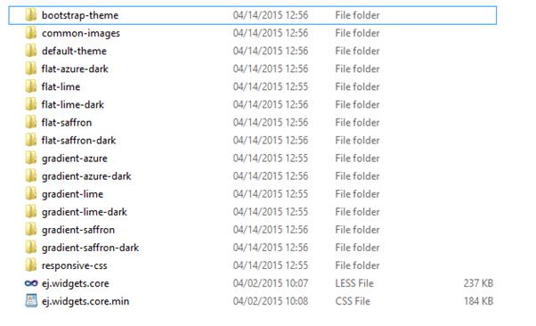

Before pasting it into your application, create a folder structure with names ej/web within the Content folder of your application and place all the copied files into it as shown in the following.

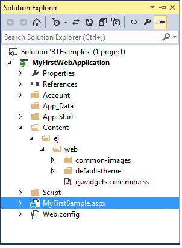
Solution Explorer - Project with CSS files copied into the Content folder
{:.caption}

N> The common-images folder is needed to be copied into your application mandatorily, as it includes all the common font icons and other images required for the control to render.

Once the CSS files are added in your application, include the reference to "ej.web.all.min.css" file in the Site.Master page, within the head section.



<link href="Content/ej/web/default-theme/ej.web.all.min.css" rel="stylesheet" />



## Adding the required JavaScript files

Adding the required JavaScript files into your application plays an important role, without which the Syncfusion controls cannot be created. It requires the following mandatory common script files.

*	jQuery (version supported from 1.7.1.min.js to latest jQuery version).
*   jquery.easing.1.3.min.js
*	jquery.globalize.min.js
*	jsrender.min.js

Apart from the above common scripts, it is also necessary to refer to the ej.web.all.min.js file in your application that plays a major role in control creation. It also requires reference to the ej.webform.min.js file in your application, as it is responsible for the server-side event functionalities of the ASP.NET controls.

The dependencies are available in the following locations of your machine. Please copy these files from the location given.

<table>
<tr>
<th>Files</th>
<th>Location</th>
</tr>
<tr>
<td>jquery-3.3.1.min.js jsrender.min.js</td>
<td>&lt;Syncfusion Installed Location&gt;\Essential Studio\{{ site.releaseversion }}\JavaScript\assets\external</td>
</tr>
<tr>
<td>ej.web.all.min.js</td>
<td>&lt;Syncfusion Installed Location&gt;\Essential Studio\{{ site.releaseversion }}\JavaScript\assets\scripts\web</td>
</tr>
<tr>
<td>ej.webform.min.js</td>
<td>&lt;Syncfusion Installed Location&gt;\Essential Studio\{{ site.releaseversion }}\JavaScript\assets\scripts\common</td>
</tr>
</table>

N> Example for "Syncfusion Installed location" is "C:\Program Files (x86)\Syncfusion"

Now, create a folder named `ej` under the Scripts folder of your application and place the copied files ej.web.all.min.js and ej.webform.min.js into it as shown in the following.

Solution Explorer - Script files copied into the Scripts folder of the project
{:.caption}

Once the scripts are added in your application, now it is necessary to include the reference to it in your application. This should be done within the Site.Master file, as we did previously for CSS files.
Add the following script references in the Site.Master file within the head section.



<link href="Content/ej/web/default-theme/ej.web.all.min.css" rel="stylesheet" />



N> As the above mentioned order, the script file of ej.webform.min.js should be referred at the last, that is whether we use individual script reference or ej.web.all.min.js script reference.

## CDN Link reference

If you want to refer to the CDN links instead of the direct script and CSS references in your application, you need to make use of the following references in the Site.Master file.



<head>

    <meta charset="utf-8" />

    <title><%: Page.Title %> - My ASP.NET Application</title>

    <link href="http://cdn.syncfusion.com/{{ site.releaseversion }}/js/web/flat-azure/ej.web.all.min.css" rel="stylesheet" />

    

    

    

    

     

    

</head>    



N> jQuery.easing external dependency has been removed from version 14.3.0.49 onwards. Kindly include this jQuery.easing dependency for versions lesser than 14.3.0.49 in order to support animation effects.

## Adding Syncfusion ASP.NET control

Here, we will see how to add the DatePicker control into the newly created Syncfusion ASP.NET Web Application. To add the control, we can use either of the following two ways:

*	Drag and drop the control from the toolbox.  
*	Manually using the control code.  

### Drag and drop the control from the toolbox

1.	An easy way of adding control into the Default.aspx page is by making use of the Toolbox option present in the Visual Studio. When you install Essential Studio Package or ASP.NET setup in your machine, all the available ASP.NET controls are automatically configured into the Visual Studio Toolbox.

You just need to drag the required control from the toolbox and then drop it into the Content section of the Default.aspx page, so that the required control code gets generated automatically and also the required dependent assembly get registered automatically.

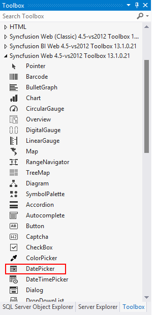
Toolbox
{:.caption}

2.	When you drag and drop the DatePicker control into the Default.aspx page, the page looks as the image shown in the following with the automatic control code generated and the required assemblies registered.

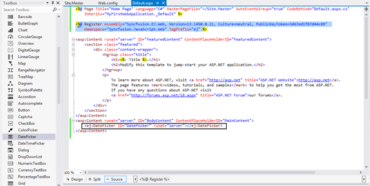
Default.aspx page with DatePicker control code and assembly registered for it at the top
{:.caption}

### Manually using the control code

If you want to add the control code manually, follow the below steps.

#### Assembly Reference

Refer to the following assemblies in your newly created ASP.NET application that allows you to use any of the Syncfusion ASP.NET controls within it.

* Syncfusion.EJ
* Syncfusion.EJ.Web

The reference to the Syncfusion assemblies can be added to your application in either of the following ways.
-	Referring from GAC
-	Referring from the installed location

#### Referring from GAC

1.	Once you have installed the Essential Studio package in your system, the Syncfusion assemblies are automatically registered in the GAC. You can easily add the reference assemblies to your project by choosing Add Reference option as shown in the following.

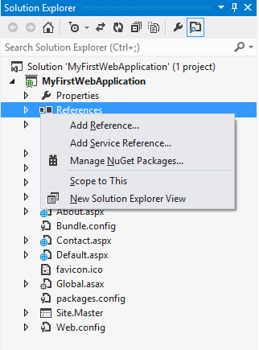
Right click on the References --> choose Add Reference option
{:.caption}

2.	Now the Reference Manager pop-up will appear on the screen. In that pop-up, select the required assemblies from the Extensions tab as follows, by choosing the appropriate versions (13.1450.0.21). The version to be chosen for the reference assemblies is based on the Framework used in the application.

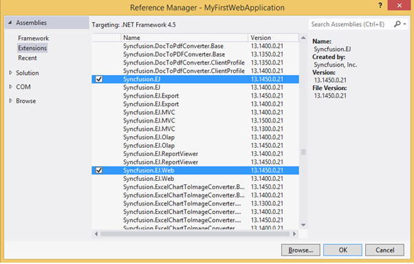
Reference Manager Pop-up
{:.caption}

#### Referring from the installed location

1.	Add the reference assemblies to your project by choosing Add Reference option as shown in the following.

Right click on the References --> choose Add Reference option
{:.caption}

2.	Now the Reference Manager pop-up will appear on the screen. Select the Browse tab in it and navigate to the installed location of the Syncfusion Essential Studio package in your system. (As illustrated in the following image.)

N> <installed location>\Syncfusion\Essential Studio\{{ site.releaseversion }}\precompiledassemblies\{{ site.releaseversion }}

N> For example, If you have installed the Essential Studio package within C:\Program Files (x86), navigate to the following location.

N> C:\Program Files (x86)\Syncfusion\Essential Studio\{{ site.releaseversion }}\precompiledassemblies\{{ site.releaseversion }}

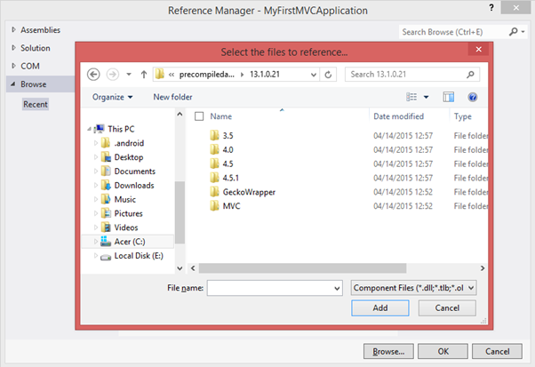
Reference Manager Pop-up with Browse button clicked
{:.caption}

N> In the above image, the folders 3.5, 4.0, 4.5, 4.5.1 denotes the .NET Framework version. Based on the Framework version used in your application, you can choose assemblies from the appropriate folders. The Syncfusion.EJ.Web and other assemblies like Syncfusion.EJ are available within these folders.

3.	Add the Syncfusion.EJ and Syncfusion.EJ.Web assemblies to your application from the following specified location.

N> <installed location>\Syncfusion\Essential Studio\{{ site.releaseversion }}\precompiledassemblies\{{ site.releaseversion }}\4.5  
For example, If you have installed the Essential Studio package within C:\Program Files (x86), navigate to the following location.  
C:\Program Files (x86)\Syncfusion\Essential Studio\{{ site.releaseversion }}\precompiledassemblies\{{ site.releaseversion }}\4.5

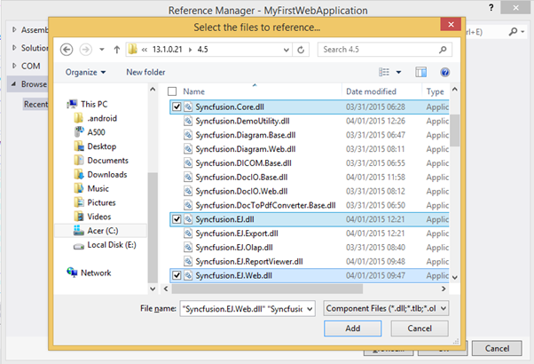
Reference Manager Pop-up with assemblies selected
{:.caption}

4.	Once the assembly selection is done, click OK to add the selected references to your project. You can view the assembly references added to your application, in the solution explorer as shown in the following.

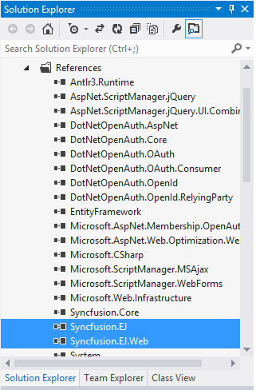
Selected Assemblies added to the Project reference
{:.caption}

N> We have removed dependency for `Syncfusion.Core` assembly since v13.2.0.29. If you are using the latest version, this assembly is not required in your application. Refer to this [KB document](https://www.syncfusion.com/kb/5211/why-is-the-syncfusion-core-assembly-missing-from-v13-2-0-29) for more details.

#### Registering Syncfusion Assemblies within the Web.config

In your application’s web.config file, add the following assembly information within the <assemblies> tag.



<system.web>
    <compilation debug="true" targetFramework="4.5">
          <assemblies>

            <add assembly="Syncfusion.EJ, Version=16.3450.0.21, Culture=neutral, PublicKeyToken=3d67ed1f87d44c89" />

            <add assembly="Syncfusion.EJ.Web, Version=16.3450.0.21, Culture=neutral, PublicKeyToken=3d67ed1f87d44c89" />

          </assemblies>
    </compilation>
    <authentication mode="Forms">
   …
</system.web>



1.	Add the following DatePicker code within the Default.aspx file, as shown in the image following it.



   <ej:DatePicker ID="DatePicker" runat="server"></ej:DatePicker>



N> Add the DatePicker code within the Content section, by removing the unwanted code within it.

2.	Also register the required assemblies within the Default.aspx page at the top where you are using the control as shown in the following.

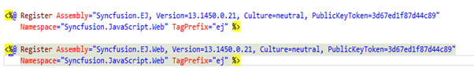

3. Finally build and run the project by pressing F5, so that you can now see the output similar to the following screenshot in your web browser.

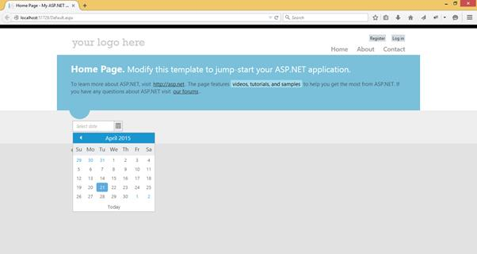
DatePicker control displaying on the web browser
{:.caption}

Thus the DatePicker control is rendered successfully with its default appearance. You can then use its various properties to set its value and also make use of its available events to trigger when necessary.

N> The Script Manager is mandatory in order to place our control initialization script in the page. 
Ensure whether the “ScriptManager” is added in the “Site.Master” or else add the “ScriptManager” to your web page.  
You just need to drag the “ScriptManager” from the toolbox under the “AJAX Extension” and then drop it into the Content section of the Default.aspx page, so that the required scripts to initiate our component will be added to your web page.



     <asp:ScriptManager ID="ScriptManager1" runat="server"> 
     </asp:ScriptManager> 
     

