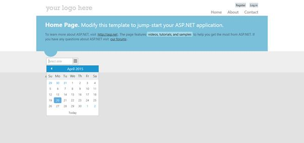

# Through Syncfusion NuGet Packages

To add our Syncfusion Web controls into the new ASP.NET application by making use of the **Syncfusion** **Nuget** **Packages**, refer to the following steps.

1. The steps to download and configure the required **Syncfusion** **NuGet** **Packages** in Visual Studio is mentioned [here](https://help.syncfusion.com/aspnet/nuget-packages#syncfusion-nuget-feed-url-configuration)

2. Once Configured the Packages source, search and install the **Syncfusion.AspNet** from **Package** **Manager** **console** by using following commands.

   **PM>Install-Package Syncfusion.AspNet**
   
3. While initial creation, by default, the **Unobtrusive** setting is enabled in your applications web.config file. You need to change its value to **false** in your application as shown in the following:

   ~~~ cshtml

	<appSettings>
		<add key="ClientValidationEnabled" value="true" />
		<add key="UnobtrusiveJavaScriptEnabled" value="false" />
	</appSettings>

   ~~~
	  
4. You need to add the script manager code in the **_Layout.cshtml** file present within the **~/Views/Shared** folder of your application. Add it before the closing body tag in the _Layout.cshtml file.

   ~~~ cshtml
	<body>
        @RenderSection("scripts", required: false)
        @Html.EJ().ScriptManager()
    </body>

   ~~~		
	  
	
   N>The main reason for referring the Script manager in _Layout file is that, it can be referred as common by all the View files present within your application. If **unobtrusive** is set to true in the application, the script manager can be excluded, as the control is initialized using HTML5 attributes. Also for control rendering, you need to include **ej.unobtrusive.min.js** file along with ej.web.all.min.js in **_Layout.cshtml** page.

5. Syncfusion specific stylesheets are loaded into the **Content** folder of your application, include the below specified theme reference **(bootstrap-theme/ej.web.all.min.css)** file in the **~/Views/Shared/_Layout.cshtml** file, within the head section as this file contains the default theme styles applied for all the Syncfusion MVC controls.

   ~~~ cshtml
   
	<head>
	    <title>@ViewBag.Title</title>
	    @Styles.Render("~/Content/ej/web/bootstrap-theme/ej.web.all.min.css")
	</head>

   ~~~			

6. It is mandatory to include the reference to the required JavaScript files in your **_Layout.cshtml**, so as to render the Syncfusion Web controls properly. 	 
   
   ~~~ cshtml
   
	<head>
		<meta charset="utf-8" />
		<title>@ViewBag.Title - My ASP.NET Application</title>
		@Styles.Render("~/Content/ej/web/bootstrap-theme/ej.web.all.min.css")
	</head>

	<body>
		@Scripts.Render("~/bundles/jquery")
		@Scripts.Render("~/bundles/bootstrap")  
		@Scripts.Render("~/Scripts/jsrender.min.js")
		@Scripts.Render("~/Scripts/ej/web/ej.web.all.min.js")  
		@RenderSection("scripts", required: false)
		@Html.EJ().ScriptManager();
	</body>

   ~~~	
   
	The order of the reference to the script files made in the above section should be maintained in the same manner as mentioned above.
   
	If your application contains duplicate/multiple references to the jQuery files, remove it as the explicit reference to the **jquery-1.10.2.min.js** script file that is added to the application as specified above.

7. Now you can add the control **DatePicker** in the **Index.cshtml** file present within **~/Views/Home** folder.
	
   ~~~ cshtml
   
   <ej:DatePicker runat="server" ID="MyFirstDatepicker"></ej:DatePicker>

   ~~~	

8. Compile and execute the application. You can able to see the below output in the browser.

	

For more details - [View](https://help.syncfusion.com/extension/syncfusion-nuget-packages/overview)