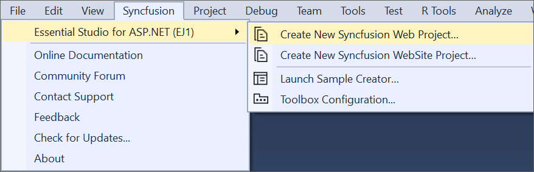

# Using Syncfusion Project Template

Syncfusion provides the Visual Studio Project Template support for ASP.NET (EJWEB) components that will automatically include all the Syncfusion ASP.NET control’s client and server side dependencies are preconfigured and copied to the appropriate folders. The following steps help you to create the **Syncfusion ASP.NET (Essential JS 1) application** through the **Visual Studio Project Template:**

1.  To create a Syncfusion ASP.NET (Essential JS 1) project, follow either one of the options below:

    **Option 1:**   
    Click **Syncfusion Menu** and choose **Essential Studio for ASP.NET (Essential JS 1) > Create New Syncfusion Web Project…** or **Create New Syncfusion WebSite Project…** in **Visual Studio**.
       
    

	N> In Visual Studio 2019, Syncfusion menu available under Extension in Visual Studio menu.

	**Option 2:**   
    Choose **File > New > Project** and navigate to **Syncfusion > Web > Syncfusion ASP.NET Web Application** or **Syncfusion ASP.NET Web Site** in **Visual Studio**.

2. Choose Templates > Visual C# > Syncfusion ASP.NET Web Site.  
3. Set a name and location for the project. 
4. Click OK to create the project.  

   

   Then, Syncfusion licensing registration required message box will be shown as follow, if you are installed the trial setup or NuGet packages since Syncfusion introduced the licensing system from 2018 Volume 2 (v16.2.0.41) Essential Studio release. Please navigate to the [help topic](https://help.syncfusion.com/common/essential-studio/licensing/license-key#how-to-generate-syncfusion-license-key) which is shown in the licensing message box to generate and register the Syncfusion license key to your project. Refer to this [blog](https://blog.syncfusion.com/post/Whats-New-in-2018-Volume-2-Licensing-Changes-in-the-1620x-Version-of-Essential-Studio.aspx) post for understanding the licensing changes introduced in Essential Studio.

   

Add your required controls in the ASPX Page. The code for adding DatePicker control within the “Default.aspx” file are as follows.



<ej:DatePicker ID="DatePicker" runat="server"></ej:DatePicker>



* Another way of adding control into the Default.aspx page is by making use of the Toolbox option present in the Visual Studio. You need to just drag the required control from the toolbox and then drop it into the Content section of the Default.aspx page, and the required control code will automatically gets generated.

* Finally build and run the project by pressing F5, so that you can now see the output similar to the following screenshot in your web browser.

N> The Script Manager is mandatory in order to place our control initialization script in the page. 
Ensure whether the “ScriptManager” is added in the “Site.Master” or else add the “ScriptManager” to your web page.  
You just need to drag the “ScriptManager” from the toolbox under the “AJAX Extension” and then drop it into the Content section of the Default.aspx page, so that the required scripts to initiate our component will be added to your web page.



     <asp:ScriptManager ID="ScriptManager1" runat="server">
     </asp:ScriptManager> 
     


N> Refer to the [Embedded Resources](https://help.syncfusion.com/aspnet/embeded-resources) section for more information on automatically loading script files from assemblies.